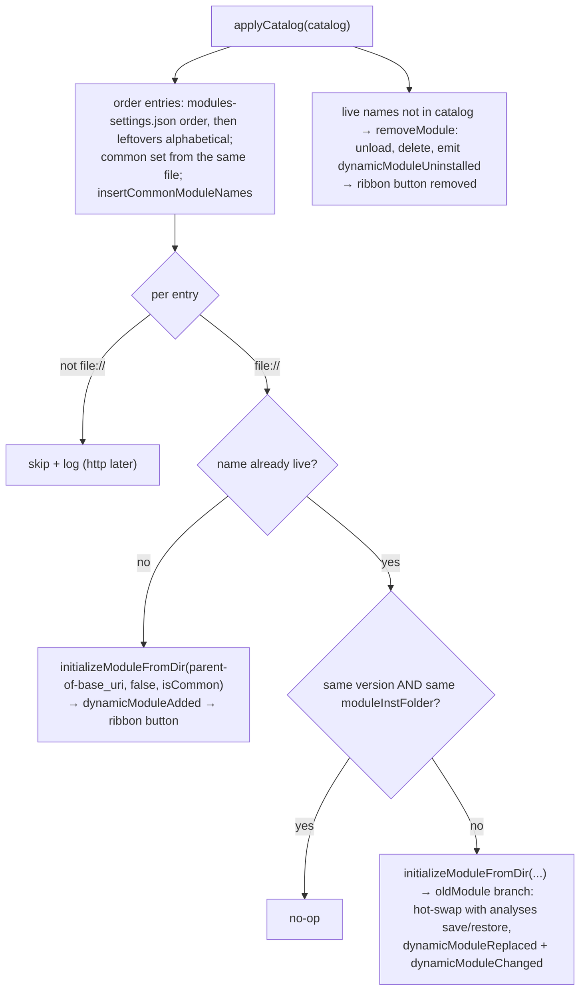

# HANDOVER — Client Module Discovery

**Status:** design agreed, implementation starting. Orchestrator-side discovery is done and
verified (see `HANDOVER-module-discovery.md`); this increment connects the real desktop client
to it: server pushes the catalog at channel setup, the C++ client caches and signals it, and
the existing module/ribbon machinery consumes it instead of the local manifest scan.

**Roadmap context:** after this, basic data load — then we have a showable prototype that runs
analyses end-to-end (real app → orchestrator → runner → results, with a live module menu).

---

## The flow, end to end

```
orchestrator                              JaspClient (worker thread)        Qt (GUI thread)
───────────                               ──────────────────────────        ───────────────
hello → welcome + buffer `modules`   ───►  dial → first frame = catalog  ─►  cache + emit
on PAIR channel (preconnect buffering)      (recvLoop → handleMessage)        modulesUpdated
later: catalog changes → push        ───►  cache + emit (same path)      ─►  applyCatalog
                                          (client never sends anything
                                           for discovery — pure receiver)
```

1. **Server:** on `hello`, reply `welcome` and buffer the current catalog on the frontend's
   fresh PAIR channel. The frontend has not dialed yet, so the frame sits in the listening
   socket's buffer and is delivered the instant it dials — **the catalog is the first frame on
   the data channel** (preconnect buffering — the same mechanism as dispatch-on-registration,
   probe-verified and test-pinned). Thereafter, push on actual change (already built).
2. **Client:** `handleMessage` grows one branch — `modules` → parse into a typed
   `ModuleCatalog`, replace the cached slot, emit `modulesUpdated`. The reply-to-a-query case
   and the push case are **collapsed**: consumers cannot tell them apart and per neo-jasp.md
   §19.2 should not ("the frontend handles it identically … replace its menu"). Public surface:
   `ModuleCatalog catalog() const` + `void modulesUpdated(const ModuleCatalog &)` — nothing
   else. No `requestModules()`, no connection signals: reconnect re-runs `handle_hello`
   server-side, so a fresh catalog is buffered again automatically — self-healing, with zero
   re-query logic anywhere in the client or UI.
3. **Qt machinery, when ready:** `connect(client, modulesUpdated → DynamicModules::applyCatalog)`
   once, then apply `client->catalog()` if non-empty. Readiness (the QML context needed to
   instantiate `Description.qml` as live QML) is expressed purely by *when* the machinery
   subscribes/reads — the client is indifferent to it.

## Design decisions (and why)

1. **Server pushes at channel setup** rather than the client querying when ready, and rather
   than carrying modules inside `welcome` (neo-jasp.md §19.5 floats that). Pushing on the PAIR
   channel keeps `welcome` minimal on the shared control REP socket, uses the *same* delivery
   path as all subsequent updates (one `modules` handler, one code path), and makes reconnect
   free. The program never triggers, never waits on protocol state.
2. **The client is a pure receiver for discovery.** Earlier candidates — client-side
   auto-query, and an explicit `requestModules()` pull — both put protocol choreography
   (ask-when-ready, re-ask-on-reconnect) into the UI layer. The chosen shape makes *the server*
   responsible for "a connected frontend always holds the current catalog"; the client's only
   state is one cached catalog slot with a crisp lifecycle (replace on every `modules`;
   disconnect semantics: hold-last for display, `empty()` means "never fetched").
3. **Qt-native shape:** cached value + NOTIFY signal is exactly the `Q_PROPERTY` idiom the rest
   of the codebase uses; the UI reads when ready and reacts to changes — no RPC-style
   request/response in a signal-shaped world.
4. **`list_modules` stays implemented, with no required production caller.** It is the
   debug/introspection entry point and the future manual-refresh trigger (a "reload modules"
   menu item would re-open a client-side `requestModules()` — it composes: same emission path).
   The R e2e keeps exercising it as the query path.
5. **Catalog stays lightweight:** `{name, version, base_uri}`. It may grow later (e.g. fields
   for version tie-breaking) — the C++ struct is a plain extensible POD; parsing tolerates
   missing fields. `Description.qml` is still parsed **client-side** (it must be instantiated
   as live QML in the client's context anyway), so the wire carries no ribbon metadata.
6. **`file://` only for now.** Stripping the scheme yields exactly the directory the existing
   asset code reads (`<lib>/<name>/` — what `DynamicModule::moduleInstFolder()` computes), so
   the ~6 scattered `QFile` consumers are untouched. An `http://`-capable fetch abstraction
   (image provider / asset resolver) is deferred to the webapp phase.
7. **Catalog-only — no fallback local scan.** NEO JASP requires the orchestrator (the client
   already dials-and-retries at startup); two discovery paths would mean two behaviors. The
   manifest scanning in `InstalledModules` retires; **only its `modules-settings.json` reading
   survives**, extracted into a small standalone reader — it still decides ribbon order and
   common/extra grouping (presentation metadata the catalog deliberately does not carry).
8. **The apply side copies the existing dev-module machinery** (per agreement): the lifecycle
   paths already exist and already handle the pointer-staleness hazards (hot-swap with analysis
   JSON save/restore, `Analysis::checkAnalysisEntry` re-resolution). See the mapping below.

## Apply-side mapping (`DynamicModules::applyCatalog`)

Diff live modules against the incoming catalog; route each case through existing machinery:

| Catalog event | Existing path reused |
|---|---|
| **New module** | dev-module "load from this folder" construction (the direct-libpath path that reads `Description.qml`/`DESCRIPTION` straight from a source dir; no copy, no R-side install), fed by `base_uri` minus `file://` |
| **Module gone** | the removal half of `uninstallModule`: unload + delete `DynamicModule` + emit — **minus** bundled-fallback and the R-side uninstall round-trip (the orchestrator owns R-side lifecycle) |
| **Version changed** | `replaceModule` hot-swap: save analyses JSON → unload → `dynamicModuleReplaced` → reload |
| **Same (name, version), `base_uri` moved** (runner-takeover case) | the dev-module *reload* path (`reloadDescription` / `dynamicModuleChanged`) — lighter than full replace; verify against `initialize()`/`reloadDescription()` before committing to it |
| **`Description.qml` fails to parse/load** | skip the module + log; it simply does not appear |

`modules-settings.json` is consulted for order/common-ness around the diff. RibbonModel needs
no changes — it already tracks `dynamicModuleAdded/Uninstalled/Replaced/Changed`.

**Startup latch:** the old `loadModules(InstalledModules::getModules())` call in
`MainWindow::loadQML()` is replaced by: wire `modulesUpdated → applyCatalog`, then apply
`catalog()` now if non-empty. The connect-time push is cached by the client within milliseconds
of dial (the worker thread doesn't need the QML context — only parsing does), so "connected
long before the UI was ready" is the normal case and needs no special handling.

## Implementation steps

### 1. Orchestrator — connect-time push
- `handle_hello`: after `frontends.insert`, send `modules_envelope(&catalog, None, Some(session_id))`
  on the new frontend's channel (buffered pre-dial). Empty catalog pushes too — honest state.
- `messages.rs`: note on `ModulesMsg` that it is also sent unsolicited at channel setup.
- Tests: (a) `hello` → **first frame** on the data channel is the catalog (stub-libset seed);
  (b) reconnect: drop + re-hello → catalog again, including modules that appeared in between;
  (c) `hello_frontend` test helper drains the initial catalog frame so existing tests' recv
  expectations are unchanged; discovery tests use a raw variant.
- E2E: `frontend_modules.R` asserts the unsolicited connect-push arrives *before* it sends
  `list_modules`, then still exercises the query path.

### 2. C++ client — `Desktop/jaspclient/`
- New tiny header (e.g. `catalogmodule.h`): `struct CatalogModule { name, version, baseUri }`
  (extensible), `using ModuleCatalog = std::vector<CatalogModule>`, `Q_DECLARE_METATYPE`.
- `JaspClient`: `signals: void modulesUpdated(const ModuleCatalog &)`; `ModuleCatalog catalog()
  const` (main-thread state); `handleMessage` gains the `modules` branch (parse → replace →
  emit); `qRegisterMetaType<ModuleCatalog>()` at construction. That is the entire change.

### 3. UI machinery — `Desktop/modules/`, `Desktop/mainwindow.cpp`

**What the code reading established** (signatures/line refs are from the current tree):

- `base_uri` **is exactly** what `DynamicModule::moduleInstFolder()` computes. The installed-module
  constructor (`dynamicmodule.cpp:54`) takes the *libpath* (the parent of the module package
  dir), derives `_name` from that dir's name, and `moduleInstFolder()` (`:496`) returns
  `<libpath>/<name>/` — i.e. `base_uri`. So catalog modules reuse the installed-module path
  wholesale by passing **base_uri's parent** to `initializeModuleFromDir`; every asset getter
  (qml/icons/help/translations), `importPaths()`, and icon delivery then work unchanged.
- **Add and version-change are the same code path.** `initializeModule` (`dynamicmodules.cpp:86`)
  detects a same-name occupant (`oldModule` branch, `:132-141`) and performs the full hot-swap:
  `storeAnalysesJson → unloadModule → dynamicModuleReplaced(old,new) → delete old →
  dynamicModuleChanged(new) → loadModuleTranslationFile → reloadAnalysesJson`. `RibbonModel`
  already listens to Replaced/Changed (`ribbonmodel.cpp:40-41`).
- **Removal needs one new small method** — the middle of `uninstallModule` (`:266-280`: unload,
  `setInstalled(false)`, erase from `_moduleNames`, delete + erase from `_modules`, emit
  `dynamicModuleUninstalled`) minus the bundled-fallback swap and `registerForUninstall`
  (the orchestrator owns R-side lifecycle; the R round-trip consumers were de-engine'd).
- **Same (name, version) but `base_uri` moved** (runner takeover): full rebuild via
  `initializeModuleFromDir` → hot-swap, NOT `reloadDescription` (that re-reads the *same*
  folder; a takeover moves the folder).
- **Failure UX already exists**: `initialize()` throws `ModuleException` on missing files and
  `initializeModule` catches it, shows a warning dialog, cleans up, returns false (`:147-160`).
  Catalog application inherits skip+warn with no new code.
- **Ordering/common**: the settings-reading half of `InstalledModules::getModules`
  (`installedmodules.cpp:88-119`) parses `Modules/modules-settings.json` (present at the repo
  root `Modules/`, resolved via `AppDirs::bundledModulesDir()`); the manifest-scanning half
  retires. Only two consumers of `InstalledModules` exist: `MainWindow::loadQML` (`:813`) and
  `ModuleLibrary::installedModulesInfo` (`modulelibrary.cpp:78`) — the latter re-implemented
  from live `DynamicModules` (name → `version().asString(3)`).
- **`Version`** (`Common/version.h`): constructible from string (throws `encodingError` on
  garbage), `asString()` normalizes trailing zeros — compare normalized strings, treat
  unparseable versions as "changed" (rebuild — the safe default).

**applyCatalog routing** (`DynamicModules::applyCatalog(const ModuleCatalog &)`, public slot):



**Startup wiring:**
- `MainWindow` ctor (where `_jaspClient` + `_dynamicModules` are created, `:116-129`):
  `connect(_jaspClient, &JaspClient::modulesUpdated, _dynamicModules, &DynamicModules::applyCatalog)`.
- `RibbonModel::loadModules()` loses its `ModuleInfo` argument: `addSpecialRibbonButtonsEarly()`
  → `DynamicModules::dynMods()->applyCatalog(JaspClient::client()->catalog())` →
  `addSpecialRibbonButtonsLate()` → modules-remember restore. The old safety-net button loop
  (`ribbonmodel.cpp:69-71`) goes away — buttons arrive via the `dynamicModuleAdded` connection
  (`:38`), which fires during `applyCatalog`.
- `MainWindow::loadQML` (`:813`): `_ribbonModel->loadModules()`.

**Edge cases / known limitations (alpha):**
- `_name` is derived from the parent dir name (`stripNonAlphaNum`), as the desktop has always
  done; catalog name (DESCRIPTION `Package`) differing from the dir name is logged and the
  entry skipped (the diff keys on the constructed name). True for every real JASP module in
  both layouts (libpaths are named after their module).
- `file://` URIs are percent-decoded client-side (the orchestrator encodes spaces/non-ASCII):
  small `fileUriToLocalPath()` helper in `catalogmodule.h`. Windows `file:///C:/…` noted as
  TODO (alpha runs Linux/macOS).
- Modules absent from `modules-settings.json` append alphabetically, non-common.
- Empty catalog at connect → empty ribbon (honest state; populates live on first push).
- Iteration over `_moduleNames` uses snapshots (add/remove during iteration); `DynamicModules`
  signals are direct connections and ribbon handlers don't touch `_modules`.
- The `statusChanged → error` auto-uninstall (`dynamicmodules.cpp:115-122`) stays as-is.

**Concrete edits, in order:**
1. `catalogmodule.h` — add `fileUriToLocalPath()` (strip `file://`, decode `%XX`; "" for non-file).
2. `installedmodules.{h,cpp}` — reduce to `static std::pair<std::vector<std::string>, std::set<std::string>> moduleOrdering()`; delete `ModuleInfo`, operators, manifest scanning, `getInstalledModuleVersions`.
3. `dynamicmodules.{h,cpp}` — `applyCatalog` slot + `removeModule(name)` + includes.
4. `ribbonmodel.{h,cpp}` — no-arg `loadModules()` per above; drop the safety-net loop + `installedmodules.h` include.
5. `mainwindow.cpp` — the connect; no-arg `loadModules()`; drop the include if unused.
6. `modulelibrary.cpp` — `installedModulesInfo()` from live modules; drop the include.
7. Doc: neo-jasp.md §19.2 annotation (lightweight schema + connect-push) + this handover's outcome note.

### 4. Validation
- Rust: new tests + full suite green + clippy; `run_modules_test.sh` (strengthened) and
  `run_provision_test.sh` still PASS. (Done — 20/20, all e2e green.)
- Desktop: build; run the real app against orchestrator + libset (ALPHA_RUN.md flow): ribbon
  builds from the catalog; fake/dev runner attach → module appears; kill → disappears.

## Implementation outcome

Steps 1–6 implemented as planned. Files touched:

- `Desktop/jaspclient/catalogmodule.h` — `CatalogModule`/`ModuleCatalog` + `fileUriToLocalPath()`
  (RFC 8089: `file:///` empty-host and `localhost` local, Windows drive-letter restore,
  percent-decode, remote host / non-file → "").
- `Desktop/jaspclient/jaspclient.{h,cpp}` — pure-receiver discovery: `modulesUpdated` signal +
  `catalog()` cache; `handleMessage` `modules` branch (reply/push collapsed); never queries.
- `QMLComponents/modules/dynamicmodule.{h,cpp}` — the installed-module constructor re-anchored:
  it now takes the module's **package directory** (what `base_uri` points at) and stores it
  without a trailing slash, so `moduleRLibrary()` = its parent (the R library), the name comes
  from the package dir's own name (an R invariant, not a layout assumption), and
  `moduleInstFolder()` == the package dir tautologically. The old contract took a *library*
  dir and assumed it was named after the module — caught in e2e: it loaded libset modules only
  because their libpaths happen to be named after them, and rejected everything else.
  `reloadDescription()` now routes through `moduleInstFolder()` (same value for the other
  constructors, which keep their own storage invariants).
- `Desktop/modules/dynamicmodules.{h,cpp}` — `applyCatalog()` (settings order → alphabetical
  leftovers; `file://` → local path handed to `initializeModuleFromDir` as the package dir;
  no-op on same (version, assets); hot-swap via the existing `initializeModule` oldModule
  branch; skip+log on name mismatch / non-local URI) and `removeModule()` (uninstall core
  minus bundled-swap/R-round-trip). Legacy `initializeModuleFromDir` callers (loadModule,
  bundled-swap, installer callback) updated to pass package dirs.
- `Desktop/modules/installedmodules.{h,cpp}` — **deleted**. The manifest scan, `ModuleInfo`,
  version dedup and the class itself are gone; the one surviving piece — the
  `modules-settings.json` ordering/common reader — moved into `dynamicmodules.cpp` as the
  file-local `moduleOrderingFromSettings()` next to its only caller (`applyCatalog`). Ordering
  *feels* ribbon-ish but is applied at module birth (`insertCommonModuleNames`,
  `initializeModuleFromDir(..., isCommon)`), and RibbonModel already depends on DynamicModules —
  moving the reader there would invert that dependency.
- `Desktop/modules/ribbonmodel.{h,cpp}` — no-arg `loadModules()`: special buttons early →
  `applyCatalog(client->catalog())` → special buttons late → remember-restore; the safety-net
  button loop is gone (buttons arrive via the `dynamicModuleAdded` connection).
- `Desktop/mainwindow.cpp` — ctor: `connect(modulesUpdated → applyCatalog)` right after
  `connectToOrchestrator`; `loadQML` calls the no-arg `loadModules()`.
- `Desktop/modules/modulelibrary.cpp` — `installedModulesInfo()` from live `DynamicModules`.
- `refactor_design/neo-jasp.md` §19.2 — "as implemented" annotation (lightweight schema,
  connect-time push, no `modules_changed` type).

**Validation pending:** desktop build + real-app e2e (recipe in chat). Orchestrator side
re-verified green during this increment (20/20 tests + both e2e suites).

**Post-e2e fixes (found running the real app):**
- Ribbon order: `modulesUpdated → applyCatalog` is wired in `loadQML()` AFTER the initial
  `loadModules()` (not the MainWindow ctor) — the connect-time push is fast enough to add
  module buttons before the special ones, which put modules on the wrong side of the divider.
  Pushes before wiring are cached and applied wholesale by the initial load. (Mid-session
  attaches append at the row's end — cosmetic.)
- `JaspClient` reconnect: a dialed PAIR does not error its recv when the orchestrator dies
  (the dialer silently retries the stale channel URL forever). Added `pipe_notify(REM_POST)`
  flag + 1s-bounded recv → `connectionLoop` re-handshakes for a fresh channel URL — the same
  mechanism the orchestrator uses for its own liveness.
- Deleted `ModuleLibrary::cleanupTempDir` (install-flow leftover; NEO TODO: session/work-id-
  keyed cleanup belongs with the orchestrator's janitor).
- `ModulesMenu.qml`: removed the dead `engineSync.activateUtilEngine` binding. (EnginesWindow.qml
  still references engineSync — known leftover, window unopened, per GUT_TODO §5.)

### 4. Validation
- Rust: new tests + full suite green + clippy; `run_modules_test.sh` (strengthened) and
  `run_provision_test.sh` still PASS.
- Desktop: build; run the real app against orchestrator + libset (ALPHA_RUN.md flow): ribbon
  builds from the catalog; fake/dev runner attach → module appears; kill → disappears;
  open analyses survive a module replace; reconnect re-populates.

## Files to touch

1. `orchestrator/src/main.rs` — connect-time push + tests (+ helper split)
2. `orchestrator/src/messages.rs` — doc note
3. `refactor_design/frontend_modules.R` — assert connect-push first
4. `Desktop/jaspclient/{jaspclient.h,jaspclient.cpp}` + new `catalogmodule.h`
5. `Desktop/modules/{dynamicmodules.*,installedmodules.*}`, `Desktop/mainwindow.cpp`
6. Doc fix: neo-jasp.md §19.2 still shows the rich `modules` schema and modules-in-`welcome` —
   annotate that the implemented contract is lightweight + connect-push on the data channel.

## What NOT to do

- No rich catalog fields now (tie-break metadata later, plain struct grows).
- No `http://` / fetch abstraction — `file://` + existing `QFile` I/O only.
- No install/uninstall re-wiring (de-engine'd in GUT_TODO; orchestrator owns R-side lifecycle).
- No client-side query/trigger logic — the client never sends for discovery.
- No fallback local module scan — catalog only.
