# NEO JASP — A Frontend/Backend Separation and Data Refactor

> Status: Draft for discussion · Doc JASP-NEO-001 · supersedes `architecture-refactor-plan.md`
> and `comms-protocol-spec.md`, which are merged here. **Part I** is the architecture (the
> *why* and the *shape*); **Part II** is the normative wire protocol (the *exactly what*).
> Where they disagree, Part II wins.

## Abstract

JASP today is an intertwined monolith: a Qt frontend that manages an engine process, a C++
engine that embeds R, a homegrown shared-memory IPC channel, column-name encoding smeared
across five sites in two languages, and — pervasively — a **stateful engine driven by a
complex multi-step control state machine**: running anything meant negotiating a lifecycle of
handshakes and messages (spawn, cooldown, pause, kill; multi-message setup), and the engine
and its control plane held state at every turn. NEO JASP replaces all of it with three
independent components talking over standard message-passing (NNG) around a single zero-copy
Arrow data cache:

- a **thin, language-agnostic frontend** that submits *work* and renders *results*;
- a **headless orchestrator** that owns the data cache, the module registry, the runner
  pool, and the session's state — a scheduler that holds no *execution* state, and keeps
  the state it does hold centralized and readable;
- a pool of **standalone pure-R runners** that execute work and stream results.

**The entire design is organized around one concept: the invariant *work unit*.** This is
not a detail; it is the load-bearing idea, and almost every property of the system falls out
of it. It is, in particular, the direct negation of that fifth sin: where the old engine
needed a state machine and a multi-step conversation to run a single analysis, the new system
needs **one self-contained message** — no handshake, no lifecycle negotiation, no
control-plane state.

A **work unit** is a complete, self-contained description of one thing to compute. It carries
everything needed to execute it — the dataset reference, the options, the output settings,
the evaluation environment — and a `kind` that says what it is (`analysis`, `rcode`, a
computed column, a filter, …). An analysis is simply the most common *kind* of work unit; it
is not a special case wired through the protocol, it is one value of a discriminator.

**The work unit is *invariant* — a pure function of its inputs — and the runner holds no
state. Those two facts are what make the whole system simple and *repeatable*:**

- **The runner holds no state.** It receives a work unit, runs it, streams results,
  and forgets it. It keeps nothing between work units but its already-loaded libraries. There
  is no session, no per-analysis context, no "the options you sent earlier." A runner is
  therefore *replaceable at any moment*: kill it, start another, re-send the work unit — the
  result is identical, because nothing was lost. This is what makes crash recovery, memory
  recycling, and the make-before-break rotation pool trivially correct.
- **The orchestrator holds no *execution* state.** Because the work unit is
  self-contained, the orchestrator never needs to know *how* to run anything or *what* a work
  unit requires. It makes exactly two decisions: *which warm runner* (execution time) and *is
  that runner capable* (capability constraints). The state it *does* hold — routing affinity,
  the module/runner inventory, and the session's workspaces and results — is **centralized in
  the orchestrator and readable** (on disk, inspectable; §4.7), never hidden in opaque runner
  memory. **A new kind of work adds zero orchestrator execution logic and zero new routing
  state**; it is dispatched on the same two axes as every other.
- **"Change" is not an event; it is a newer work unit.** Options changed? Re-send the work
  unit with new options and a higher `revision`. Settings changed? Re-send with new settings.
  Re-run? Re-send. There is **no** options-changed message, **no** settings message, **no**
  re-run command — there is only "here is the current desired work unit," and the newest
  revision wins. This collapses half a protocol's worth of special cases into one rule.
- **The frontend and the runner speak the same two messages.** The frontend sends `work` and
  receives `result`; the runner receives `work` and sends `result`. They are the *same
  messages*. The orchestrator routes between two identical conversations, translating only
  identifiers (frontend `dataset_id` → runner `dataset_path`) and allocating resources (an
  `output_dir`). No execution state accumulates in the runner or in transit.

Because the work unit is invariant and the runner holds no state, the protocol can be tiny,
the components can be swapped
independently, the runner pool can be managed by dumb inventory rules, and the same
architecture runs unchanged on a desktop over `ipc://` or in a container over `wss://`. The
rest of this document is the elaboration of that one idea.

---

# PART I — ARCHITECTURE

## 1. Design principles (the north star)

The whole refactor is a climb back out of **five original sins** toward the obvious design
JASP should have shipped with. Every decision in this document negates exactly one of these:

| Original sin | Target design |
|---|---|
| **R embedded in C++** (`RInside`) — the C++/R seam runs through the middle of the program | Analyses run in a **standalone R process** (the runner); the frontend and orchestrator never embed R |
| **Homegrown IPC** (`IPCChannel`, boost shared memory) | **Standard message-passing (NNG)** — transport-agnostic, language-agnostic |
| **Column-name encoding smeared** across 5 sites in 2 languages (arbitrary names encoded on the fly everywhere) | **Canonicalize once** at ingestion; **translate only at the user boundary**, once each way (§8.2) |
| **Data not a first-class artifact** (C++ `DataSet` copied column-by-column through `RBridgeColumn`, preload/non-preload) | **One shared, zero-copy columnar artifact** (Arrow/Feather cache), the single source of truth (§8) |
| **Stateful engine control** — running anything meant driving the engine through a complex multi-step state machine (spawn/cooldown/pause/kill lifecycle; multi-message handshakes to set up and run an analysis); the engine and its control plane were deeply stateful | **One self-contained, invariant work unit** — a single `work` message fully describes the computation; no handshake, no lifecycle state machine, no control-plane state. A change is a *newer work unit*, not a state transition (§4) |

The insight tying them together: **the encoding smear is a *symptom* of embedding R in C++.**
When the compute is its own process with a clean message boundary, name translation naturally
happens *at that boundary* — once each way — not smeared across an internal seam. Fix the
architecture (sin #1) and the encoding collapse (sin #3) falls out for free. They are the
same fix.

The result: a thin, **language-agnostic frontend** that only ever sees *real* column names
and just submits work; a **headless orchestrator** that owns data, capability, and the runner
pool; and **standalone R runners** reached over NNG. The frontend's entire job is
`anova("stupid column name", "stupid group column name", …options)` — it knows nothing about
R, engines, paths, or encoding.

## 2. Current state (what we're escaping)

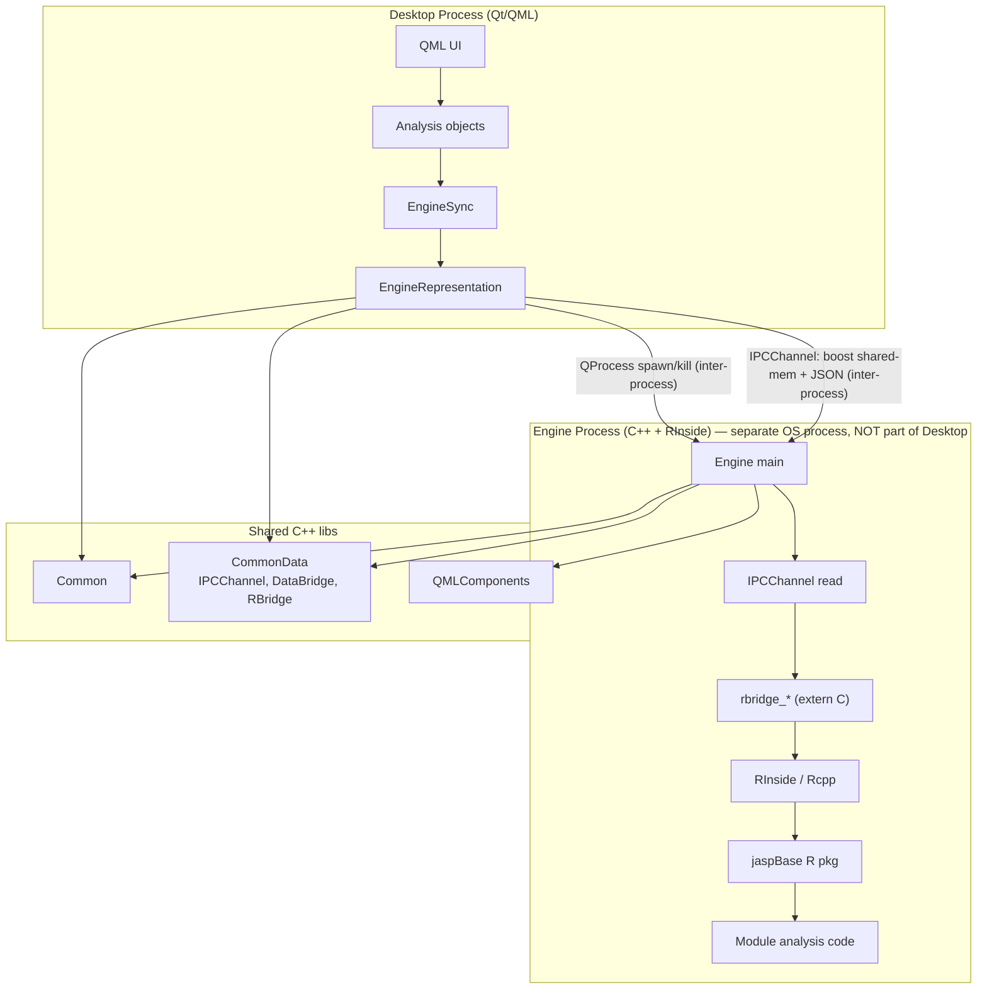

### Pain points (why this is an intertwined monolith)

| Problem | Where it lives |
|---|---|
| Frontend manages engine lifecycle (spawn, kill, cooldown, pause) | `EngineSync`, `EngineRepresentation` |
| IPC is homegrown boost shared-memory + JSON blobs with manual resize | `IPCChannel` |
| Engine is a C++ process that embeds R via RInside — a whole process just to be a C↔R glue layer | `Engine/`, `R-Interface/` |
| Protocol is a bag of enums in a header, no versioning, no spec | `enginedefinitions.h` |
| `CommonData` is linked by both sides and contains `DataBridge`, `RBridge`, `IPCChannel` — everyone knows about everyone | `CommonData/` |
| Engine links `QMLComponents` (!) — the R engine process links the QML form library | `CMakeLists.txt` |
| jaspBase analyses reach back into C++ via `rbridge_*` for data access — no clean data boundary | `RBridge`, `DataBridge` |

## 3. Target architecture

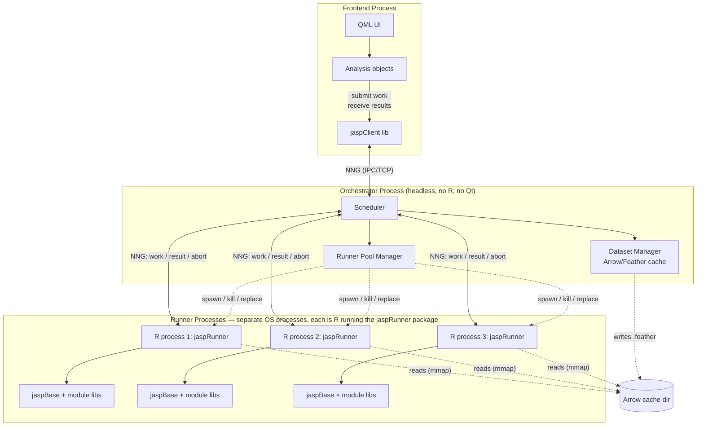

### Core principle: the frontend only knows work units

The frontend submits a **work unit** `{work_id, kind, revision, options, …}` and receives a
stream of **results** `{work_id, kind, status, payload, …}`. It has **zero** knowledge of:

- how many runners exist, or what language they run in;
- where the data comes from, or whether the dataset is CSV, SPSS, or whatever;
- whether a runner crashed and was replaced;
- whether the work is an analysis, raw R, a computed column, or a filter.

All of that is the orchestrator's problem. An analysis is just `kind:"analysis"`.

## 4. The invariant work unit

This is the concept the whole protocol is built on. Get this right and the message catalog,
the runner loop, the pool manager, and crash recovery all become small.

Three precise points, which the rest of this section unpacks:

- The **work unit is invariant** — a pure, self-contained function of its inputs (dataset +
  options + settings); same inputs, same result, on any runner, at any time.
- Most importantly, **the runner holds no state** between work units. This is the
  load-bearing property: it is what makes a work unit repeatable on any runner and the
  runner replaceable at any moment.
- The little state that remains (routing, inventory, workspaces, results, scratch) is held
  by the **orchestrator, centralized and readable** — on disk, inspectable, never hidden in
  opaque runner memory.

### 4.1 What a work unit is

A **work unit** is a complete, self-contained description of one thing to compute. It is the
atom of the system: the thing the frontend submits, the thing the orchestrator routes, the
thing the runner executes, and the thing results are keyed by.

Specifically, a work unit is a **runner-executed computation** — distinct from the
orchestrator's **data-plane operations** (`dataset_open`, `dataset_close`, `data_edit`, …),
which are cache mutations the orchestrator performs itself as sole cache writer (§5.2, §24, and
§19's “Two families of frontend request”). A cell edit, say, is *not* a work unit: it has no
`revision`/`result` contract, and a runner is read-only, so it could not perform the write.

Every work unit has, in common:

| Field | Meaning |
|---|---|
| `work_id` | Stable identity of this logical unit of work. For an analysis it is the analysis instance id; for raw R it is whatever id the requester chose. The same `work_id` across re-submissions means “the same work, updated.” |
| `kind` | What sort of work: `"analysis"`, `"rcode"`, and (later) `"computed_column"`, `"filter"`, … The discriminator that makes an analysis *one kind of work* rather than a special case. |
| `revision` | Monotonic integer per `work_id`, **supplied by the frontend** (bumped on each re-submission; the orchestrator neither assigns nor originates it). Newer wins; older is stale and discarded by the orchestrator (§23). |
| `dataset_ids` *(frontend form)* / `dataset_paths` *(runner form)* | The data — an **ordered array** of dataset references (usually one). The frontend names datasets by id; the orchestrator resolves each id to a concrete read-only path for the runner (one-to-one, order-preserving). Paths never cross the frontend boundary. An array so a future kind can reference multiple datasets without a protocol change. |
| `output_dir` | Writable directory for the work unit's file artifacts — **one self-contained dir per revision** (`results_<revision>/`, §4.7). The runner writes there and references artifacts by relative path; a new revision seeds recompute by copying a finished base revision's dir (copy-on-seed, §19.1 `base_revision`), never by sharing a mutable scratch. The runner has no filesystem policy of its own. |
| `payload` | The **kind-specific computation** — a single nested object, opaque to the orchestrator and forwarded verbatim to the runner. Schema discriminated by `kind` (below). |

…and then the **`payload`** body, whose schema is fixed per `kind`:

- `kind:"analysis"` → `payload = { module, module_version, analysis, options, settings }` —
  module name + version, the analysis name within the module, the analysis `options` (opaque to
  the orchestrator), and the output `settings`.
- `kind:"rcode"` → `payload = { code, env, settings? }` — raw R source, the evaluation env
  (`{libpaths?, module?}`), and optional output `settings`.
- future kinds (computed column, filter, image regeneration) define their own `payload` schema
  and are dispatched identically — **level zero stays unchanged as kinds grow**.

`settings` (decimals, notation, p-value format, result font, plot size/background) lives **inside
`payload`**, not level zero, because only the runner uses it — the orchestrator never interprets
it (a settings change just bumps `revision`). Nesting the kind-specific fields in one `payload`
makes `work` a clean discriminated union and mirrors `result`, whose kind-specific output is
likewise carried in a `payload` (§19.2).

The crucial property is **self-containment**: a work unit, plus the dataset it references,
is *everything* needed to execute it. Nothing is remembered from a previous work unit. No
options are “still in effect,” no settings are “currently set,” no environment persists. If
you want a different setting, you send a work unit that carries it.

### 4.2 The lifecycle of a work unit

```mermaid
sequenceDiagram
    participant FE as Frontend
    participant OR as Orchestrator (scheduler)
    participant RU as Runner (pure R)

    FE->>OR: work {work_id, kind, revision, dataset_ids, payload}
    OR->>OR: resolve dataset_ids -> dataset_paths;<br/>allocate output_dir;<br/>pick warm, capable runner (§6)
    OR->>RU: work {…same unit…, dataset_paths, output_dir}
    loop while running
        RU->>OR: result {work_id, kind, revision, status:"running"/"changed", payload}
        OR->>FE: result {…forwarded…}
    end
    RU->>OR: result {work_id, kind, revision, status:"complete", payload}
    OR->>FE: result {…forwarded…}
    Note over OR: orchestrator kept only work_id -> runner affinity,<br/>then discards it on completion
```

The orchestrator's entire job in this diagram is: translate identifiers, allocate an output
directory, choose a runner, forward `result`s home. It never opens the options, never
inspects the data, never tracks what the work unit needs.

### 4.3 Why invariance (and the stateless runner) makes everything else trivial

**Change is supersession, not an event.** Because a work unit is full desired state, every
mutation the user can make is the *same* operation — re-submit the work unit with a bumped
`revision`:

| User action | Wire effect |
|---|---|
| Runs an analysis | `work` (new `work_id`, `revision:1`) |
| Changes an option | `work` (same `work_id`, new `options`, `revision+1`) |
| Changes an output setting (decimals, plot size…) | `work` (same `work_id`, new `settings`, `revision+1`) |
| Re-runs | `work` (same `work_id`, `revision+1`) |
| Aborts | `abort` (`work_id`) |

There is no options-changed message, no settings message, no re-run command. One rule —
*newest revision of a `work_id` is the truth* — replaces a zoo of special cases. The sender
never needs to know whether the id is running, queued, or idle.

**The runner holds no state — so it is replaceable at any moment.** It keeps nothing but its
loaded libraries.
So “recycle this leaky R process,” “this runner crashed,” and “warm up a replacement” are all
the same operation: stop routing to runner A, route to runner B, and (for in-flight work)
re-send the current work unit to B. Because B needs nothing A had, the result is identical.
This is what makes the make-before-break rotation pool (§6) seamless and crash recovery a
non-event.

**New kinds of work are free.** The orchestrator routes on capability + warmth; it does not
know or care what a work unit *does*. So adding computed columns, filters, or image
regeneration is: define a new `kind`, teach a runner to execute it, done. No orchestrator
change, no new routing logic, no new state. The orchestrator's complexity does not grow with
the variety of work the system can run.

**The two boundaries are one protocol.** The frontend sends `work`, receives `result`. The
runner receives `work`, sends `result`. They are the *same messages* — the orchestrator routes between two identical conversations. This symmetry is why the protocol is
small and why a web deployment is a transport change, not a protocol change.

**Lost, reordered, or duplicated messages are harmless.** A work unit is invariant — full
desired state, not a delta.
Re-sending the latest work unit for a `work_id` is always correct, regardless of what got
lost or reordered on the way. The frontend supplies a fresh `revision` on each
re-submission (its own iteration count) and the orchestrator validates it is monotonic;
the stale-revision guard is the only ordering machinery needed.

### 4.4 The runner holds no state; the state that remains is centralized and readable

The runner holds nothing between work units but its loaded libraries. Everything else that
needs persisting lives in the orchestrator, centralized and readable:

| The orchestrator holds (centralized, readable) | It does **not** hold (execution state) |
|---|---|
| `work_id → owning runner` affinity, to route results/cancel/replace | How to run any work unit |
| `work_id → requesting session_id`, to route results home | What options/settings a work unit has |
| The module registry (capability: which runner advertises what) | Any per-work-unit context between messages |
| Dataset cache inventory (`dataset_id → path`) | Anything about the data's contents |
| Runner inventory (warm/busy/starting, invocation counts for rotation) | Any “current analysis” notion |

Every row on the left is inventory, routing metadata, or on-disk artifacts; none of it is
*execution state*, and all of it is **on disk and inspectable** — never hidden in opaque
runner memory. That is the whole game: the **runner holds no state**; the **orchestrator
holds the rest, in the open**; and the invariant work unit is why it can be.

### 4.5 Results and their identity

A work unit has two nouns: the **recipe** (how to run it — `work_id` + options + settings +
dataset) and its **results** (the last known output — the results tree + images). The recipe
is the work unit; the results are what it produced.

Results do **not** get their own id. There is **no `result_id`** — we have no interest in
result history. A result is identified by `(work_id, revision)`, and that identity is
*materialized as a folder*: `results_<revision>/`. The revision in the folder name *is* the
result's identity and location. A new revision writes a new folder; the current result is
`results_<latest_completed_revision>/`.

This is exactly what a `result_id` would have bought — per-result identity, atomic swap,
stable per-result image paths — keyed by the `revision` we already track instead of a new
identifier. So `result_id` is **retired**: redundant, because `(work_id, revision)` is the
identity and the folder name encodes it.

**The orchestrator manages and stores results**, not the frontend. The runner fully
serializes its results and sends them over the wire (`result` messages); images are just
files written into the result folder. The orchestrator owns the workspace folders (it owns
the filesystem and produces `.jasp`), so it stores and serves results; the frontend renders
them. (The orchestrator owning results is the natural choice: it already owns the data and
produces the `.jasp`.)

### 4.6 The recomputability invariant

Make it a contract: **every work unit is recomputable from its inputs (dataset + options +
settings) alone, with no scratchpad.** The scratchpad may be present, absent, corrupt, or
stale — the runner must still produce correct results from just the inputs. Equivalently:
delete every scratchpad, re-run everything, get the same answers.

So the scratchpad is a **cache, not state**. It speeds up incremental recompute (revision
N+1 reuses unchanged work from N) but is never *required*. This makes it disposable:

- **Crash-safe:** a torn scratchpad is discarded → recompute. No correctness problem.
- **Version-safe:** a scratchpad from an older jaspBase is discarded → recompute. No migration.
- **Evictable:** under disk pressure, a scratchpad can be dropped → recompute later.

This is what lets the scratchpad be **opt-in in saves** (`persist_scratchpad`): including it
makes the first edit after open incremental; omitting it keeps the file clean and the
invariant literally true. Either way, correctness never depends on it.

### 4.7 State on disk: the file structure

The state the orchestrator manages lives on disk, centralized and readable. Defining the
layout clears up most lifecycle questions.

Runtime (one root; one folder per session):

```
<state_root>/                              e.g. a per-launch temp dir
└── <session_id>/
    ├── datasets/
    │   └── <dataset_id>.arrow             dataset for this session (Arrow IPC + LZ4),
    │                                      incl. session-attached filters & computed columns
    └── workspaces/
        └── <work_id>/
            └── results_<rev>/             ONE self-contained dir per revision — the runner's
                │                          writable output_dir for that revision: working state
                │                          mid-run, published (immutable) result once complete
                ├── results.json           the results tree
                ├── images/                plots referenced by results.json (relative paths)
                └── jaspState.RData        jaspResults recompute state (incremental-recompute cache)
```

- **Each revision is self-contained.** `results_<rev>/` is the `output_dir` the orchestrator
  hands the runner for that revision (§19.3): the runner writes its working state *and* its
  published result there, referencing artifacts by paths relative to it. There is **no shared
  `scratch/` spanning revisions**.
- **Incremental recompute = copy-on-seed.** To reuse a prior revision's computation, the
  frontend names a `base_revision` (§19.1); the orchestrator resolves it to
  `results_<base_revision>/` (injected as `base_results_dir`, §19.3) and the runner **copies
  that finished dir into its own `results_<rev>/`** before running, then loads the copied
  jaspResults state. Because a revision only ever *reads* a finished base and *writes* its own
  dir, concurrent or out-of-order revisions can never clobber each other — the
  shared-mutable-scratch race is structurally impossible.
- **Current result** = `results_<latest_completed_revision>/`; the orchestrator keeps a
  `work_id → current rev` pointer.
- **GC is frontend-driven and revision-granular.** The frontend — which knows what it is still
  showing — discards revisions via `work_close(work_id, revision)` (§19.1); the orchestrator
  reclaims `results_<revision>/` (or the whole `work_id` tree if no revision is given). Steady
  state ≈ one result folder per work (plus the one being written). The revision-in-the-name
  makes the swap clobber-free and gives stable per-result image paths.

### 4.8 Save and open

The `.jasp` file is a single document, so `session_id` is implicit (no session wrapper):

```
.jasp (ZIP)
├── manifest.json                jasp/protocol/results-format versions + original dataset source refs
├── frontend.json                frontend config: datasets[], analyses[{work_id, kind, revision, dataset_ids, payload}], ui_state
├── datasets/
│   └── <dataset_id>.arrow       the used datasets (one per dataset_id)
└── workspaces/
    └── <work_id>/
        ├── results_<rev>/       the CURRENT result (snapshot at the saved revision)
        └── scratch/             only if persist_scratchpad (else omitted)
```

**Save** — the frontend owns the document structure (which analyses, their options, the UI
state); the orchestrator owns the artifacts (data + results):

```
Frontend → Orchestrator:  save { frontend_config, target_path }
Orchestrator:             write manifest + frontend.json
                          zip frontend.json + datasets/ (cached .arrow) + workspaces/ (current result, ± scratch)
                          → target_path  (write to temp file, then rename — atomic)
Orchestrator → Frontend:  save_complete { ok } | error
```

**Open** is the mirror image:

```
Frontend → Orchestrator:  open { path }
Orchestrator:             read .jasp; extract datasets/ → cache, workspaces/ → session
                          send the frontend its frontend.json
                          replay each work unit's current result through the normal `result` channel
Frontend:                 restore UI from frontend.json; display the replayed results
```

Restored results come back through the **same `result` flow** as freshly computed ones — the
frontend can't tell the difference, and there's no special load path. No re-run on open
(results are restored); an edit re-submits the work unit (`revision+1`) and runs
incrementally off the restored scratch (if persisted) or from scratch (the invariant).

### 4.9 Per-session datasets

Datasets live **per session** (`<session_id>/datasets/<dataset_id>.arrow`) — and this is not
a choice, it is forced. **Filters and computed columns are attached directly to the dataset**
within a session: a session's dataset is the raw data *plus* that session's filters and
computed columns. So a dataset carries session-specific state and cannot be shared across
sessions. Per-session datasets fall straight out of that.

(Sharing a dataset across sessions — deduplicating bytes — would only matter for
multi-frontend/multi-tenant, and even then per-session filters/computed columns make true
sharing awkward. It's a later concern; the `dataset_id` indirection means workspaces never
hardcode a path, so it's a contained change if ever needed.)

## 5. Components

### 5.1 Frontend (`jaspClient`)

A thin library (C++ today, whatever the frontend is in later) that speaks exactly two
operational messages: it submits **`work`** and receives **`result`** streams. Plus the
data-plane and control messages (`dataset_open`, `data_edit`, `list_modules`, `ping`).

- `submit(work) → stream<result>` — fire and forget; results stream back keyed by `work_id`.
- `abort(work_id)` — cancel a running work unit.
- `status()` — orchestrator health, runner pool state (debug UI only).

The frontend links **only** `jaspClient`. No `CommonData`, no `EngineSync`, no
`EngineRepresentation`, no `IPCChannel`. Those all die.

The frontend never sees a path, a runner, or a canonical column name. It refers to datasets
by `dataset_id` and to columns by the **real** names the user sees; results come back
real-named. It does not know — and cannot depend on — whether a work unit ran in a managed
pool runner or an attached dev runner, or whether the backend is local or in a container.

**Realized design (alpha, C++).** `JaspClient` is a `QObject` facade exposing a single generic
`submit(work, handler) → work_id` plus `abort(work_id)` — **no analysis-specific methods**. The
caller fills in the envelope's `work_id`; analyses use their stable instance id
(`Analysis::workId() = "a" + instance id`), generic/one-shot work omits it and the client mints one.

- **Correlation.** The client keeps `work_id → {revision, handler}`. Re-submitting the same
  `work_id` with a higher `revision` **evicts by assignment** — the new handler simply replaces the
  old slot, so "options changed" needs no abort bookkeeping. A `result` whose `revision` is below the
  slot's is **stale and dropped**; the slot's `revision` is the per-`work_id` high-water mark (§23).
  **Caller-uniqueness contract:** a caller-supplied `work_id` must be unique per logical work unit
  within the session — the client cannot distinguish a re-submission from a collision, so uniqueness
  is the caller's responsibility (upheld for analyses by `Analyses`' id assignment).
- **Transport.** A dedicated receiver thread blocks on NNG `recv`; each incoming frame is handed to
  the GUI thread through a *single* queued invocation, where the handler runs (Qt objects are
  main-thread-only). No `QTimer` polling, no signal/slot routing web.
- **IO logging.** `JASP_CLIENT_LOG=off|stub|full` (env) logs wire IO (nothing / one-line summary /
  full JSON).
- **Display-only `Analysis` status.** `enum Status { Empty, Running, Complete, Aborted,
  ValidationError, FatalError }`. The legacy **command-states** (`SaveImg`, `EditImg`, `RewriteImgs`,
  `RunningImg`, `Aborting`) and the `KeepStatus` sentinel are **gone**, as are the `shouldRun()` poll
  predicate and the `desiredPerformTypeFromAnalysisStatus()` status→command mapper. Work is triggered
  by an **explicit `submit`** from `Analysis::run()` — never by setting a status and waiting for a
  poller. Image save/edit/rewrite are deferred (logged stubs).

### 5.2 Orchestrator

The brain. A **headless** process with no Qt, no QML, no R. It is a scheduler with **no execution state**
(§4): because every work unit is self-contained, the orchestrator never tracks *how* to run
work or *what state* it needs. Its only concerns are **(1) execution time** (route each work
unit to a *warm* runner that already has the needed libraries loaded) and **(2) capability
constraints** (route to a runner that *can* execute it: advertises the module at the right
version / can serve the rcode `env` / has the required capabilities). The `work_id → runner`
affinity it keeps is bookkeeping to stream results home and deliver cancel/replace — not
execution state. The payoff: a new kind of work adds **no** execution state; it is routed
like any other work unit.

It also owns the filesystem layout on both ends: each work unit gets read-only input
`dataset_paths` (resolved from the frontend's `dataset_ids`) and a writable per-work `output_dir`
for artifacts (§19) — the runner has no filesystem policy of its own.

Responsibilities:

| Concern | Detail |
|---|---|
| **Frontend sessions** | Accept **one or more** concurrent frontends, each on its own PAIR channel via the control handshake (§17.2). Track `work_id → {runner, session_id}` so each `result` routes to the requesting frontend; broadcast module-list changes to all frontends. |
| **Module registry (authority)** | The single authority on *capability*: know the union of installed + managed-pool + attached-runner modules (each `{name, version}` + display metadata) and serve it to frontends (`list_modules` / `modules`). Frontends never scan the filesystem. |
| **Work routing** | Receive `work`; dispatch to a runner chosen by (1) **capability** (advertises the module *at the requested version* / can serve the rcode `env`) and (2) **warmth** (already has the libs loaded — module-typed LRU pool). Attached runners preferred (§10). No unloading of deps between work units. |
| **Dataset management** | Own the **dataset index** (`dataset_id → {cache_path, schema, revision}`) — *identity, not I/O*. On `dataset_open`: mint the id, assign the target `cache_path`, and **route the conversion by format** to the lane that opens it (§5.4, §8.1); on `data_edit`/`data_update`: bump `revision` and route the write to the **Rust data-runner** (sole cache writer), then broadcast `data_changed`. The orchestrator never reads or converts a byte. Allocate each work unit a writable `output_dir` for artifacts. |
| **Runner pool** | Maintain a **fixed pool of N warm runners** (`pool_size`, default 4). On a miss, evict the LRU runner and spawn the needed one. Track state: `starting`, `ready`, `busy`, `dead` (rotation/retirement is orchestrator-internal, not a runner state). (Memory-based sizing is deferred — §25.) |
| **Runner lifecycle** | Count work per managed runner. Past a **soft** `max_invocations` (50–100) spawn a replacement (same library set) but the old runner **keeps serving**; only once the replacement is READY does it stop routing to the old runner and shut it down (**make-before-break** — no cold window; the pool briefly runs at N+1). The runner itself is oblivious — it just serves `work` until `shutdown`. |
| **Result forwarding** | Stream each `result` from a runner back to the originating frontend (by `session_id`). Handle runner death mid-work → notify that frontend with an error, re-run the work unit on a fresh runner (statelessness makes this trivial). |

### 5.3 Runner (pure-R process)

**This is the big kill.** The entire `Engine/` C++ directory, `R-Interface/`,
`jasprcpp.cpp`, `RBridge`, `DataBridge` — all replaced by an R package:

**`jaspRunner`** (new R package):

```
jaspRunner/
├── R/
│   ├── main.R          # Entry point: connect, message loop
│   ├── connection.R    # nanonext socket setup
│   ├── handler.R       # Dispatch work units by kind (analysis / rcode / …)
│   ├── data.R          # Arrow/Feather dataset loading (replaces rbridge_readDataSet)
│   ├── results.R       # Result serialization back to orchestrator
│   └── lifecycle.R     # Graceful shutdown on `shutdown`
├── DESCRIPTION
└── NAMESPACE
```

The runner is a **stateless worker** (§4): it receives a work unit, executes it, streams
`result`s, and forgets it. Its life:

```r
# Pseudocode
sock <- nanonext::socket("pair", dial = orchestrator_addr)

repeat {
  msg <- nanonext::recv(sock, mode = "character")
  unit <- jsonlite::fromJSON(msg)

  if (unit$type == "shutdown") break

  # Load dataset via Arrow (mmap, zero-copy)
  dataset <- arrow::read_feather(unit$dataset_path)

  # Execute by kind
  result <- switch(unit$kind,
    analysis = jaspBase::runAnalysis(
                 module  = unit$module,
                 name    = unit$analysis,
                 options = unit$options,
                 dataset = dataset),
    rcode    = eval_r(unit$code, unit$env))

  # Stream results back, tagged with this work unit's revision
  nanonext::send(sock, jsonlite::toJSON(result))
  # No self-budget: the runner keeps serving until the orchestrator sends
  # `shutdown` (rotation is make-before-break, orchestrator-driven; §6).
}
```

Note what is absent: no invocation counter, no “am I too old” logic, no drain state. The
runner does not manage itself; it is pure execution. All lifecycle decisions live in the
orchestrator. This is the statelessness principle made concrete.

**jaspBase** stays (for now). But its data access layer (`rbridge_readDataSet`,
`rbridge_getColumnData`, etc.) gets replaced by `jaspRunner::data.R`, which reads from the
Arrow cache. jaspBase includes `jaspRunner` as a dependency and delegates data access to it.
Over time jaspBase can be cleaned up, but that is a separate war (§12).

### 5.4 Data plane (routed to two lanes)

The data plane is **not a special component** — it is runners advertising `data` capabilities
(a `{kind:"data", op, formats?}` entry in the unified `capabilities` list, §9.3) and receiving
that work through the **same capability routing** as any analysis module (§9.4). `dataset_open`
/ `data_edit` are just work; the broker looks up the capability and forwards. Because it is
defined by a *capability*, the implementation is swappable behind an unchanged protocol. The
work splits into **two lanes**:

| Lane | Advertises | Why |
|---|---|---|
| **R utility runner** | `data_open` for **reader-heavy** formats — `csv`, `spss` (`.sav`), `jasp-legacy` (old SQLite `.jasp`), and the other `haven`/`readxl` statistical formats (`excel`, `stata`, `sas`) | These formats are *defined by a hard reader*. R's `haven`/`readxl`/legacy-JASP readers are battle-tested; there is nothing to build. |
| **Rust data-runner** (`arrow-rs`) | `data_open` for **Arrow-native** formats — `arrow`/`feather`, `parquet` — **and every write**: `data_edit`, `data_close`, the computed-column `data_update` path | These are pure Arrow operations where `arrow-rs` is fast and native, with no R-reader advantage and no Rcpp dependency. |

**The rule: R opens what needs a reader; Rust opens what is already Arrow, and Rust owns every
write.** Opens may be served by either lane — each writes its own orchestrator-assigned
`cache_path`, so concurrent opens never contend. **Edits are Rust's alone**, which keeps a
single serialized writer per existing dataset and preserves the `revision` invalidation
invariant (§23). The orchestrator never reads or converts a byte — it routes and owns the
dataset index (`dataset_id → {cache_path, schema, revision}`).

Both lanes share one contract: **path in → Arrow file written to disk → `{schema, rows}`
reply** (a few KB; data never crosses the wire regardless of size, §8.1).

**R is a permanent lane, not a stopgap** — for as long as the reader-heavy formats are best
served by R's ecosystem. The Rust data-runner is the destination for the Arrow/edit path *now*
(the hot path, on every analysis), and may absorb more open formats over time (CSV is the
natural candidate — `arrow-rs`/`csv` handle it well; it lives in the R lane for the alpha only
because R's `fread`/`readr` are the most robust messy-CSV readers already in the tree). As
native Rust readers mature, formats migrate lanes by changing one `register` advertisement —
no protocol change.

**Lifecycle: both lanes are pinned, not rotated.** As the cache's writers they are core
infrastructure, so both are **exempt from the invocation-count rotation** of §6 and **pinned
like attached runners** (§9.4) — never LRU-evicted, never recycled mid-flight; they leave only
on disconnect/deregister. The R lane is a long-lived process that grows in memory and is
supervised/restarted by the orchestrator on crash — the concrete reason the Rust lane (which
neither leaks nor needs rotation) owns the frequent edit path.

> **R-version constraint.** The R lane needs a working `arrow` + `haven`/`readxl`. On the
> current reference R (4.6.1) the Rcpp 1.1.1 incompatibility must be checked; if a
> pure-`arrow`+`haven` path proves impossible there, the R lane uses an Rcpp-compatible R. This
> is the same constraint that motivated the base-R descriptives stand-in — and a reason the
> edit path (the hot path) lives in Rust, which has no R dependency at all.

## 6. Runner pool & rotation

### 6.1 Runners are module-typed

Each JASP module has its own dependency library set. `jaspSem` needs `lavaan`,
`jaspMachineLearning` needs `caret`/`xgboost`, `jaspDescriptives` needs `ggplot2`. These sets
are large, slow to load, and potentially conflicting. Loading them all into one runner is
impractical.

**A runner loads one *or more* modules' library sets, and only runs work for the modules it
advertises.** It is “typed” at startup to its advertised module set — each as an
`analysis` capability `{kind:"analysis", name, version}`, so routes are keyed by name **and**
version (a dev runner's WIP version and the installed release version can coexist; see
`register.capabilities`, `work.module`/`module_version`). A runner may advertise several
`analysis` capabilities and/or an `rcode` capability.

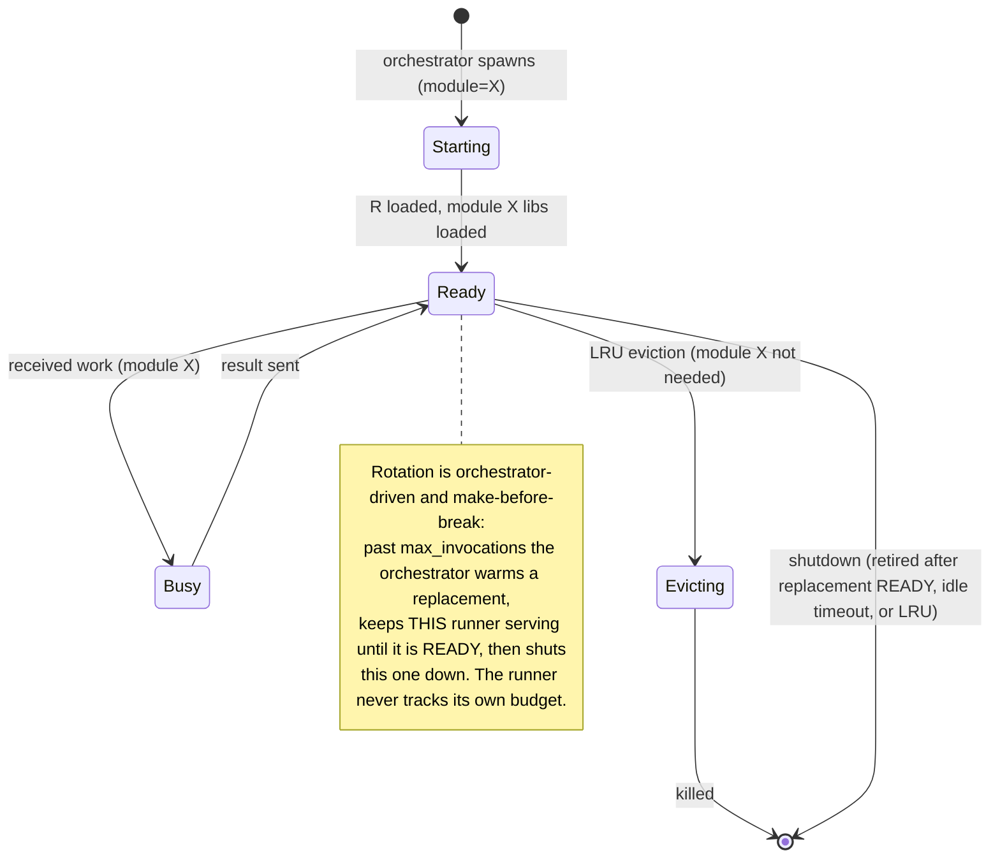

> **Data-plane runners are exempt.** The rotation rules here apply to *module-typed analysis
> runners*. Runners that advertise `data` capabilities — the R utility runner and the Rust
> data-runner (§5.4) — are cache infrastructure and are **pinned, not rotated**: never
> LRU-evicted, never recycled by invocation count, like attached runners (§9.4). They leave the
> pool only on disconnect or deregister.

### 6.2 Pool = LRU module cache

Think of the runner pool as a **CPU L1 cache for module libraries**. The pool holds the last
X modules that were used. Cache hits are fast (runner already warm). Cache misses evict the
LRU module and spin up a new runner.

```
pool: Map<module@version, Runner>   # fixed pool, max size = POOL_SIZE (e.g. 4)
lru:  OrderedQueue<module@version>  # eviction order (coldest module-set first)

on work(module=M):
    if M in pool and pool[M].state == READY:
        send work to pool[M]               # cache hit, fast path
        touch_lru(M)

    elif M in pool and pool[M].state == BUSY:
        enqueue(work, for_module=M)        # module loaded but runner busy
        touch_lru(M)

    else:                                  # cache miss
        victim = lru.evict()               # least recently used module
        pool[victim].mark_for_eviction()   # kill when idle (or now if idle)
        pool[M] = spawn_runner(module=M)   # start warming up immediately
        enqueue(work, for_module=M)        # queued until runner is READY
        lru.push(M)
```

**Miss rate will be low.** Most users work with 2–3 modules per session. With a pool of 4,
you almost never evict. The cold-start penalty (loading module libs) happens once per module
per session, same as today.

### 6.3 Key parameters

| Parameter | Suggested default | Rationale |
|---|---|---|
| `pool_size` | 4 | Number of warm managed runners (fixed pool). Simple and predictable for v1. (Memory-based sizing is deferred — §25.) |
| `max_invocations` | 50–100 | **Soft** threshold (R leaks memory). Past it, the orchestrator warms a replacement and retires this runner **only once the replacement is READY** (make-before-break). Tune empirically. |
| `idle_timeout` | 30 min | Current `ENGINE_BORED_SHUTDOWN`. Keep it. |
| `startup_warmup` | Load module libs on start | The expensive part (5–15s). Do it once per module, reuse. |
| `eviction_policy` | LRU | Evict least-recently-used module-set on a miss. Simple, effective. |

### 6.4 Make-before-break rotation (seamless)

R leaks memory, so managed runners are recycled after enough work — but **never** in a way
that leaves a module without a warm runner. The invocation limit is a **soft** trigger and
the orchestrator drives the whole rotation; the runner itself is oblivious (it just serves
`work` until it gets `shutdown`):

1. The orchestrator counts the `work` it dispatches to each managed runner.
2. When a runner crosses `max_invocations`, the orchestrator **spawns a replacement** (same
   module-set). The old runner **keeps serving** — the orchestrator keeps routing new work to
   it.
3. While the replacement warms (the slow part, ~5–15 s), the pool briefly runs at
   `pool_size + 1`. This over-subscription is deliberate and bounded (one extra per
   module-set being rotated, only for the warmup window).
4. Once the replacement is **READY**, the orchestrator stops routing new work to the old
   runner, lets its in-flight item finish, then sends it `shutdown`; it exits and the pool
   returns to `pool_size`.

**Invariant — the seamlessness guarantee:** a runner is retired **only after its replacement
is confirmed READY**. If a replacement fails to start (module won't load, crash during
warmup), the orchestrator keeps the old runner alive and retries the replacement later.
Because the old runner covers the replacement's entire warmup, the module-set always has ≥1
warm runner — there is **no cold window and no stutter** at rotation. (A naive
kill-then-spawn would instead leave a cold gap of one full warmup.)

Why this works at all: **the runner is stateless** (§4). Warming a replacement and moving
work to it requires no state transfer — a fresh runner given the same work unit produces the
same result. Rotation is just “run it over there instead,” which is only possible because
“there” needs nothing from “here.”

## 7. R interruption & the queue-processing pattern

### 7.1 The problem

R is single-threaded and ancient. You cannot interrupt it from outside once it's running,
especially inside compiled C/C++/Fortran routines. There is no safe `SIGINT` handler that
works reliably across all R packages.

### 7.2 Current mechanism (confirmed by code inspection)

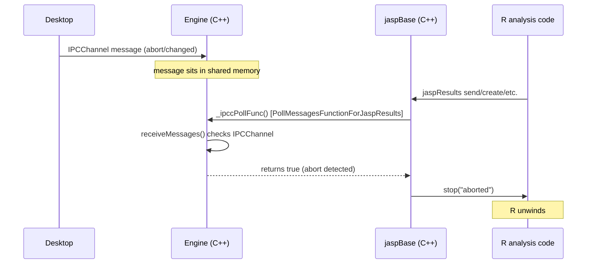

- `PollMessagesFunctionForJaspResults` is registered into jaspBase via
  `jaspResults::setPollMessagesFunc()` during `rbridge_init`.
- jaspBase calls it from C++ whenever it does something (send results, create objects).
- If abort detected → returns `true` → jaspBase calls `stop()` → R unwinds.
- **Limitation**: if R is stuck in `lme4`'s C++ optimizer or any long compiled routine that
  doesn't call back into jaspBase, **nothing fires**. The only escape is `ENGINE_KILLTIME`
  (750ms) → `killProcess()` → SIGKILL the whole engine.

### 7.3 New mechanism: queue processing replaces pollForAbort

With NNG, messages are already queued in the socket. The runner doesn't need a shared-memory
flag to check. It just **processes its inbound queue** and reconciles its work queue (§20).

**Every queue-processing tick is also an activity signal.** Each time the runner processes its
queue, that is an opportunity to "phone home" and report liveness. When it produces a `result`,
the result *is* the activity signal; when it has processed its queue but has nothing to return,
it sends a lightweight `activity` message (§19.4), rate-limited by `activity_min_interval_ms`
(§25.1) so a busy analysis does not spam. The orchestrator stamps `last_activity` on receipt of
**any** message and uses it for silence-based hang detection (§25.4). This is opportunistic
liveness — a byproduct of real work, **not a timer** — and it is language-agnostic
(`last_activity`, not R-specific), so it generalizes to Python/Rust runners (§7.5).

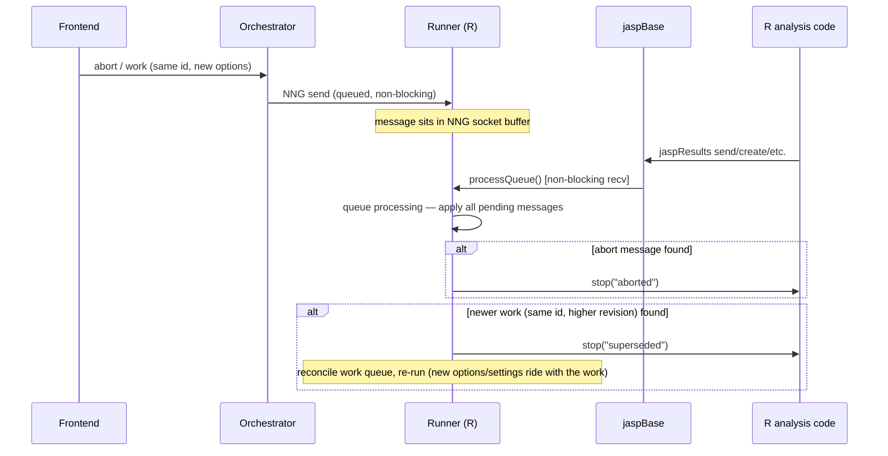

**The key change**: jaspBase's poll callback no longer checks a C++ flag. It triggers the
runner's **queue processing** — a non-blocking `recv_aio` (or `recv(mode="raw", block=FALSE)`)
on the NNG socket — and reconciles the work queue (§20): a newer `work` for the running
`work_id` calls `stop()` to cancel and re-run (the new options *and* output settings ride
with the `work`); `abort` calls `stop()` and drops the item.

```r
# jaspRunner::processQueue (pseudocode)
processQueue <- function() {
  repeat {
    msg <- nanonext::recv_aio(sock, mode = "character", timeout = 0)  # non-blocking
    if (inherits(msg, "errorValue")) break  # nothing in queue

    parsed <- jsonlite::fromJSON(msg$data)

    switch(parsed$type,
      "work" = evict_then_append(parsed$work_id, parsed$revision, parsed), # evict same id (cancel if running) + append to BACK; ignore stale rev
      "abort"    = stop("analysis_aborted"),
      "shutdown" = { should_exit <<- TRUE; stop("runner_shutdown") }
    )
  }
}
```

### 7.4 What this buys you

| Scenario | Old behavior | New behavior |
|---|---|---|
| User changes options mid-analysis | Desktop sets flag → next jaspBase call sees it → abort → re-run | Frontend re-sends `work` (same `work_id`, new options, higher revision) → queue processing evicts the running one and re-queues it **at the back** (evict-and-append) → executor re-runs it after already-queued items |
| User hits abort | Same as above, via `abort` flag | Same, via `abort` message |
| Settings change (e.g., decimal places) | Flag set, applied eventually | Frontend re-sends affected `work` with new `settings` + bumped revision → runner re-runs with the new settings (settings ride with `work`) |
| R stuck in C++ routine (lme4, etc.) | **Nothing happens** until C returns or ENGINE_KILLTIME kills the process | **Same limitation** — processQueue can't fire if R never calls jaspBase. Nuclear option: orchestrator kills runner after timeout. |
| Multiple rapid option changes | Last flag wins | NNG queues all messages; queue processing applies them in order. The newest `work` (highest revision) for an id wins. |

### 7.5 The NNG queuing advantage

NNG sockets have internal buffers. If the runner is busy, messages pile up in the socket
buffer. They don't get lost. When queue processing next fires, it handles everything in
order. No race conditions, no lost messages, no shared-memory resize bugs. This is strictly
better than the current shared-memory flag approach because:

1. **Multiple message types** (`work`, `abort`, `shutdown`) instead of one boolean flag.
2. **Ordering is preserved** — messages are processed in the order they were sent.
3. **No shared memory** — no mutex contention, no resize bugs, no heartbeat files.
4. **The same mechanism works for Python runners later** — `pynng` has the same API.

### 7.6 The hard limitation (unchanged)

If R is inside a compiled C/C++/Fortran routine that doesn't call back into R or jaspBase,
**nothing can interrupt it**. This is an R platform limitation, not an architecture
limitation. The mitigations are:

1. **Orchestrator kill timeout**: if a runner doesn't respond to abort within T seconds (say
   5s), the orchestrator SIGKILLs it and spins up a replacement. The work unit is re-run on
   the fresh runner (statelessness — §4). The user may see a delay but not a failure. This is
   the current `ENGINE_KILLTIME` behavior, preserved and improved (re-run instead of lost).
2. **Cooperative C code**: well-behaved R packages call `R_CheckUserInterrupt()` in their C
   loops. This is not our problem to fix.
3. **Accept the delay**: most analyses call jaspBase frequently enough (creating result
   tables, plots, etc.) that the interrupt latency is sub-second.

## 8. The data plane

Data is a first-class artifact: one shared, zero-copy, columnar file that every analysis
runner reads and the **data-plane runners** write (§5.4). The orchestrator never touches the
bytes — it routes data work to whichever runner advertises the capability and owns the dataset
index. This section consolidates the cache format, the column-name encoding contract, the
Arrow type representation, and the `.jasp` file format.

### 8.1 The Arrow cache (Feather + LZ4)

```mermaid
sequenceDiagram
    participant User
    participant Frontend
    participant Orchestrator
    participant Data as Data-plane runner (lane chosen by format)
    participant Cache as Arrow Cache Dir
    participant Runner as Analysis Runner

    User->>Frontend: Open dataset (CSV/SPSS/...)
    Frontend->>Orchestrator: dataset_open {path, format}
    Note over Orchestrator: mint dataset_id, reserve index entry,<br/>route by format to the lane that opens it<br/>(R utility for csv/spss/jasp-legacy; Rust for arrow/parquet)
    Orchestrator->>Data: work {kind:data, op:data_open, format, cache_path, source}
    Data->>Data: read source + canonicalize (R readers or arrow-rs)
    Data->>Cache: write .feather (Arrow IPC, LZ4) to cache_path
    Note over Data: store real↔canonical display map<br/>in schema metadata
    Data->>Orchestrator: result {schema, rows}
    Note over Orchestrator: finalize index entry<br/>(dataset_id → path, schema, revision)
    Orchestrator->>Frontend: dataset_ready {id, schema}

    Note over Cache: File sits on disk,<br/>memory-mappable

    User->>Frontend: Submit work
    Frontend->>Orchestrator: work {payload, dataset_ids}
    Orchestrator->>Runner: work {payload, dataset_paths}
    Runner->>Cache: mmap .feather (zero-copy)
    Runner->>Runner: jaspBase::runAnalysis()
    Runner->>Orchestrator: result {status: complete, payload}
    Orchestrator->>Frontend: result
    Frontend->>User: Show results
```

The **broker threads never touch the disk.** `dataset_open`, `data_edit`, and the
computed-column write path are all *routed work* — the orchestrator forwards them exactly as
it forwards analysis `work`. The orchestrator owns only the **dataset index** —
`dataset_id → {cache_path, schema, revision}` — i.e. *identity*, not I/O. It mints the
`dataset_id`, assigns the target `cache_path`, tracks `revision`, and broadcasts
`data_changed`; it never reads or converts a byte.

The I/O is done by **two capability-routed lanes** (§5.4), split so each format is handled by
whatever is best at it:

- **Opens route by source format.** `dataset_open` carries the format (from `format_hint`, or
  sniffed); the broker forwards it to the lane advertising `data_open` for that format. The
  **R utility runner** opens the *reader-heavy* formats — `csv`, `spss` (`.sav`),
  `jasp-legacy` (old SQLite `.jasp`), and the other `haven`/`readxl` formats — reusing R's
  battle-tested readers. The **Rust data-runner** opens the *Arrow-native* formats
  (`arrow`/`feather`, `parquet`) with `arrow-rs`.
- **All writes route to Rust.** `data_edit`, `data_close`, and the computed-column
  `data_update` path go to the Rust data-runner, the sole mutator of existing cache files —
  which keeps one serialized writer per dataset and preserves the `revision` invariant (§23).

Whichever lane handles an open, the contract is identical: it ingests the source **once**,
canonicalizes column names, and writes a single **Feather V2 (Arrow IPC)** file **to the
`cache_path` the orchestrator supplied** — **to disk, not over the wire**. It replies with
only `{schema, rows}` (a few KB) regardless of dataset size. Because the data plane is defined
by a capability, not a binary, formats can migrate lanes (e.g. CSV → Rust) by changing one
`register` advertisement, with no protocol change.

**Analysis runners** read the cache with `arrow::read_feather()` (mmap, zero-copy). No
column-by-column copy, no preload/non-preload fork, no `RBridgeColumn`, no static global.
The **frontend** refers to data only by `dataset_id`; the orchestrator resolves it to a
`dataset_path` for the runner. Paths never cross the frontend boundary.

**Why Feather/Arrow IPC (not Parquet)?**

| | Feather (Arrow IPC) | Parquet |
|---|---|---|
| Read speed | **Fastest** — memory-mapped, zero-copy | Slower — must decompress + deserialize |
| Write speed | Fast | Slower (encoding + compression) |
| Column pruning | Yes | Yes |
| File size | Larger (no compression by default, optional LZ4/ZSTD) | Smallest |
| Use case | **Intermediate exchange between processes** | Long-term storage / analytics |

For JASP's use case (write once on dataset open, read many times per work unit, rewritten on
dataset edit), Feather is the right choice. The data is hot and local. We're optimizing for
read latency into R, not disk space.

**LZ4 compression is mandatory** on all Feather cache files and all inline Arrow IPC
payloads (§24.5). LZ4 decompresses at ~4 GB/s per core — effectively free at read time —
while cutting size ~2–4× on typical data. No uncompressed mode; the toggle complexity isn't
worth it.

### 8.2 Column-name canonicalization & the encoding contract

> **Canonicalize the data's column names *once*, at ingestion, into a clean columnar
> artifact (Arrow) that carries a real↔canonical display map in its schema metadata.
> Everything internal uses the canonical (syntactic) names; translation happens only at the
> user boundary — once each way — not smeared across the pipeline.**

User column names are arbitrary (`"Age (years)"`, `"Income (log €)"`) and are **not** valid R
symbols. Today JASP keeps the arbitrary names and **encodes them on the fly at every
boundary** — options in C++, formulas in R, R-scripts in C++, plots in R — with multiple
encoders and deliberate asymmetries. That smear is a symptom of embedding R inside C++:
the C++/R seam runs through the middle of the program, so translation got split across it.
Making R a **standalone process** puts a clean boundary back, and translation collapses to
that boundary.

| Component | Role in encoding |
|---|---|
| **Orchestrator (once, at cache-build)** | Assigns each column a clean **canonical** (R-syntactic) name and stores the **real↔canonical display map in the Arrow schema metadata**. Built once per dataset. After that the orchestrator is **name-agnostic** — it routes by module and never touches column names per-work. |
| **Frontend** | **Language-agnostic.** Sends `anova("Age (years)", "Group", …)` with the **real** names the user sees; receives **real-named** results back. Knows nothing about R or encoding. |
| **Runner** | Reads the display map from the Arrow metadata and does **all** translation: **encode** incoming options real→canonical (including user R-code via the `encodeRScript` regex), work in canonical space, then **decode** results canonical→real for display before sending them back. Every encode/decode is a cheap **in-R map lookup** — no C++ round-trip. |

Two consequences to internalize:

- **Decode still happens at every exit point** — a plot is rasterized in R, so its axis
  labels must be real *before* rasterization; a table header shown to the user must be the
  real name. The decode *sites* don't shrink. What changes is that each decode is a trivial
  in-R lookup against the one central map, instead of a C++ round-trip — and the encode side
  collapses (3 sites → 1).
- **The one encode that can't be wished away is user-written R code** (`encodeRScript`): the
  user types real column names into R, so those must be mapped to canonical. It lives in the
  **runner** precisely because it's R code handled in R — which is also why the orchestrator
  stays out of name-translation entirely.

> **Why the map is “made once, thank the gods”:** the real↔canonical map is built a single
> time when the dataset is cached, and stored *in the data itself* (Arrow schema metadata,
> e.g. a `jasp:display_name` field-metadata key holding the real name on the canonically-named
> field). Every later encode/decode is just a lookup into that one artifact — no per-analysis
> recomputation, no C++ round-trip, no duplicated “which strings are columns” knowledge.

**Computed columns** are the one **write** path: a runner that computes a column sends a
`data_update` (§19.4) to the orchestrator (the cache owner), which applies it to the Arrow
cache — the new column gets a canonical name and a display-map entry like any other — then
broadcasts `data_changed` (§19.2) to all frontends. The runner sends it and forgets
(statelessness); the orchestrator is the sole cache writer.

### 8.3 Types & representation in Arrow

This is the single place that defines how JASP's column types are physically stored in the
Arrow cache and how runners recover the R types analyses expect.

#### The type map

| JASP type | Arrow type | Field metadata | R (analysis sees) |
|---|---|---|---|
| `scale` | `float64` — **always**, even when every value is integral | `jasp:all_integer` (display hint) | `numeric` |
| `ordinal` | `dictionary<int32, utf8, ordered=1>` | `jasp:labels` (sparse) | `ordered()` factor, levels = labels |
| `nominal` | `dictionary<int32, utf8, ordered=0>` | `jasp:labels` (sparse) | `factor`, levels = labels |
| string categorical | `dictionary<int32, utf8, ordered=0>` | – (value is its own label) | `factor` |

Scalar is `float64` unconditionally. Integer-ness is a **display hint, not a type**:
`jasp:all_integer` tells the dataview to show `7` not `7.0`. It is recomputed from the
values on every cache rewrite (the Rust data-runner is the sole writer and rewrites the file
on any edit anyway), so it cannot drift; it must never gate logic — display only.

**The Arrow type is the measurement level.** Ordinal vs nominal is encoded by the
`DictionaryType`'s **native `ordered` flag** (`ordered=1` = ordinal, `ordered=0` = nominal)
— the Arrow format's own mechanism for ordered categoricals, the same one pandas uses to
round-trip ordered categoricals. We use the language-agnostic Arrow-native flag, not the
pandas metadata blob. No `jasp:column_type` metadata is needed: `float64` = scale,
`ordered=1` dictionary = ordinal, `ordered=0` dictionary = nominal, all readable from the
type alone. **Validated:** the `ordered` flag survives a Feather V2 + LZ4 write→read round-trip
on R's `arrow` 25.0.0 / libarrow 25.0.0 (see `refactor_design/poc/ordered_flag_roundtrip.R`,
30/30 checks pass). The caveat still holds for *other* language bindings (e.g. Arrow.jl
historically dropped the flag) — re-confirm if a non-R runner ever reads the cache.

#### Primer: R factors, ordered factors, and how they map to Arrow

There is no special “JASP factor” — JASP builds ordinary **R factors** from the column data +
labels.

**A factor** is R's representation of a categorical column: a vector of small integers (one
per row — the *codes*) plus a `levels` character vector (the category names). The integer is
just a **position into the levels**:

```r
x <- factor(c("Control","Treatment","Placebo","Control"),
            levels = c("Control","Treatment","Placebo"))
unclass(x)      # 1 2 3 1      <- stored integers (POSITIONS, 1-based)
levels(x)       # "Control" "Treatment" "Placebo"
as.numeric(x)   # 1 2 3 1      <- the footgun: returns positions, not the values
```

It is compact (ints + a tiny levels vector, not repeated strings), and the **levels are what
appear in output** — table headers/cells, plot axis ticks, legend entries.

**An ordered factor** (`ordered(x)`, class `c("ordered","factor")`) is a factor whose **level
order is meaningful** — an *ordinal* variable (`low < med < high`). Statistical routines use
that order (trend tests, polynomial contrasts). A plain (unordered) factor is *nominal*. So
ordinal-vs-nominal is exactly ordered-vs-unordered.

**The isomorphism.** An Arrow dictionary *is* an R factor — indices plus a values/levels
vector — differing only in 0- vs 1-based indexing. So `read_feather()` → factor is a
reinterpretation, not a conversion (near-free), and the indexed form is the efficient one for
storage and for the categorical math (design matrices, contrasts, tabulation work on the
codes/level structure; you only expand to `levels[codes]` when a human must read a string).

| Arrow dictionary | R factor |
|---|---|
| indices (int32, 0-based) | codes (integer, 1-based) |
| dictionary values (the data values) | `levels` (the category names) |
| `ordered` flag | `ordered()` class |

**The mapping (running example).** A `condition` column coded `10/20/30` with labels
`10→Control, 20→Treatment, 30→Placebo`, data values `10,20,30,10,20`:

- dictionary **values** = the VALUES `"10","20","30"` → the factor's native `levels`;
- dictionary **indices** → the factor's codes;
- `ordered=1` ⇒ ordinal ⇒ `ordered()`; `ordered=0` ⇒ nominal ⇒ plain factor;
- **`jasp:labels`** = `{"10":"Control",...}` relabels the levels for display
  (`levels <- c("Control","Treatment","Placebo")`). The **codes don't move** — relabelling
  swaps only the tiny levels vector, never the per-row data.

Do not confuse the **three different integers** in play:

| Integer | Example | Meaning | Consumed by |
|---|---|---|---|
| the **value** | `10,20,30` | the real data / identity | **as scale** (numeric meaning), ordering, dedup |
| the **label** | `"Control"` | optional display name (often blank → value shows) | factor levels, tables, plots, dataview text |
| the factor **code** | `1,2,3` | position into the levels — storage only, meaningless | indexing; reachable via `as.integer(factor)` |

**as scale returns the *values*, not the codes and not the labels:**
`as.numeric(levels(f))[as.integer(f)]` — parse the *k* levels once, index the *N* rows (see
*Convert per level, never per row* below). Never `as.numeric(f)` (codes) and never
`as.numeric(as.character(f))` (parses all *N* strings). Scale is always R `numeric` (double);
there is **no integer read target** — integer-valued scale comes back double, and the only
integers around are the factor codes inside a factor (extract with `as.integer()` if a module
needs them).

**Who consumes what.** The **label** is what you *read* (factor levels, tables, plots,
dataview primary text); the **value** is what you *compute with* and what uniquely *identifies*
a level (as-scale, ordering, dedup, dataview shadow). Labels are a sparse, optional overlay;
values are the data. That is why the representation is *dictionary = values* with `jasp:labels`
overlaid — and why the factor codes are neither: a derived storage detail (the Arrow indices)
that also replaces the old `intsId` surrogate.

#### Categoricals: dictionary of *values* + a label overlay

A categorical is an Arrow `dictionary<int32, utf8, ordered=?>`. The **dictionary values are
the data values themselves** — each level's `originalValue` (int, float, or string),
stringified into the `utf8` dictionary (numerics at full precision). Arrow gives a factor for
free, int32 indices + LZ4 compress like the survey data they are, and the `ordered` flag
(above) carries ordinal-vs-nominal. Labels are a separate, **sparse** display overlay:

- **`jasp:labels`** — a JSON **value→display-label map** (the label editor's content). Sparse:
  an entry exists only where a label differs from its value (for a clean numeric code the
  label is empty and the value is shown — `label.cpp:88`). Often empty entirely.

**“Read as scale” returns the values directly** — the dictionary values parsed to numeric,
via `as.numeric(levels(f))[as.integer(f)]`: parse the *k* levels **once**, index the *N* rows
— *not* `as.numeric(as.character(f))`, which expands to *N* strings and parses all of them
(the 100k-string conversion JASP has always avoided by caching one `_dblValue` per label,
`label.h:92`, read via `dataAsRDoubles` `column.cpp:1639`). The string→number parse thus
happens per *distinct value*, never per row — which, with the orchestrator parsing the source
once canonically at ingestion, is also what keeps locale/precision/`NA` bugs out of the
per-row path. For a text-valued categorical (CSV `"Male"/"Female"`) *as scale* is `NA` —
there is no number to return.

**“Read as nominal/ordinal”** applies the `jasp:labels` overlay to the factor levels
(value→label where a label exists, else the value), matching current JASP where R factor
levels are the labels with a fallback to the value.

This also **retires the `intsId` surrogate.** Current JASP stores an auto-increment integer in
every cell (`Column::_ints`) purely as a row→label pointer, because SQLite needs an int to
reference a label row. Arrow's dictionary indices *are* that pointer, derived for free at
write — so the surrogate is never stored or carried.

#### Ordering — the dictionary order is the ranking (via the native `ordered` flag)

For an ordinal, `ordered=1` means *the dictionary sequence order is the ranking* — that is the
flag's defined semantics. So **reordering an ordinal = reordering the dictionary +
reindexing**. There is no separate ranking key. Concretely, with dict (values)
`["1","2","3"]` (`ordered=1`), `jasp:labels {"1":"low","2":"med","3":"high"}`, data cells
`[low,high,med,low]` (= values `[1,3,2,1]` = indices `[0,2,1,0]`):

- **as scale** = the values = `[1,3,2,1]` (dictionary values parsed to numeric).
- **as ordinal** = `ordered()` factor, levels = labels in dictionary order (`low<med<high`).
- **Reorder to high>med>low** = rewrite dict `["3","2","1"]` + reindex. **`jasp:labels` is
  untouched** (it is a value→label map, order-independent) and the **values don't move** —
  `as scale` still returns `[1,3,2,1]`; only the ranking (dictionary order) changed.

The reindex is free (the Rust data-runner rewrites the file on any edit anyway) and invisible
(runners just read correct data). The *data* (values) is stable under reorder; only the
*encoding* (indices) and the ranking (dictionary order) shift — and `jasp:labels`, being
value-keyed, needs no realignment at all. This is a faithful port of current JASP — values are
the stable identity and the ranking is a separate, mutable attribute (`Labels.ordering`,
derived from the `Column::_labels` vector position; contract at `CommonData/label.h:20`) —
expressed with Arrow's native ordered-dictionary so the column is a standard ordered
categorical that any Arrow-aware tool understands.

#### Per-column requested-type reads (replaces preload / non-preload)

An analysis declares, per variable, the type it wants that column read as (the existing
`.readDataSetRequested` / `columns` mechanism — one column read as scale by analysis A, as
nominal by analysis B). The runner's data layer is therefore a **read-with-requested-types**
function, collapsing the preload/non-preload split and the Rcpp bridge into one path.
Coercions:

| Stored as | Requested | Runner produces |
|---|---|---|
| dictionary | scale | the **values** — dictionary values parsed to numeric, not labels |
| dictionary | nominal | factor, levels relabelled value→label via `jasp:labels` |
| dictionary | ordinal | `ordered()` factor, levels = labels in dictionary order |
| float64 | scale | `as.numeric(col)` — read the numeric column **directly**, no factor round-trip |
| float64 | nominal/ordinal | `factor(col)` — levels **numerically** sorted (matches `dataAsRLevels` `column.cpp:1561`), not lexical |

There is **no integer read target** — exactly as in current JASP, whose only paths are
`scale`→double (`dataAsRDoubles`) and factor (`dataAsRLevels`); integer-valued scale comes
back as R `numeric`, and the factor codes are only reachable by reading-as-factor then
`as.integer()`. Our runner hands analyses a real factor, so that still works.

```r
read_jasp_data <- function(path, columns_spec, filters) {
  tbl <- arrow::read_feather(path, as_data_frame = FALSE)   # mmap, zero-copy
  # Apply filters in Arrow C++ BEFORE conversion — excluded rows are never materialized or type-
  # converted (2.3-4x faster than subsetting in R after the fact; benchmark_filter_application.R).
  if (length(filters)) {
    mask <- Reduce(`&`, lapply(filters, function(f) tbl[[f]]$as_vector()))   # stored bool cols
    mask[is.na(mask)] <- FALSE                            # a filter that yields NA excludes the row
    tbl <- tbl$Filter(mask)                               # C++: keep only the passing rows
  }
  df  <- data.frame(nrow = tbl$num_rows)
  for (s in columns_spec) {
    field  <- tbl$schema$GetFieldByName(s$name)
    col    <- tbl[[s$name]]
    if (inherits(field$type, "DictionaryType")) {           # categorical
      vals   <- col$as_vector()                                       # R factor; levels = the data VALUES (dictionary order preserved)
      lj     <- field$metadata[["jasp:labels"]]
      labels <- if (!is.null(lj) && nzchar(lj)) jsonlite::fromJSON(lj) else NULL   # value -> label; often NULL (value == label)
      if (s$as == "scale") {
        df[[s$name]] <- as.numeric(levels(vals))[as.integer(vals)]    # parse k levels ONCE, index N rows — never per row
      } else {
        # Relabel only where a label overlay actually exists. When `labels` is NULL (value == label
        # — the common case: string categoricals, unlabelled numeric codes) the levels are already
        # the display values, so SKIP the assignment: `levels(vals) <-` forces a copy-on-modify of
        # the N integer codes (~7 ms/col at 1M rows) even when it changes nothing. Guarding it is
        # ~3.6x faster on tall sparse data (refactor_design/poc/benchmark_sparse_labels.R).
        # Never rebuild with factor(vals, levels=levels(vals), labels=lab) either — that re-matches
        # all N rows in R (~15–20x slower still).
        if (!is.null(labels) && length(labels) > 0)
          levels(vals) <- label_or_value(levels(vals), labels)        # overlay: label where set, else value
        if (s$as == "ordinal") class(vals) <- c("ordered", "factor")  # O(1); the Arrow `ordered` flag marks ordinal
        df[[s$name]] <- vals
      }
    } else {                                                 # scale (float64) column
      df[[s$name]] <- switch(s$as,
        scale   = as.numeric(col),          # direct — no factor round-trip
        nominal = factor(col),               # R sorts numeric levels numerically (matches JASP)
        ordinal = ordered(factor(col)))
    }
  }
  df
}
# label_or_value(values, labels): for each value, labels[[value]] if non-empty, else the value
```

> **Filters: apply during the read, not after — validated.** Filters are part of the invariant
> work unit, so their cost is paid on every re-read. Apply them in Arrow C++ (`tbl$Filter(mask)`)
> *before* converting to R, so excluded rows are never materialized or type-converted — not by
> materializing all rows and subsetting `df[mask, ]` in R afterwards. Benchmarked on 1M × 10
> (`benchmark_filter_application.R`): the R-end approach adds +260 ms at 90% selectivity (it can
> more than triple the load); the Arrow read-time filter is 2.3–4× faster and, for selective
> filters, even faster than *no* filter (1% kept: 41 ms vs 69 ms) because it skips converting
> excluded rows. Feather has no per-batch statistics, so this saves CPU, not disk I/O — true I/O
> pushdown would need Parquet row-group stats. Validated on the wide shape too (100 × 10,000 file,
> a *random* 200-column subset via `col_select`): the Arrow filter is 2.3–3.8× faster than
> subsetting in R and ~equal to (or faster than) no filter, so filtering stays cheap on wide data.
> (Requesting *all* columns of a very wide file is a separate ~2.3 s per-column-overhead extreme,
> mitigated by `col_select` for realistic analyses — not a filter concern.)

> **Convert per level, never per row.** The as-scale path parses the *k* unique value-levels
> once (`as.numeric(levels(vals))`) and indexes the *N* rows by code (`[as.integer(vals)]`) —
> the same shape as current JASP, which caches one `originalValueAsDouble()` per `Label` and
> indexes by `intsId` (`column.cpp:1639`). The naive `as.numeric(as.character(vals))` expands
> to *N* strings and parses all of them — the per-row-conversion bug this replaces. The *k*
> parses are safe because the orchestrator stringifies values canonically (full precision) at
> ingestion. If even the *k* parses are unwanted, store numeric-valued categoricals as a
> **numeric dictionary** (`dictionary<int32, float64>`) so as-scale reads the numbers directly
> — zero conversion; the orchestrator picks numeric-vs-`utf8` per column at ingestion.

> **Relabel is O(k), not O(N) — validated.** Apply the `jasp:labels` overlay by replacing the
> factor's *levels attribute* (`levels(vals) <- lab`) — which leaves the *N* integer codes
> untouched — and mark an ordinal with `class(vals) <- c("ordered","factor")` (O(1)). Do **not**
> rebuild via `factor(vals, levels=levels(vals), labels=lab)`: that re-matches all *N* rows in R.
> Benchmarked on R `arrow` 25.0.0 (`refactor_design/poc/benchmark_arrow_load.R`,
> `benchmark_read_definitive.R`): at 1M rows × 10 categorical columns the rebuild costs
> ~1.5–1.9 s vs ~0.08–0.10 s for the O(k) relabel (**~15–20× faster**, result-identical). The
> remaining load cost is Arrow's factor materialization (~10 ms) plus R's copy-on-modify of the
> codes (~37 ms); relabelling inside Arrow's C++ conversion (future work) could approach Arrow's
> ~11 ms native floor. Either way, loading is cheap relative to any real analysis, so the
> invariant-work re-read per work unit is not a concern once the O(k) relabel is used.

> **Sparse labels: skip the relabel when value == label — validated.** `jasp:labels` is sparse
> and "often empty entirely" (`label.cpp:88`): a string categorical (`Male`/`Female`) or an
> unlabelled numeric code displays its *value*, so there is nothing to map. Hence the guard above
> (relabel only when the overlay is non-empty). This matters because `levels(vals) <-` forces a
> copy-on-modify of the *N* codes (~7 ms/col at 1M rows) **even when the labels are a no-op** — so
> an unconditional relabel pays that copy on every column. Skipping it for value==label columns is
> **~3.6× on tall sparse data** (1/10 labelled: 24 ms vs 80–86 ms; `benchmark_sparse_labels.R`).
> The win scales with row count (the copy is O(N)): on wide-*short* data the copy is ~free and the
> guard buys little (~1.1×) — there the cost is per-column crossings, addressed by the batched read
> (next note). The parse must also be guarded: `jsonlite::fromJSON(NULL)` errors, so read
> `jasp:labels` only when present and non-empty.

> **Wide data (many columns): the spec is the prune.** `read_jasp_data` reads only the columns
> in `columns_spec` — the columns the analysis actually uses — so a wide dataset is not a
> problem in the common case: `read_feather(as_data_frame = FALSE)` mmaps lazily, and
> `tbl[[name]]$as_vector()` materializes only the named columns. Benchmarked on a
> 100 × 10,000 file (`refactor_design/poc/benchmark_spec_size.R`): load time ≈ a **fixed floor**
> (one read of the N-field footer — ~240 ms at 10,000 fields, scaling with file width and with
> per-field metadata size) **+ ~1.7 ms per requested column**. A realistic 5–20-column analysis
> therefore loads in ~250–280 ms no matter how many columns it doesn't touch. The only slow case
> is reading **all** columns of a very wide file (~17 s at 10,000 — e.g. descriptives-over-
> everything); for that, reading in one batched C++ call (`read_feather(as_data_frame = TRUE)` +
> the O(k) overlay, parsing each labels JSON once and assembling the frame once) is ~3× faster
> (`benchmark_wide_lean.R`). That batched path is ~2× *slower* than per-column on tall/narrow data
> (~34 ms vs ~24 ms) — but ~10 ms is irrelevant next to an analysis.
>
> **Production read path (decided): one unified path.** We use the **batched** path for *all*
> shapes — `read_feather(as_data_frame = TRUE, col_select = <needed>)` + guarded relabel + cached
> label parse + a single frame assembly — implemented in `jaspRunner/R/data.R`. One code path, no
> shape heuristic: ~34 ms on common tall/narrow data, ~350 ms reading all columns of a very wide
> file (vs ~17 s per-column). The per-column code above illustrates the per-column *type-conversion*
> logic (scale/nominal/ordinal + the guarded relabel) that `data.R` applies after the batched read;
> we trade the per-column path's ~10 ms tall-data advantage for the simplicity of a single path.

#### What the current code does (verified) — carry over, collapse, fix

Order today is **mostly canonical, not smeared**: one chain — `Column::_labels` vector
position → `Labels.ordering` → R factor levels (`Column::dataAsRLevels` →
`jaspRCPP_makeFactor`, no re-sort) — read by the R bridge, QML options/contrasts, the label
editor, and results alike. The migration:

- **Carry over** each level's `originalValue` → the dictionary values, and its `label` → the
  `jasp:labels` overlay; `autoSortByValue` → a `jasp:auto_sort_by_value` policy flag. **Drop
  the `intsId` surrogate** (`Column::_ints`) — Arrow's dictionary indices replace the
  row→label pointer it existed to provide.
- **Collapse** the parasitic mirrors that exist only because of the mutable-SQLite
  implementation: the `Label::_order` int field, the DB `ordering` column, and the JSON
  `"order"` key (which has two inconsistent read-back conventions — array order for copy vs.
  the `"order"` field for revert — a latent bug). In an immutable-Arrow-file world the ranking
  lives in exactly one place: the dictionary sequence (the Arrow-native `ordered` order).
- **Fix** the one real functional smear: `reorderFactor()` in jaspBase
  (`R/friendlyConstructorFunctions.R:91`), used by computed-column helpers (`replaceNA.ordered`,
  `ifElse.ordered`). It re-sorts numerically/alphabetically and **ignores the dataset's
  canonical order**, so a computed ordinal can come back ordered differently from its source
  column. In the new model computed columns return via `data_update` (§19.4) and must
  **preserve the source column's canonical order**, not re-sort.

#### Field metadata keys (the full list)

| Key | Applies to | Meaning |
|---|---|---|
| `jasp:display_name` | all | Real (user) column name — the encoding contract (§8.2) |
| `jasp:all_integer` | scale | Display hint: render with 0 decimals |
| `jasp:labels` | categoricals | JSON value→display-label map (sparse; the label editor's content) |
| `jasp:empty_values` | all | JSON array of user-defined missing-value codes → `NA` at read |
| `jasp:auto_sort_by_value` | categoricals | Policy: re-derive order from values on edit |
| `jasp:compute_expr` | computed | R expression of a computed column (provenance) |
| `jasp:compute_work_id` | computed | Owning work unit |
| `jasp:description` | all | Column description |

### 8.4 The `.jasp` file format: SQLite → Arrow

The current `.jasp` file is a ZIP containing `internal.sqlite` — a dynamic-schema SQLite
(`DataSet_1` with `Column_<id>` columns reshaped at runtime via `ALTER TABLE`, plus `Columns`,
`Filters`, `Labels`, `DataSets` metadata tables). **Everything in it is representable in Arrow
IPC + metadata:**

| Current (SQLite) | New (Arrow) |
|---|---|
| `DataSet_1` dynamic table (raw cell values) | Arrow record batches (typed columns) |
| `Columns` table (per-column metadata) | Arrow **field metadata** (`jasp:description`, `jasp:all_integer`, `jasp:auto_sort_by_value`, `jasp:compute_expr`, …) |
| `Labels` table (value labels) | Arrow **field metadata** (`jasp:labels` = JSON value→label map) |
| `Filters` table (filter definitions) | Arrow **file-level schema metadata** (`jasp:filters` = JSON array) |
| `DataSets` table (dataset metadata) | Arrow **file-level schema metadata** (`jasp:description`, `jasp:revision`, `jasp:csv_delimiter`, …) |
| `analyses.json` (separate ZIP entry) | Stays as-is (separate JSON in ZIP) |
| Binary resources (plots, RDS) | Stays as-is (separate entries in ZIP) |

New `.jasp` layout:

```
.jasp (ZIP)
├── manifest.json       (versions)
├── data.arrow          (Arrow IPC + LZ4: data + all metadata in schema/field metadata)
├── analyses.json       (analysis definitions + results refs)
├── resources/          (plots, RDS, state — binary blobs)
└── index.html          (rendered results, optional)
```

**Why this works:** Arrow IPC supports arbitrary string key-value metadata at both the
file/schema level and the per-field level. All the SQLite metadata tables are small
JSON-serializable structures that fit trivially in metadata. The raw data is what Arrow was
built for. The dynamic `ALTER TABLE` pattern dies — Arrow schemas are defined at write time,
and the Rust data-runner (sole cache writer, §5.4) rebuilds the file on mutation anyway.

**What dies:** `internal.sqlite`, `internalDbDefinition.sql`, all of `databaseinterface.cpp`'s
SQL generation (`dataSetCreateTable`, `columnSetValues`, the `Dataset_1`/`DataSet_1` casing
bug, the `assert(dataSetId == 1)`), and the SQLite dependency for data storage. The
single-dataset constraint also vanishes — each dataset is its own `.arrow` file.

**One caveat:** Arrow IPC is not a random-write format. Cell edits rewrite the file (or the
affected record batch). This is already the design for the live cache (§8.1) — the Rust
data-runner is the sole writer and rewrites on edit. The `.jasp` archive is write-once on
save, so this is a non-issue there.

## 9. Self-attaching runners & capability discovery

> Goal: a developer (or anyone) can start a `jaspRunner` in their *own* R installation, point
> it at a running orchestrator, and have it **advertise which modules it can run**. The
> orchestrator accepts the registration and routes work to it — *preferring* it over the
> managed pool. This is the feature that makes real-time module development sane, and the
> mechanism generalizes to remote / private / capability-matched compute later.

### 9.1 Why this is the killer DX feature

Today, developing a JASP module means fighting the packaging pipeline: the engine is a bundled
R, packages must be installed into *its* library, code must be signed, CMake must agree, and
the whole thing restarts to pick up a change. It's slow and miserable.

With self-attaching runners, the workflow collapses to:

```r
# In the developer's own R session, with their own library / renv / pkgload:
pkgload::load_all("~/dev/jaspMyModule")   # or install into their lib
jaspRunner::run(
  modules      = "jaspMyModule",
  orchestrator = "ipc:///run/jasp/orch.sock",
  priority     = "dev"
)
```

No bundled R. No code signing. No CMake. Edit → `load_all` → run an analysis in JASP → it
executes the *live* code. The runner is just an R process the developer owns and restarts at
will.

### 9.2 Two classes of runner

This introduces a distinction the pool manager must understand:

| | **Managed runner** (§6) | **Attached runner** (this section) |
|---|---|---|
| Who starts it | Orchestrator's Pool Manager | The runner itself (dev, remote box, etc.) |
| Who owns its lifecycle | Orchestrator (spawn/kill/replace) | The owner; orchestrator only observes |
| `max_invocations` recycle | Yes (R leaks) | **No** — owner restarts it to pick up edits |
| LRU eviction | Yes | **No** — it's pinned while registered |
| Module set | Assigned by orchestrator | **Advertised by the runner** |
| Health handling | Orchestrator replaces on death | Orchestrator *drops from routing* on death; owner decides to restart |

The orchestrator's routing table becomes a **registry** that holds both classes. Managed
runners are inventory the orchestrator controls; attached runners are volunteers it schedules.

### 9.3 Registration = capability advertisement

An attached runner connects and sends a `register` message. This is deliberately a *general
capability-discovery* message, not a dev-only hack — the same shape serves remote compute
later (§19.5). A runner advertises a **single unified `capabilities` list**, each entry tagged
by `kind` and mirroring the work `kind` enum one-to-one (§19.1): a work unit *requests* a
computation; a capability *advertises* the ability to satisfy such requests. Each entry carries
only the **routing key** for its kind — never the full request payload (a runner that can run
Anova can run it with *any* options, so it advertises `{name, version}`, not an
`AnalysisWork`):

- **`analysis`** — `{kind:"analysis", name, version}`. **Version-matched** routing: "who can
  run *M* at version *V*?" (§9.4).
- **`rcode`** — `{kind:"rcode"}`. **Unconstrained** for now (empty routing key); a future
  `r_version` constraint may be added.
- **`data`** — `{kind:"data", op, formats?}`, discriminated by `op` (`data_open` / `data_edit`
  / `data_close` / `data_update`). `data_edit`/`data_close`/`data_update` are **op-matched**
  (no `formats`). `data_open` is **format-keyed**: `formats` is the list of *source formats*
  that runner can open, so routing asks "who can open format *F*?" Two runners share
  `data_open` over **disjoint** format sets (below). `formats` is ignored for the
  format-agnostic ops. Analysis runners advertise no `data` capability.

**`environment`** — hardware/runtime (`r_version`, `gpu`, `high_memory`) — is a separate
field, not a capability: it *qualifies how* a capability runs (resource-matched routing, §9.5)
rather than *what* the runner can do.

**The data plane is split by lane** (§5.4). An R **utility runner** opens the *reader-heavy*
formats — the ones defined by a hard reader, where R's battle-tested `haven`/`readxl`/legacy
JASP code is reused. The **Rust data-runner** opens the *Arrow-native* formats and owns
**every write** (`data_edit`, `data_close`, and the computed-column `data_update` path). Opens
may be served by either lane (each writes its own orchestrator-assigned `cache_path`, so there
is no contention); **edits are Rust's alone**, which keeps a single serialized writer per
existing dataset and preserves the `revision` invalidation invariant (§23).

```jsonc
// R utility runner -> Orchestrator  (reader-heavy opens)
{
  "v": 1, "type": "register", "id": "…",
  "runner_id": "util-r-7",                              // hint only; orchestrator assigns
  "capabilities": [
    { "kind": "data", "op": "data_open",
      "formats": ["csv", "spss", "jasp-legacy", "excel", "stata", "sas"] }
  ],
  "priority": 0,
  "environment": { "r_version": "4.5.1" },
  "transport": "ipc", "auth_token": null
}

// Rust data-runner -> Orchestrator  (Arrow-native opens + ALL writes)
{
  "v": 1, "type": "register", "id": "…",
  "runner_id": "data-rs-1",                             // hint only; orchestrator assigns
  "capabilities": [
    { "kind": "data", "op": "data_open", "formats": ["arrow", "feather", "parquet"] },
    { "kind": "data", "op": "data_edit"   },            // op-matched, no formats
    { "kind": "data", "op": "data_close"  },
    { "kind": "data", "op": "data_update" }
  ],
  "priority": 0,
  "environment": {},
  "transport": "ipc", "auth_token": null
}

// Attached dev analysis runner -> Orchestrator
{
  "v": 1, "type": "register", "id": "…",
  "runner_id": "dev-laptop-jdoe-4471",                  // hint for pinning
  "capabilities": [
    { "kind": "analysis", "name": "jaspMyModule", "version": "0.2.0-WIP" }
  ],
  "priority": 100,                                      // higher = preferred (§9.4)
  "module_root": "/home/dev/jaspMyModule/inst",
  "environment": { "r_version": "4.5.1", "gpu": false },
  "transport": "ipc", "auth_token": null
}

// Orchestrator -> Runner
{ "v": 1, "type": "register_ack", "id": "…", "reply_to": "…",
  "ok": true, "runner_id": "r-3", "activity_min_interval_ms": 1000 }
```

> **`runner_id` is assigned by the orchestrator**, not the runner. A connecting runner may
> send a *hint* id (e.g. a dev-machine label for pinning), but the orchestrator is the
> authority: it mints the canonical `runner_id` (`r-N`) and returns it in `register_ack`.
> Routing is keyed by the orchestrator-assigned id and the connection's pipe; self-generated
> ids are not trusted.

The orchestrator keeps one routing registry keyed by capability `kind`, with a per-kind
routing key: `analysis → (module, version)`, `data → (op, format?)` (format applies only to
`data_open`; the other ops key on `op` alone), `rcode →` unconstrained. All are O(1) lookups
keyed by pipe — one "what can this runner do" list, structurally honest about version-matched
vs op/format-matched routing. A format nobody advertises fails fast with a clear
`unsupported_format` error rather than misrouting.

> **`filter` / `computed_column` are their own work kinds, not `rcode`** (decided; not yet
> built). They are constrained, validated, routine expressions with structured data-plane
> output (a row mask / a new column via `data_update`) — unlike arbitrary `rcode`. They route
> to R-capable runners (jaspBase). The unified model accommodates them cheaply: add a `kind`
> plus a matching capability variant. Whether one `compute` kind or two (`filter` +
> `computed_column`) is an open detail; the lean is two (distinct payloads/outputs) sharing an
> R-compute capability.

Liveness is activity-driven, not a fixed heartbeat (§25.4): the runner reports `last_activity`
opportunistically on queue processing (§7.3) — via the `activity` message (§19.4) when it has
nothing else to send, with any inbound message (e.g. a `result`) also counting. On socket close
(pipe-disconnect) or silence past `busy_hang_timeout` the orchestrator removes the runner from
routing and notifies the frontend (`runner_left`). Reconnect re-registers idempotently by the
orchestrator-assigned `runner_id`.

### 9.4 Routing precedence

When a work unit for module *M* **at version *V*** arrives (`work.module` +
`work.module_version`), the orchestrator resolves a runner in this order. A runner is
*eligible* if it advertises *M*; among eligible runners it prefers one whose advertised
version equals *V*:

1. **Attached runner advertising M@V** (highest `priority` first; `dev` beats
   `normal`/`remote`). This is the explicit “always prefer the dev runner” rule.
2. **Warm managed runner** already typed to M@V (§6 cache hit).
3. **Attached runner advertising M@V that is busy** — queue behind it.
4. **Spawn a managed runner** for M@V, with LRU eviction if the pool is full (§6 miss).

If no runner advertises *M* at exactly *V*, the orchestrator's version policy (configurable)
uses the best available version (recording the producing version in the result) or fails with
`version_mismatch`. Version-aware routing is what lets a dev runner (WIP version) and the
installed runner (release version) coexist.

Attached runners are *pinned*: never LRU-evicted, never recycled by invocation count. They
leave the table only when they disconnect or are deregistered.

**Data-plane routing.** Data work routes on `data` capabilities, not `analysis` (§9.3):

- `data_open` resolves by **format**: the broker reads the dataset's format (from
  `dataset_open.format_hint`, or sniffed) and picks the runner advertising `data_open` for
  that format — the R utility runner for reader-heavy formats (`csv`, `spss`, `jasp-legacy`,
  …), the Rust data-runner for Arrow-native ones (`arrow`, `feather`, `parquet`). A format
  nobody advertises fails with `unsupported_format`.
- `data_edit` / `data_close` / `data_update` resolve by **`op`** to the Rust data-runner,
  which owns all writes (§5.4). These are pinned runners; there is no spawn/evict decision.

### 9.5 What this unlocks later (same mechanism, different transport)

- **Private remote processing** — run a runner on your own GPU box, register over
  `tls+tcp://`, route heavy analyses (Bayesian, ML) there.
- **Bring-your-own-R** — a runner advertising R 4.5 + a specific package set; routing can
  match on `capabilities.r_version`.
- **Capability-matched routing** — `gpu`, `high_memory`, etc. The orchestrator picks a runner
  whose capabilities fit the work.
- **Shared / distributed compute pools** — many runners register with one orchestrator; it
  load-balances across them.

All of these are just “another attached runner with a different transport and capabilities.”
The dev-runner feature is the first concrete instance of a general registration-and-discovery
system.

## 10. NNG: opinion and alternatives

### 10.1 Why NNG is the right call for JASP

I'll be direct: **NNG is not the fastest brokerless messaging library.** A 2025 benchmark
paper ([arXiv:2508.07934](https://arxiv.org/html/2508.07934v1)) shows ZeroMQ wins on
throughput and NanoMsg wins on CPU efficiency for small payloads. NNG typically has higher
jitter and wider latency distribution. **None of that matters for JASP.** Here's why:

1. **Your bottleneck is R, not IPC.** An analysis takes 100ms–60s. The IPC overhead is
   ~10–100µs. You'd need to be doing thousands of messages per second for the messaging
   library to matter. You're doing maybe 1–10.

2. **NNG is the only one still being developed.** The same benchmark paper notes: NanoMsg has
   0 recent commits. ZeroMQ has 0 recent commits. NNG has 100 recent commits and 18 open
   issues. You're building a system that needs to last years. Betting on a dead library is how
   you end up with another fragile layer.

3. **`nanonext` is the killer feature.** The R binding for NNG is:
   - On CRAN, actively maintained under `r-lib` (the tidyverse org).
   - Implemented almost entirely in C (fast).
   - Supports `mode = "raw"` for zero-copy numeric vector exchange.
   - Has async I/O (`recv_aio`, `send_aio`) with proper R integration.
   - Supports all NNG protocols: pair, req/rep, pub/sub, survey, push/pull.
   - Has a built-in HTTP server (useful for debugging/health endpoints).

   The ZeroMQ R binding (`rzmq`) exists but is less mature, less maintained, and doesn't have
   the same level of async integration.

4. **The protocol patterns map perfectly:**
   - Frontend ↔ Orchestrator: `PAIR` (bidirectional, streaming) or `REQ/REP`.
   - Orchestrator → Runners: `PUSH/PULL` (work distribution, built-in round-robin).
   - Runner → Orchestrator results: `PUB/SUB` or separate `PAIR`.
   - Health checks: `SURVEYOR/RESPONDENT` (broadcast “who's alive?”).

5. **Transport flexibility.** Start with `ipc://` (Unix domain sockets / named pipes). Later,
   if you ever want remote runners or a server mode, switch to `tcp://` by changing one
   string. No code changes. NNG's TLS support is built-in (Mbed TLS) if you ever need it.

6. **Python later.** `pynng` is a solid Python binding. When you add Python runners, the same
   protocol spec works.

### 10.2 Alternatives considered

| Option | Verdict | Why |
|---|---|---|
| **ZeroMQ** | ✗ | Better raw throughput, but **0 recent commits** — effectively unmaintained. `rzmq` R binding is weaker than `nanonext`. You'd be adopting a dead project for marginal perf gains you'll never notice. |
| **NanoMsg (original)** | ✗ | Dead. NNG is its explicit successor by the same author. |
| **gRPC** | ✗ | Heavyweight. Requires protobuf, codegen, C++ runtime. R support (`grpc` package) wraps the C++ library — exactly the tight C++ coupling you're trying to escape. Overkill for 4 local processes. |
| **Arrow Flight** | Maybe later | gRPC + Arrow IPC. Interesting for the *data* path specifically, but adds a gRPC dependency. Feather files + NNG control channel is simpler and just as fast for local use. |
| **Unix domain sockets + custom framing** | ✗ | You'd be reinventing NNG badly. The whole point is to not write another `IPCChannel`. |
| **POSIX shared memory (current approach)** | ✗ | This is what you have now. Manual buffer management, mutexes, resize logic, heartbeat files. Never again. |
| **D-Bus** (Linux only) | ✗ | Platform-specific, high-level, wrong abstraction. |
| **MessagePack-RPC over TCP** | Maybe | Simpler than gRPC, but you still need a transport library. NNG gives you the transport *and* the patterns. |

### 10.3 NNG risks to be aware of

- **Smaller community** than ZeroMQ (4k vs 10k GitHub stars). Fewer Stack Overflow answers.
  But the library is simple enough that the docs suffice.
- **Benchmark-wise slowest** of the three. Again: irrelevant at JASP's message rates. If you
  ever need to stream large binary blobs (images), consider sending those as files/paths
  rather than inline in messages.
- **nanonext is the only mature R binding.** If it breaks, you're stuck. Mitigation: it's
  under `r-lib` now (tidyverse governance), which is about as safe as R packages get.

## 11. Web / container deployment (design it in now)

> Goal: eventually run the backend in a container so JASP can be served to a browser. The
> frontend becomes a web UI; the orchestrator + runners become a server-side stack. **This is
> not a phase-1 deliverable, but phase-1 decisions must not preclude it.**

### 11.1 Why the current shape is already web-ready

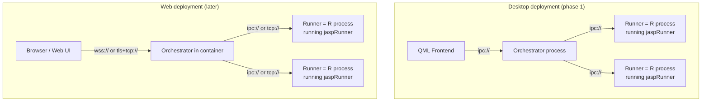

The **protocol is transport-agnostic**. NNG speaks `ipc://`, `tcp://`, `tls+tcp://`, `ws://`,
and `wss://` — same API, same message spec. Moving from desktop to web is primarily a
**transport string change plus auth**, not a protocol rewrite. This is the core payoff of
choosing NNG: the web path is a configuration concern, not an architecture concern. And
because the work unit is invariant (§4), a web orchestrator can route work to runners anywhere without
carrying session execution state across the network.

### 11.2 The five things that MUST be designed in now

These are cheap to do right today and painful to retrofit:

| # | Decision | Why it matters for web |
|---|---|---|
| 1 | **Address datasets by ID, never by absolute path, in the protocol.** Orchestrator owns a configurable *cache root* and maps `dataset_id → path`. | In a container the cache is a mounted volume or object storage. Frontend must never assume a filesystem path is meaningful. |
| 2 | **Transport is config, not code.** `jaspClient` and `jaspRunner` read the orchestrator URL from config/env (`JASP_ORCH_URL`). | Desktop ships `ipc:///run/jasp/orch.sock`; container ships `wss://…` or `tls+tcp://…`. Zero code change. |
| 3 | **Orchestrator owns the dataset cache, runners never write it.** Runners read (mmap) only. | Lets you swap the cache backend (local dir → S3/FUSE → network volume) without touching runners. |
| 4 | **No secrets, no hardcoded localhost trust.** The existing `JaspRpcServer` binds `127.0.0.1:48164` with **no auth**. That pattern must not leak into the orchestrator. | A containerized orchestrator is network-exposed. Auth/session must be a first-class, if initially stubbed, concept. |
| 5 | **Multi-tenancy seam: everything scoped by `session_id`.** Even single-user desktop passes a session id (just one value). | Web = many users. Each needs isolated runners + dataset cache. If `session_id` is threaded through from day one, multi-tenant is a scaling change, not a refactor. |

### 11.3 Container topology — Option A (one container per session)

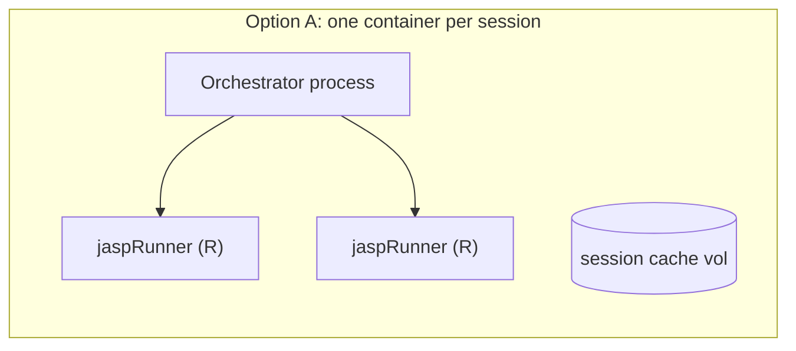

**Option A** (orchestrator + runners in one container, one per user session) is the target.
It is the right fit for JASP — interactive, session-bound, and R's leaky-memory nature all
favor per-session isolation over a shared multi-tenant pool. A shared-pool/fleet option (B) is
not worth the complexity for the minor density gains. We will not design or build B; if a real
deployment ever demands it, the five seams decided above (dataset IDs, orchestrator-owned
cache, `session_id`, config transport, auth edge) keep it reachable as an operational
evolution with no code change.

### 11.4 What changes vs. what stays when you go web

| Component | Desktop | Web | Change magnitude |
|---|---|---|---|
| Protocol spec | same | same | **None** |
| Orchestrator | headless process | containerized service | Small (add auth/session, config transport) |
| Runners | pure R processes | same, in-container | **None** (maybe base image) |
| Dataset cache | local temp dir | mounted volume / object store | Small (cache-root abstraction already there) |
| Frontend | QML | Web UI (separate effort) | **Large, but independent** — talks the same protocol |
| Transport | `ipc://` | `wss://` / `tls+tcp://` | Config change |
| Auth | none (local trust) | token/session at gateway | New, but isolated to orchestrator edge |

Note: the **QML→web frontend is its own large project** and is fully decoupled from this
refactor. The backend doesn't care what renders the results. That's the whole point of the
separation.

### 11.5 A note on the existing `Desktop/rpc/` JSON-RPC server

`JaspRpcServer` (Qt HttpServer, `127.0.0.1:48164`, `POST /rpc`) is already a small step
toward “something external can drive JASP.” It's useful as a reference for the *shape* of an
external API, but it is **not** the web path — it's Qt-bound, localhost-only, unauthenticated.
In the new architecture its role (external/programmatic access, AI tooling) is better served by
the orchestrator exposing the same NNG protocol over `ws://`/`tcp://` with auth, or by a thin
HTTP→NNG gateway. Don't invest further in extending the Qt RPC server as the web backbone.

## 12. Migration path (how to not die)

This is a big refactor. Don't do it all at once. Suggested phases:

### Phase 1: Define the protocol spec
- Write the message spec as a JSON Schema or similar (Part II is this).
- Version it (`"v": 1`).
- This is the contract. Everything else implements it.

### Phase 2: Build `jaspRunner` R package
- nanonext-based message loop.
- Arrow/Feather data loading (replace `rbridge_readDataSet`) — the `read_jasp_data` of §8.3.
- Call into jaspBase for actual analysis execution.
- Test standalone: can it receive a work unit, load data, run an analysis, return results?

### Phase 3: Build the Orchestrator
- Start minimal: spawn N runners, route work, forward results.
- Dataset management: open file → write Feather cache.
- Runner lifecycle: spawn, monitor, kill, replace.
- Language: **Rust** (decided — §15.1). `arrow-rs` + the `nng` crate. The orchestrator stays
  a thin router — **no `tokio`** (two sockets, two blocking threads; §5.2). Data-plane I/O is
  **routed work split across two lanes** (§5.4): an R utility `jaspRunner` opens the
  reader-heavy formats (`csv`, `spss`, `jasp-legacy`, …) with R's existing readers, and a Rust
  `arrow-rs` data-runner opens the Arrow-native formats (`arrow`/`parquet`) and owns **all**
  writes (`data_edit`/`data_close`/`data_update`). Routing is by capability — format for opens,
  service name for edits — so formats can migrate lanes with no protocol change.

### Phase 4: Build `jaspClient` (frontend library)
- Thin NNG client.
- Replace `EngineSync` + `EngineRepresentation` + `IPCChannel` in the frontend.
- Frontend now only talks to orchestrator.

### Phase 5: Cut over
- Wire the frontend to `jaspClient`.
- Delete `Engine/`, `R-Interface/`, `IPCChannel` from `CommonData`.
- Delete `EngineSync`, `EngineRepresentation` from `Desktop/`.
- Celebrate.

### Phase 6: Clean up jaspBase
- Remove `rbridge_*` dependencies.
- jaspBase talks to `jaspRunner` for data, not to C++.
- Slowly untangle the legacy complexity.

## 13. What dies

| Component | Replacement |
|---|---|
| `Engine/` (entire directory) | `jaspRunner` R package |
| `R-Interface/` (Rcpp/RInside glue) | `jaspRunner` R package |
| `CommonData/ipcchannel.*` | NNG sockets |
| `CommonData/rbridge.*` | `jaspRunner::data.R` (Arrow reads) |
| `CommonData/databridge.*` | `jaspRunner::data.R` |
| `Desktop/engine/enginesync.*` | `jaspClient` + orchestrator |
| `Desktop/engine/enginerepresentation.*` | `jaspClient` |
| `Common/enginedefinitions.h` | Protocol spec (Part II, versioned) |
| `internal.sqlite` / `databaseinterface.cpp` | Arrow IPC + metadata (§8.4) |
| `ENGINE_KILLTIME`, `ENGINE_COOLDOWN`, etc. | Orchestrator config |
| `Analysis` command-states (`SaveImg`/`EditImg`/`RewriteImgs`/`RunningImg`/`Aborting`) + `KeepStatus` + `shouldRun()` poll + `desiredPerformTypeFromAnalysisStatus()` | Display-only `Status` (`Empty`/`Running`/`Complete`/`Aborted`/`ValidationError`/`FatalError`) + explicit `submit` (§5.1) |

## 14. What survives

| Component | Why |
|---|---|
| `Common/` (minus enginedefinitions) | Logging, dirs, version — still useful |
| `QMLComponents/` | Frontend UI. Doesn't need to change (much). |
| `jaspBase` | Analysis framework. Stays, gets cleaned up later. |
| Module analysis code | The actual statistics. Untouched. |
| `Desktop/rpc/` | Maybe folded into orchestrator. Decide later. |

## 15. Open questions & deferred

1. **Orchestrator language — DECIDED: Rust.**
   The orchestrator is a router with a filesystem, not a compute engine: its hot path is moving
   JSON between NNG sockets, resolving a couple of HashMaps, and managing a handful of R child
   processes. Performance is irrelevant (the bottleneck is always R), so the decision came down
   to **distribution and reliability**, not speed.
   - **Rust** wins on both: `cargo build --release` produces a **single static binary** with no
     runtime to bundle (JASP already ships R; adding a Python runtime was unacceptable for a
     desktop app that must "just work"), and its compile-time guarantees suit a long-running
     daemon. `arrow-rs` (Feather read/write), the `nng` crate, `tokio` (async), and `serde_json`
     cover everything the orchestrator needs.
   - **Python** was the prototyping option (`pynng` + `pyarrow`, ~3× faster to a first working
     system). A throwaway Python prototype is still a sensible way to validate the protocol and
     NNG/Arrow quirks before the Rust build — but Python is not the production target, because of
     the distribution problem.
   - **C++ (no Qt)** and **Go** were considered and rejected (C++ invites Qt back in and
     re-creates the complexity being escaped; Go's Arrow support is less mature than `arrow-rs`).

   **File ingestion.** Ingestion is **routed work split across two lanes** (§5.4), by source
   format:

   - **R utility runner** opens the *reader-heavy* formats — `csv`, `spss` (`.sav`),
     `jasp-legacy` (old SQLite `.jasp`), and the other `haven`/`readxl`/`data.table` formats
     (Excel, Stata, SAS). R already has these battle-tested readers, so nothing new is built.
   - **Rust data-runner** (`arrow-rs`) opens the *Arrow-native* formats (Arrow IPC / Feather,
     Parquet) and owns **every write** to the cache (`data_edit`/`data_close`/`data_update`).
     Native Rust readers are mature here and carry no Rcpp dependency, so the frequent edit
     path never touches R.

   Whichever lane opens a file, it **writes Feather+LZ4 directly to the `cache_path`** the
   orchestrator supplies — data never crosses the wire (§8.1) — then replies with
   `{schema, rows}`. R is a **permanent lane** for the reader-heavy formats (for as long as
   they are best served by R's ecosystem); CSV is the natural candidate to migrate to Rust
   later. The data plane is defined by a capability, so a format moving lanes is a
   `register`-advertisement change with **no protocol change**.

2. **How does jaspBase get the dataset?**
   - Option A: jaspRunner loads Arrow → converts to R data.frame → passes to jaspBase. Simple.
     Works. Memory-hungry for big datasets (copy).
   - Option B: jaspBase reads Arrow directly via the `arrow` R package. Zero-copy-ish. But
     requires jaspBase to depend on `arrow` and change its data access patterns.
   - Suggestion: Start with Option A (least jaspBase changes), migrate to B later.

3. **Image results?** Runner writes images to its `output_dir`, sends the *path* (relative to
   `output_dir`) in the `result` message. Frontend reads the file. Don't base64-encode images
   into JSON messages.

4. **`.jasp` Arrow metadata key names** — the exact field/file metadata keys for the SQLite→Arrow
   migration are settled at the format level (§8.4); the precise key inventory and the
   orchestrator read/write code are implementation TBD.

5. **`nanonext` PoC — DONE.** All transport behaviors validated over both `ipc://` and `tcp://`
   (`refactor_design/poc/poc_nanonext_transport.R`, nanonext 1.10.1 / nng 1.12.0, 46/46 checks):
   - **Per-peer PAIR channels** isolate correctly (each peer's traffic stays on its own channel).
   - **`recv-size-max` is a non-issue in nanonext**: it lifts libnng's ~1 MB default on its own —
     1/8/64/**256 MB** messages all delivered intact with default socket settings. No manual
     `NNG_OPT_RECVMAXSZ` raise is needed (that caution applies to raw libnng / other bindings).
   - **`pipe_notify` / `#1665`**: the close-from-callback failure does **not** arise — nanonext
     signals a condition variable, not a user callback. Sequential pipe removals were all detected,
     on both a multi-pipe socket and the per-runner-PAIR design. `pipe_notify(flag = TRUE)` makes
     `wait()` return **FALSE for a pipe event vs TRUE for a message** (a `recv_aio` completion) —
     the runner's message-vs-disconnect distinguisher; `until(cv, msec)` is the timeout-safe
     detector and `cv_value(cv)` a non-consuming counter.
   - **Sends to a dead peer raise no error** — detect death via pipe-disconnect, never send failure.
   - **The §18.1 framing** (`[uint32 BE len][JSON][binary]`) round-trips byte-for-byte, including
     carrying a real Arrow IPC stream. Note: `send()` accepts only `mode = "serial"`/`"raw"`; use
     `charToRaw()` + `mode = "raw"` for the wire framing.
   (The Arrow `ordered`-flag round-trip is validated separately, §8.3,
   `refactor_design/poc/ordered_flag_roundtrip.R`.)

6. **Decode-in-frontend for tables** (optional future optimization; plots must stay in R since
   they're rasterized there).

7. **Memory-based pool sizing** — deferred; research preserved in §25.

# PART II — WIRE PROTOCOL (normative)

This part is the normative definition of what goes over the wire. Where Part I says *why*,
this says *exactly what*. It is organized around the **invariant work unit** of §4: the
frontend and the runner speak the same two messages — `work` and `result` — and the
orchestrator is a router with no execution state between them.

## 16. Scope & principles

This spec defines the message protocol between the three JASP components:

- **Frontend** (QML desktop today, web later) via the `jaspClient` library;
- **Orchestrator** (headless process: routing, dataset cache, runner pool);
- **Runners** (pure-R processes running the `jaspRunner` package).

Design principles, in priority order:

1. **Human-readable control plane.** All control messages are JSON. A developer can
   `tcpdump`/log the conversation and read it. Binary is used *only* for bulk data, and only
   inside a clearly-framed envelope.
2. **Transport-agnostic.** The protocol does not care whether the bytes travel over `ipc://`,
   `tcp://`, `tls+tcp://`, `ws://`, or `wss://`. Deployment picks the transport via one config
   value (§17).
3. **Language-agnostic.** Any language with an NNG binding (R via `nanonext`, Python via
   `pynng`, Rust/C++ via `nng`) can implement either side. No C++-only constructs, no
   R-specific serialization on the wire.
4. **One framing rule.** Every message uses the same envelope and the same length-prefixed
   framing (§18). No special cases.
5. **Versioned and additive.** The envelope carries a version. Additive changes stay on the
   same version; breaking changes bump it (§28).
6. **Self-contained work; the runner holds no state.** A `work` item carries everything needed to
   execute it; the runner holds no state between work units, and the orchestrator holds no *execution* state (the state it does hold is centralized and readable), scheduling only by warmth +
   capability. **This is the same principle as §4, restated as a wire constraint:** because
   work is self-contained, the frontend and the runner exchange the *same* `work`/`result`
   messages, and “change” is always a newer work unit, never a side-channel mutation.

### The work unit is the unit of the protocol

The message catalog (§19) is built from one verb in each direction: the frontend **submits
`work`** and **receives `result`**; the runner **receives `work`** and **emits `result`**. An
analysis is `kind:"analysis"` — one value of a discriminator, not a special-cased message.
Everything the old protocol expressed as a distinct message (run, options-changed,
settings-changed, re-run) collapses into “submit a work unit with a higher `revision`.” The
rest of the catalog is data plane (`dataset_*`, `data_*`), capability (`list_modules`,
`modules`, `register`), and housekeeping (`ping`, `error`).

## 17. Conventions & transport

### 17.1 Conventions

| Item | Convention |
|---|---|
| Encoding | JSON is UTF-8. Field names are `snake_case`. |
| IDs | `id`, `work_id`, `dataset_id` are UUIDv4 strings unless noted. Orchestrator-assigned ids use sequential forms: `runner_id` = `r-N`, `session_id` = `s-N` (§19.5). |
| Modules | A module is identified by a **descriptor `{name, version}`** — a `name` string plus a semver `version` string. Advertised as an `analysis` capability in `register.capabilities` (§19.5); a `work` targets one via `module` + `module_version` (§19.3); the producing version is echoed in `result` provenance. |
| Correlation | Every request carries `id`; the matching response echoes it in `reply_to` (or `work_id` for streamed `result`s that reference their work unit). |
| Timestamps | Unix epoch milliseconds, field `ts` (optional, orchestrator-stamped). |
| Revision | `revision` is a monotonically increasing integer per `work_id`, **supplied by the frontend** (bumped on each re-submission); the orchestrator validates monotonicity and uses it for stale-result rejection (§23). |
| Nulls | Absent optional fields are omitted, not sent as `null`, unless a `null` is meaningful. |

### 17.2 Transport layer

Transport is configuration, not code. Both `jaspClient` and `jaspRunner` read the orchestrator
address from config / environment. The URL embeds the **protocol version**, so a frontend can
*discover* a compatible running orchestrator: a second frontend starting up probes this
well-known versioned URL and, if it connects, joins the existing backend rather than starting
a duplicate.

```
JASP_ORCH_URL = ipc:///run/jasp/orch/v1.sock    # desktop (default) — "/v1" = protocol version
            | tcp://host:port/jasp/v1           # LAN / container
            | tls+tcp://host:port/jasp/v1       # remote, encrypted
            | ws://host:port/jasp/v1  | wss://host:port/jasp/v1   # browser / web
```

The version in the URL is for **discovery**; **validation** happens on connect via the version
handshake: the peer sends its protocol version `v` and its own version, and the orchestrator
replies with its `v` + `orchestrator_version`, rejecting incompatible protocol versions.
Incompatible protocol versions never share an endpoint.

#### Topology

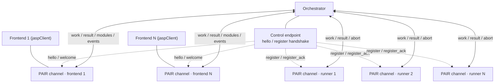

- **Multiple frontends, one orchestrator.** The orchestrator accepts **one or more** frontend
  connections concurrently. NNG `PAIR` is 1:1, so each frontend gets its own dedicated PAIR
  channel via the control-endpoint handshake — exactly like a runner. Each frontend has a
  `session_id`; the orchestrator records `work_id → {runner, session_id}` so every `result` is
  routed back to the frontend that requested it, and broadcasts module-list changes to all
  connected frontends.
- **Orchestrator ↔ each Runner**: likewise one PAIR channel per runner (managed or attached) —
  one uniform code path for all peers.
- **Authority.** The orchestrator is the single authority on *capability*: it knows the union
  of installed modules, managed-pool modules, and attached-runner modules, and serves that
  list to each frontend (§19.1 `list_modules`). Frontends never scan the filesystem for
  modules.

#### Connection & registration handshake (all peers)

Every peer — frontend or runner — connects the same way: dial the **versioned control
endpoint**, do a version handshake, get a **dedicated PAIR data channel**, then carry all
traffic on that channel.

1. Peer dials the orchestrator's versioned control endpoint and sends its handshake: a
   frontend sends `hello {v, client_id?, client_version?}`; a runner sends `register {v,
   capabilities, …}`. Neither supplies its own canonical id — the orchestrator assigns
   `session_id` (`s-N`) to frontends and `runner_id` (`r-N`) to runners, and returns them
   in the reply.
2. Orchestrator checks the **protocol version** `v` (rejects if incompatible — the
   *validation* step), validates further (auth token / module allowlist if required),
   allocates a **dedicated data channel** (a unique `ipc://` path or `tcp` port), and replies
   — `welcome {v, ok, channel_url, …}` to a frontend (the orchestrator-assigned `session_id`
   rides on the envelope), `register_ack {ok, runner_id, channel_url, …}` to a runner (the
   orchestrator assigns the canonical `runner_id`; §9.3).
3. Both sides open a `PAIR` socket on `channel_url`. All subsequent traffic flows on that
   channel: frontend ↔ orchestrator (`work`, `result`, `list_modules`, `modules_changed`, …);
   orchestrator ↔ runner (`work`, `result`, `abort`, …).
4. Managed runners may receive the control endpoint + a pre-assigned `runner_id` hint via
   argv/env at spawn; attached runners may supply a hint id. The orchestrator is the authority
   on identity and returns the canonical `runner_id` in `register_ack` (§9.3). The handshake
   itself is identical for all peers.

This keeps the message spec clean: the control endpoint carries only the handshake
(`hello`/`welcome`, `register`/`register_ack`); everything else is per-channel. The versioned
URL lets a second frontend **discover** a running compatible orchestrator (connect succeeds →
join it); the `v` check **validates** compatibility before use.

## 18. Framing & envelope

### 18.1 The one framing rule

Every NNG message body is laid out as:

```
 0                   1                   2                   3
 0 1 2 3 4 5 6 7 8 9 0 1 2 3 4 5 6 7 8 9 0 1 2 3 4 5 6 7 8 9 0 1
+-+-+-+-+-+-+-+-+-+-+-+-+-+-+-+-+-+-+-+-+-+-+-+-+-+-+-+-+-+-+-+-+
|                     json_len (uint32, big-endian)             |
+-+-+-+-+-+-+-+-+-+-+-+-+-+-+-+-+-+-+-+-+-+-+-+-+-+-+-+-+-+-+-+-+
|                                                               |
|             JSON envelope (UTF-8), exactly json_len bytes      |
|                                                               |
+-+-+-+-+-+-+-+-+-+-+-+-+-+-+-+-+-+-+-+-+-+-+-+-+-+-+-+-+-+-+-+-+
|                                                               |
|        binary payload (remaining bytes) — OPTIONAL             |
|                                                               |
+-+-+-+-+-+-+-+-+-+-+-+-+-+-+-+-+-+-+-+-+-+-+-+-+-+-+-+-+-+-+-+-+
```

- `json_len` is a 4-byte unsigned integer, **big-endian** (network byte order).
- The JSON envelope is exactly `json_len` bytes.
- The binary payload is everything after. It is **optional**: a control-only message has
  `json_len == len(body) - 4` and no trailing bytes.
- The receiver reads 4 bytes → `json_len`, parses that many bytes as JSON, and treats the
  remainder (if any) as the binary payload. Unambiguous in every language; no reliance on a
  JSON parser reporting its end offset.

> **Why not ZMQ-style multipart?** NNG is *not* ZeroMQ — an NNG message is a single
> contiguous body, with no `sendmore` frame delimiter. The length prefix is how we get
> `[JSON][binary]` atomicity on NNG. It is 4 bytes of overhead and works identically on every
> transport.

### 18.2 The envelope

The JSON envelope always has these fields:

| Field | Type | Req | Description |
|---|---|---|---|
| `v` | int | ✓ | Protocol version. Currently `1`. |
| `type` | string | ✓ | Message discriminator (e.g. `"work"`, `"result"`). |
| `id` | string(uuid) | ✓ | Correlation id for this message. |
| `reply_to` | string(uuid) | – | The `id` this message answers (responses). |
| `session_id` | string | – | Tenancy scope (§27). One value on desktop. |
| `ts` | int | – | Orchestrator-stamped epoch-ms. |
| `format` | string | – | **Required when a binary payload is present.** Names the payload encoding (§18.3). |

A minimal control message:

```json
{ "v": 1, "type": "ping", "id": "3f2b…c1" }
```

A message with a binary payload (note `format`):

```json
{ "v": 1, "type": "data_edit", "id": "9a41…77",
  "dataset_id": "d1e2…", "op": "replace_column", "column": "score",
  "format": "arrow_ipc/stream" }
```

…followed by the binary bytes (an Arrow IPC stream) in the same NNG message.

### 18.3 Binary payload formats (`format`)

| `format` | Payload is | Used for |
|---|---|---|
| `arrow_ipc/stream` | An [Arrow IPC **stream**](https://arrow.apache.org/docs/format/Columnar.html) (one or more record batches), **LZ4-compressed** | Bulk column / block data (data edits, computed columns) |
| `arrow_ipc/file` | An Arrow IPC **file** (== Feather V2) | Rare; when a self-describing random-access buffer is wanted |
| `raw/float64` | Tightly-packed IEEE-754 doubles, little-endian | A single numeric vector with no schema overhead |
| `raw/int32` | Tightly-packed 32-bit ints, little-endian | A single integer/index vector |

`arrow_ipc/stream` is the **default and recommended** encoding for any structured bulk data:
it is self-describing (carries its own schema), zero-copy on the receiver, and
language-neutral. The raw encodings are an escape hatch for a lone homogeneous vector where
the schema is already implied by the envelope.

> **Reference:** Arrow IPC is part of the stable, versioned
> [Apache Arrow Columnar Format](https://arrow.apache.org/docs/format/Columnar.html). The
> *file* variant is exactly **Feather V2** (R: `arrow::write_feather(version=2)` /
> `read_feather()`; MIME types are IANA-registered). The dataset cache (§24) stores Feather V2
> files; the wire uses the *stream* variant for incremental data.

> **Optional optimization:** for a pure-data message you *may* instead place the envelope's
> semantic fields in the Arrow schema's key-value metadata and send a single self-describing
> Arrow buffer with no JSON part. Implementations MUST still accept the standard
> length-prefixed framing; the metadata trick is a permitted shortcut, not a second protocol.

### 18.4 Size limits & large data

- `max_inline_payload` (orchestrator config, default **256 MiB**) caps the binary part of a
  single inline message. NNG's `recv-size-max` (`NNG_OPT_RECVMAXSZ`) **defaults to ~1 MB and
  silently discards larger messages with no error**, so both ends MUST raise it to
  `max_inline_payload` (see the §25 NNG-gotchas note).
- For data larger than that (e.g. importing a 2 GiB CSV), do **not** inline it. Instead the
  frontend sends `dataset_open` (or a `data_edit` with a file source) referencing a path/URI,
  and the orchestrator routes it to the **data-runner** for server-side ingest (§8.1, §24.3).
  This keeps the socket buffers sane and is the only path that works for web, where the browser
  has no shared filesystem with the server.

## 19. Message catalog

Each entry lists direction, envelope fields beyond the common ones (§18.2), any binary
payload, and semantics. Common fields (`v`, `type`, `id`, …) are omitted from the
per-message tables.

**The catalog is organized around the work unit.** The frontend and the runner speak the
*same* two operational messages — `work` and `result` — keyed by a stable `work_id` and
discriminated by `kind`. An analysis is `kind:"analysis"`, one value among (present and
future) kinds. Both messages carry their kind-specific body in a nested `payload`, opaque to
the orchestrator. The orchestrator forwards `work` frontend→runner — resolving the level-zero
`dataset_ids`→`dataset_paths` and allocating `output_dir`, forwarding `payload` verbatim — and
forwards `result` runner→frontend (routing by `session_id`).

**Two families of frontend request.** The frontend makes two kinds of request to the
orchestrator, and they are deliberately separate:

- **Work** (`work`, `abort`) — *computations*, executed by a **runner**: analyses, raw R, and
  (later) computed columns, filters, image regeneration. These are invariant, revision-keyed,
  and produce streamed `result`s (§4, §20).
- **Data-plane operations** (`dataset_open`, `dataset_close`, `data_edit`, …) — *cache
  mutations*, executed by the **orchestrator** as sole cache writer (§5.2, §24). These are
  synchronous, bump the *dataset* revision, and notify frontends via `dataset_ready`/
  `data_changed`; they are not work units.

The boundary is clean even where they touch: a computed column *decomposes* into both — a `work`
unit (the analysis runner computes it) whose execution emits a `data_update` (the Rust
data-runner writes the column to the cache, §5.4). Compute and cache-write stay separate
concerns, in separate components.

### 19.1 Frontend → Orchestrator

#### `work`
Submit or re-submit a work unit (invariant). This is the single “do this” message — it
replaces the old `analysis_request` and generalizes it to any `kind`. Keyed by `work_id` and
declarative: sending `work` for an id that is already running or queued **cancels and
replaces** it (when `revision` is newer). It is not an error, and the sender need not know
whether the id is running, queued, or idle. **“Options changed,” “settings changed,” and
“re-run” are all just a re-sent `work` with a higher `revision`.**

The frontend submits the work unit with level-zero routing/data fields plus a kind-specific
`payload`; the orchestrator resolves each `dataset_ids` entry to a `dataset_path`, allocates an
`output_dir`, and forwards the `payload` **verbatim** to a runner (§19.3).

Level-zero fields (the orchestrator reads and acts on these):

| Field | Type | Req | Description |
|---|---|---|---|
| `work_id` | string | ✓ | Stable id of this logical work unit. For `kind:"analysis"` it is the analysis instance id. Same id = same logical work, updated. |
| `kind` | string | ✓ | `"analysis"` (run a module analysis) · `"rcode"` (evaluate raw R) · future: `"computed_column"`, `"filter"`, … Discriminates the `payload` schema. |
| `revision` | int | ✓ | Monotonic integer per `work_id`, **supplied by the frontend** and bumped on each re-submission (the frontend's own iteration count). The orchestrator validates monotonicity and forwards it unchanged (§19.3, §23). |
| `base_revision` | int | ◑ | Revision to **seed incremental recompute from** — the last result the frontend is iterating off. The orchestrator resolves it to a concrete `base_results_dir` (§19.3); the runner copies that finished revision's dir into its own before running (copy-on-seed, §4.7). Absent → full recompute (no seed). Frontend-owned like `revision`; per-revision isolation means concurrent/out-of-order revisions never share a mutable scratch. |
| `dataset_ids` | string[] | ◑ | Ordered array of datasets the work runs against (usually one element). The orchestrator resolves each id → a `dataset_path` for the runner (§19.3), one-to-one and order-preserving. Plural so a future kind can reference multiple datasets without a protocol change. |
| `payload` | object | ◑ | The kind-specific computation — opaque to the orchestrator, forwarded verbatim to the runner. Schema discriminated by `kind` (below). |

The frontend **owns** the `revision`: it bumps it on every re-submission of a `work_id`. The orchestrator keeps only a per-`work_id` **high-water mark** (recoverable from the `results_<rev>/` folder names), rejects regressions, and forwards the supplied `revision` verbatim to the runner. Revision continuity therefore survives an orchestrator restart (§23).

The **`payload`** is opaque to the orchestrator and forwarded verbatim to the runner; its schema
is fixed per `kind`:

- `kind:"analysis"` → `{ module, module_version, analysis, options, settings }`
  - `module` — module **name**, e.g. `"jaspDescriptives"`.
  - `module_version` — target **version** (semver); omitted → highest available version of `module`.
  - `analysis` — analysis name within the module.
  - `options` — analysis options (opaque to the orchestrator).
  - `settings` — output settings used to *produce* results: `{numDecimals, fixedDecimals, normalizedNotation, exactPValues, resultFont, ppi, imageBackground}`. A settings change is a re-sent `work` with a higher `revision`. Pure-UI settings (theme, window state) never reach the runner.
- `kind:"rcode"` → `{ code, env, settings? }`
  - `code` — raw R source to evaluate.
  - `env` — evaluation env: `{libpaths?: [...], module?: "jaspX"}`.
  - `settings` — optional output settings (as above).

Analysis example:

```json
{ "v":1, "type":"work", "id":"…", "work_id":"a17", "kind":"analysis", "revision":3,
  "dataset_ids":["d1e2…"], "base_revision":2,
  "payload":{ "module":"jaspDescriptives", "module_version":"1.2.0", "analysis":"Descriptives",
    "options":{ … }, "settings":{"numDecimals":3, "ppi":300} } }
```

Raw-R example:

```json
{ "v":1, "type":"work", "id":"…", "work_id":"r88", "kind":"rcode", "revision":1,
  "dataset_ids":["d1e2…"],
  "payload":{ "code":"library(jaspBase); sum(.readDataSetRequested())",
    "env":{"module":"jaspDescriptives"} } }
```

#### `abort`
Remove a work unit: cancel it if running, drop it if queued (the runner reports `aborted`).
The orchestrator forwards `abort` to the owning runner.

| Field | Type | Req | Description |
|---|---|---|---|
| `work_id` | string | ✓ | Which work unit to cancel. |

#### `work_close`
Discard a work unit the frontend is finished with (its analysis was closed) and reclaim its
on-disk workspace. The frontend is the authority on "this work is consumed forever."
**Revision-granular:** with `revision` present, only that revision's `results_<revision>/` is
reclaimed — and the work is aborted only if that revision is the in-flight one; with `revision`
absent, the whole work tree (every revision) is reclaimed and any in-flight work aborted.
Idempotent — closing an unknown or already-closed work/revision is a no-op. Reclamation runs off
the routing thread (the orchestrator's janitor), so it never blocks routing.

| Field | Type | Req | Description |
|---|---|---|---|
| `work_id` | string | ✓ | Which work unit to discard. |
| `revision` | int | – | Present → reclaim only `results_<revision>` (abort it if it is the in-flight revision). Absent → reclaim the whole work (all revisions) and abort the in-flight work. |

#### `dataset_open`
Open (and cache) a dataset. Triggers `dataset_ready`. The resolved **format is the routing
key**: the broker forwards the open to the data-plane lane advertising `data_open` for that
format (§5.4, §9.4) — the R utility runner for reader-heavy formats, the Rust data-runner for
Arrow-native ones. The chosen lane writes Feather to the orchestrator-assigned `cache_path`
and the orchestrator replies `dataset_ready`.

| Field | Type | Req | Description |
|---|---|---|---|
| `path` | string | ✓ | Source location: local path, or URI for remote ingest. |
| `format_hint` | string | – | Source format; the routing key (sniffed if absent). See the vocabulary below. |
| `dataset_id` | string | – | Reuse an id; orchestrator assigns one if absent. |

**Format vocabulary and lane** (a format nobody advertises fails with `unsupported_format`):

| Format | Lane that opens it |
|---|---|
| `csv` | R utility (alpha; natural future candidate for Rust) |
| `spss` (`.sav`), `excel`, `stata`, `sas` | R utility (`haven`/`readxl`) |
| `jasp-legacy` (old SQLite `.jasp`) | R utility (legacy reader) |
| `arrow` / `feather`, `parquet` | Rust data-runner (`arrow-rs`) |

```json
{ "v":1, "type":"dataset_open", "id":"…", "path":"/data/survey.csv", "format_hint":"csv" }
```

#### `dataset_close`
Release a cached dataset.

| Field | Type | Req | Description |
|---|---|---|---|
| `dataset_id` | string | ✓ | Which cache entry to free. |

#### `data_edit`
Apply an edit to a cached dataset. Small edits are JSON-only; bulk edits carry a binary
payload (§18). The orchestrator bumps the dataset `revision` and **routes the edit as
`kind:"data"` work to the Rust data-runner** (§5.4), which owns all cache writes and applies
the edit to the Arrow file on disk; the orchestrator then broadcasts `data_changed` (§19.2)
to all connected frontends. The orchestrator never touches the bytes — it owns the dataset
index and `revision`, not the I/O.

| Field | Type | Req | Description |
|---|---|---|---|
| `dataset_id` | string | ✓ | Target dataset. |
| `op` | string | ✓ | One of the edit ops below. |
| `format` | string | ◑ | Required when a binary payload is present. |
| (op-specific) | – | – | See the op table. |

Edit operations:

| `op` | JSON-only? | Op-specific fields | Binary payload |
|---|---|---|---|
| `set_cell` | ✓ | `row`, `column`, `value` | – |
| `rename_column` | ✓ | `column`, `new_name` | – |
| `delete_columns` | ✓ | `columns[]` | – |
| `delete_rows` | ✓ | `rows[]` (or `start`,`count`) | – |
| `replace_column` | ✗ | `column`, `n` | Arrow IPC stream: the new column (1 field) |
| `add_columns` | ✗ | `names[]`, `n` | Arrow IPC stream: the new columns |
| `insert_rows` | ✗ | `at`, `n` | Arrow IPC stream: the new rows |
| `set_factor_levels` | ✓ | `column`, `levels[]` (ordered `{value, label}`) | – |

`set_factor_levels` carries the **full ordered level list** (`{value, label}` pairs); the
array order *is* the ordinal ranking. The frontend editor sends the whole list on every
change (no diffing). The orchestrator routes the edit to the **data-runner**, which rebuilds
the dictionary of values in the new order (`ordered=1` for ordinals) and the `jasp:labels`
overlay (§8.3), then rewrites the cache. Reordering rewrites the dictionary + indices, but
the **values stay stable** and `jasp:labels` is value-keyed (no realignment), so `as scale`
reads are invariant under reorder.

```json
{ "v":1, "type":"data_edit", "id":"…", "dataset_id":"d1e2…",
  "op":"set_factor_levels", "column":"condition",
  "levels":[{"value":"3","label":"high"},{"value":"2","label":"medium"},{"value":"1","label":"low"}] }
```

#### `ping`
Liveness / capability probe. Answered by `pong`. No extra fields.

#### `list_modules`
Request the currently available modules (the analysis menu). Answered by `modules` (§19.2).
The orchestrator returns the union of installed modules, managed-pool modules, and
attached-runner modules. No required fields (optionally a `session_id`).

### 19.2 Orchestrator → Frontend

#### `result`
Streamed output of a work unit — the generalized replacement for `analysis_result`. One work
unit produces *many* of these as it runs. This is the **same message the runner sends**
(§19.4); the orchestrator forwards it to the frontend that requested the work, looked up via
`work_id → session_id`. An analysis result is just a `result` with `kind:"analysis"`.

| Field | Type | Req | Description |
|---|---|---|---|
| `work_id` | string | ✓ | Which work unit. |
| `kind` | string | ✓ | Echoes the work unit's `kind`. |
| `revision` | int | ✓ | The revision this result was produced from (§23). |
| `status` | string | ✓ | See the status enum (§22). |
| `payload` | object | – | **Kind-specific output** — normative shapes in *Result payloads by kind* below. Present on `changed`/`complete`. |
| `module_version` | string | – | Module version that produced this result (provenance). |
| `message` | string | – | Human-readable detail on `error`/`aborted`. |

The **`payload` is the generalization the old `analysis_result` lacked.** Its shape is
determined by `kind`, so the same `result` message carries an analysis results tree, raw-R
output, a computed-column confirmation, or anything added later — the frontend dispatches on
`kind`. Images are referenced by path relative to the work unit's `output_dir`, never inlined.

```json
{ "v":1, "type":"result", "id":"…", "work_id":"a17", "kind":"analysis", "revision":3,
  "status":"changed",
  "payload":{
    "results":{"title":"Descriptives","tables":[ … ]},
    "results_dir":"/home/u/.local/share/JASP/orchestrator/s-2/a17/results_3" } }
```

#### Result payloads by kind (normative)

The `payload` of a `result` is determined by its `kind` — mirroring the work side (§19.1),
adjacently tagged `{"kind": …, "payload": {…}}`. One work kind, one result shape. Division of
labor: **producers fill content; the orchestrator fills identity & location** — as typed fields
on the payload, never by surgery on an opaque tree.

##### `kind:"analysis"`

| Field | Type | Filled by | Description |
|---|---|---|---|
| `results` | object | runner | The jaspResults tree. **Opaque to the orchestrator**: forwarded verbatim, never interpreted or mutated. On failure this is the error tree `{error, errorMessage, title}`. |
| `results_dir` | string | orchestrator | Absolute path of the revision dir holding this result's file artifacts (`<dir_root>/<session>/<work_id>/results_<rev>`). **Wire-only** bootstrap for asset resolution — never persisted. |
| `images` | string[] | runner | Optional artifact manifest, paths relative to `results_dir` (runner computes it from its keep-list). For save/archive/GC. Shape reserved; not filled in the alpha. |

**The asset-path rule.** Artifact references inside `results` (plot `data`,
`interactiveJsonData`) are **relative to `results_dir`** — on disk the artifacts are siblings
of the results JSON, so the stored form stays self-describing and portable with **no absolute
paths anywhere on disk**. The frontend combines `results_dir` + reference **only on the copy
handed to the results webview**; the stored tree (and everything saved from it) keeps the
relative references. Loading from disk resolves against the JSON's own location.

##### `kind:"data"`

Terminal result of a dataset-open work — this **replaces the removed `dataset_ready`
message** (HANDOVER-dataplane-done.md): dataset open rides the work pipeline, and the ready
notification IS this terminal result.

| Field | Type | Filled by | Description |
|---|---|---|---|
| `dataset_id` | string | orchestrator | The minted identity the frontend references in later work (`dataset_ids`). |
| `rows` | int | runner (lane) | Row count. |
| `schema` | object[] | runner (lane) | The frontend's column view: `[{name, display_name, type, levels?, all_integer?}]` (§24). |
| `error_message` | string | runner (lane) | Present when `status` is a failure. |

> The dataset registry (index entry: id → current path, state, revision) does **not** cache
> the schema. Schema is content, not routing metadata: it flows lane → frontend on the Data
> payload, and analysis runners self-serve the schema of the Arrow file they actually read
> (which cannot disagree with the data). A registry-side copy is a write-only duplicate that
> can drift across dataset revisions; re-add it only together with a consumer (e.g.
> dataset-edit validation).

##### `kind:"rcode"` (reserved)

`{output, value, …}` — pinned when the rcode work kind lands.

**Producer/consumer contracts (the step-2 refactor):**

- `orchestrator/src/messages.rs`: `ResultPayload` becomes the adjacently-tagged enum above
  (`AnalysisResult` / `DataResult` / `RcodeResult`); `messages.schema.json` regenerated
  (`--schema`).
- Orchestrator `route_result`: fills `results_dir` (analysis) and `dataset_id` (data) as
  typed field assignments; no raw-JSON splices, no writes into the opaque `results` tree.
- R runner (`runner_jaspbase.R`): emits `kind` + the shaped payload (+ `module_version`
  provenance from §19.4).
- Data lane (`data_runner.rs`): emits the Data payload content (`schema`, `rows`).
- Frontend (`JaspClient`): switches on `kind`; kind-specific handlers replace the positional
  `(results, status, progress, resultsDir)` blob. `progress` returns to the signature when it
  is real.

> **Step 2 landed (one atomic change — spec + orchestrator + both runners + frontend handlers
> + R harnesses moved together; no dual-shape transition):** `ResultPayload` is the
> adjacently-tagged enum above (`messages.rs`; `messages.schema.json` regenerated with
> `--schema`). The orchestrator fills `results_dir` / `dataset_id` as typed field assignments
> in `route_result` — no JSON surgery, and the write-only registry schema cache went with it.
> The R runner emits `kind` + the shaped payload + `module_version` provenance; the Rust data
> lane emits the Data payload; the frontend dispatches on `kind` (`JaspClient::Result`
> replaced the positional `(results, status, progress, resultsDir)` blob — `progress` returns
> to the signature when it is real).

#### `dataset_ready`

> **Superseded (work model, HANDOVER-dataplane-done.md).** Dataset open rides the work
> pipeline as a `kind:"data"` work unit; the ready notification is the terminal `result`
> carrying the Data payload (§19.2, *Result payloads by kind*). There is no separate
> `dataset_ready` message on the wire. The fields below live on the Data payload.

The dataset is cached and ready to analyze.

| Field | Type | Req | Description |
|---|---|---|---|
| `dataset_id` | string | ✓ | The cache id. |
| `rows` | int | ✓ | Row count. |
| `schema` | object | ✓ | Column metadata: `[{name, display_name, type, factor, levels?}]`. `name` is the **canonical** (R-syntactic) name; `display_name` is the user's real name (§24). |

```json
{ "v":1, "type":"dataset_ready", "id":"…", "reply_to":"…",
  "dataset_id":"d1e2…", "rows":50000,
  "schema":[{"name":"age","display_name":"Age (years)","type":"int"},
            {"name":"score","display_name":"Score","type":"double"},
            {"name":"group","display_name":"Group","type":"factor","levels":["A","B"]}] }
```

#### `data_changed`
Pushed whenever the cached dataset is mutated — by a frontend `data_edit` (§19.1) or a
runner `data_update` (§19.4). Broadcast to **all** connected frontends (no `reply_to`). The
frontend uses it to decide which work units to re-submit; the orchestrator does **not**
auto-rerun or track work↔column dependencies.

| Field | Type | Req | Description |
|---|---|---|---|
| `dataset_id` | string | ✓ | Which dataset changed. |
| `revision` | int | ✓ | Monotonic dataset revision (bumped on every mutation). |
| `columns_added` | string[] | – | Canonical names of newly added columns. |
| `columns_updated` | string[] | – | Canonical names of columns whose values changed. |
| `columns_removed` | string[] | – | Canonical names of removed columns. |
| `rows_changed` | bool | – | `true` if rows were added, removed, or reordered. |
| `schema` | object | – | Full updated schema (same shape as `dataset_ready.schema`), present when columns were added or removed. |

```json
{ "v":1, "type":"data_changed", "id":"…",
  "dataset_id":"d1e2…", "revision":7,
  "columns_added":["computed_z"], "columns_updated":[], "columns_removed":[],
  "rows_changed":false,
  "schema":[{"name":"age","display_name":"Age (years)","type":"int"}, …] }
```

> Runners are stateless — there is no sync/ack back to the runner. The orchestrator is the
> sole cache writer; `data_changed` is the only mutation notification. The frontend is
> responsible for re-submitting affected work units (it knows which work units reference
> which columns).

#### `modules`
The available modules — the analysis menu. Sent as the response to `list_modules`, and also
carried by the unsolicited `modules_changed` push. The frontend rebuilds its menu from it.

| Field | Type | Req | Description |
|---|---|---|---|
| `modules` | object[] | ✓ | Module entries: `[{name, version, title, menu, qml_root, has_wrapper, requires_data, attached}]`. `attached` marks modules served by an attached (e.g. dev) runner. |

```json
{ "v":1, "type":"modules", "id":"…", "reply_to":"…",
  "modules":[
    {"name":"jaspDescriptives","version":"1.2.0","title":"Descriptives",
     "menu":"Descriptives","qml_root":"/modules/jaspDescriptives/inst/qml",
     "has_wrapper":true,"requires_data":true,"attached":false},
    {"name":"jaspMyModule","version":"0.2.0-WIP","title":"My Module (dev)",
     "menu":"My Module","qml_root":"/home/dev/jaspMyModule/inst/qml",
     "has_wrapper":true,"requires_data":true,"attached":true} ] }
```

> `title`/`menu`/`qml_root`/`has_wrapper`/`requires_data` come from the module's metadata;
> the **orchestrator** reads them so the frontend never scans the filesystem. `qml_root` is
> where the frontend loads the QML form from (see also `form_reload`).

> **As implemented (HANDOVER-module-discovery.md, HANDOVER-client-discovery.md):** the shipped
> schema is deliberately lighter — entries are `{name, version, base_uri}`, where `base_uri` is
> the module's asset directory (trailing slash; `file://` on desktop, `http://` for the webapp
> later). The frontend parses `Description.qml` at that URI for title/menu/icons itself — the
> rich fields above (orchestrator pre-digesting metadata) are NOT implemented. There is also no
> separate `modules_changed` type: the unsolicited push IS this same `modules` message with
> `reply_to` absent, and the orchestrator sends it as the **first frame on each frontend's data
> channel** (buffered at channel setup) and again whenever the set actually changes; `welcome`
> does not carry modules.

#### `modules_changed`
Pushed unsolicited whenever the available module set changes (a dev runner attaches/detaches,
a module is installed/uninstalled). Carries the same `modules` array as `modules` (no
`reply_to`); broadcast to **all** connected frontends. The frontend handles it identically to
a `list_modules` response — replace its menu. *(As implemented, this is the `modules` message
with `reply_to` absent — see the note above.)*

#### `form_reload`
Tell the frontend to (re)load the QML form for a module from a given root. Used when an
attached dev runner registers or signals a QML change (§9).

| Field | Type | Req | Description |
|---|---|---|---|
| `module` | string | ✓ | Module whose form changed. |
| `qml_root` | string | ✓ | Filesystem path (desktop) the frontend should load QML from. |

> On web there is no shared filesystem, so `qml_root` would be a served URL instead. The
> orchestrator is the single authority for *where a form comes from*; the frontend just loads
> what it is told.

#### `pong`
Response to `ping`.

| Field | Type | Req | Description |
|---|---|---|---|
| `runners` | array | ✓ | `[{runner_id, state, modules: [{name, version}], invocations, attached}]`. |

#### `error`
A protocol-level failure (malformed message, auth, etc.). See §26.

| Field | Type | Req | Description |
|---|---|---|---|
| `code` | string | ✓ | Error code (§26). |
| `message` | string | ✓ | Human-readable detail. |
| `ref_id` | string | – | The `id` of the offending message. |

### 19.3 Orchestrator → Runner (per data channel)

#### `work`
The runner-facing form of the **same logical work unit** the frontend submitted (§19.1).
The orchestrator forwards it verbatim except at level zero: it resolves the frontend's
`dataset_ids` to concrete read-only `dataset_paths` (one-to-one, order-preserving) and
allocates a writable `output_dir`. The `payload` is forwarded **untouched**. It is
**self-contained**: the `payload` carries the output-relevant `settings` needed to *produce*
the results, so the runner is stateless w.r.t. settings — it applies whatever the work unit
carries. Keyed by `work_id` and declarative; sending `work` for an id already running or
queued cancels and replaces it (when `revision` is newer). See the reconciliation rules in
§20.

| Field | Type | Req | Description |
|---|---|---|---|
| `work_id` | string | ✓ | Reconciliation key. Same id = same logical work. |
| `kind` | string | ✓ | `"analysis"` · `"rcode"` · `"data"`. Discriminates the `payload` schema. `"data"` work is synthesized by the orchestrator (not forwarded from the frontend) and routed to the appropriate data-plane lane — by **format** for `data_open`, by **service** for edits (§5.4, §9.4). |
| `revision` | int | ✓ | Monotonic per `work_id`, **supplied by the frontend** and forwarded verbatim by the orchestrator; newer wins, older ignored (§23). |
| `dataset_paths` | string[] | ◑ | Ordered array of Feather cache files to mmap (§24) — **read-only inputs**. Resolved by the orchestrator from the frontend's `dataset_ids`, one-to-one and order-preserving (`dataset_paths[i]` ↔ `dataset_ids[i]`). |
| `output_dir` | string | ◑ | **Writable output** directory **for this revision**: the runner writes file artifacts (plots/images, jaspResults recompute state, `results.json`) here and references them by **path relative to `output_dir`**. Per-revision and self-contained — `<work_root>/<work_id>/results_<revision>/` (§4.7) — so concurrent/out-of-order revisions never share a mutable scratch. Named by the orchestrator, **created and seeded by the runner**, reclaimed by the orchestrator on `work_close`; the runner must not write outside it. |
| `base_results_dir` | string | – | Present when the frontend supplied a `base_revision` (§19.1): the **finished base revision's dir** (`<work_root>/<work_id>/results_<base_revision>/`). The runner copies it into `output_dir` before running (copy-on-seed) so incremental recompute reuses the base's state/images and relative image paths resolve. Absent → full recompute (the runner creates an empty `output_dir`). Read-only input; the base revision is immutable. |
| `payload` | object | ◑ | The kind-specific computation. For `analysis`/`rcode`: forwarded **verbatim** from the frontend's `work` (§19.1); the orchestrator does not interpret it. Schema discriminated by `kind`: `analysis` → `{module, module_version, analysis, options, settings}`; `rcode` → `{code, env, settings?}` (the runner sets `.libPaths()` from `payload.env`); `data` → `{op, cache_path, …op-specific fields}` — synthesized by the orchestrator and consumed by a data-plane lane (§5.4). For `op:data_open` the op-specific fields are `{format, source}` (the resolved routing format and the source path/URI); for `op:data_edit` they are the `data_edit` op fields (§19.1). |

Analysis example:

```json
{ "v":1, "type":"work", "id":"…", "work_id":"a17", "kind":"analysis", "revision":3,
  "dataset_paths":["/cache/d1e2….feather"], "output_dir":"/work/a17/results_3",
  "base_results_dir":"/work/a17/results_2",
  "payload":{ "module":"jaspDescriptives", "module_version":"1.2.0", "analysis":"Descriptives",
    "options":{ … }, "settings":{"numDecimals":3, "ppi":300} } }
```

Raw-R example:

```json
{ "v":1, "type":"work", "id":"…", "work_id":"r88", "kind":"rcode", "revision":1,
  "dataset_paths":["/cache/d1e2….feather"], "output_dir":"/work/r88",
  "payload":{ "code":"library(jaspBase); sum(.readDataSetRequested())",
    "env":{"module":"jaspDescriptives"} } }
```

> Note the asymmetry by design: the **frontend** refers to datasets by `dataset_ids` (it
> never sees paths); the **orchestrator** resolves those to `dataset_paths` for the runner
> (one-to-one, order-preserving). Paths never cross the frontend boundary. Symmetrically, the
> orchestrator owns the **output** layout: it allocates the per-work `output_dir` and hands it
> to the runner, which writes artifacts there and references them by relative path. Input
> (`dataset_paths`, read-only) and output (`output_dir`, writable) are both the orchestrator's
> to manage — the runner has no filesystem policy of its own, reinforcing the invariant-work
> principle (§4). The `payload` is the one part forwarded **untouched**: the orchestrator
> resolves the level-zero data-plane references and never looks inside the computation.

#### `abort`
Remove a work unit from the runner's desired state: cancel it if running, drop it if queued,
and report `aborted` (§20). Distinct from `work`, which *upserts*. Applied during queue
processing.

| Field | Type | Req | Description |
|---|---|---|---|
| `work_id` | string | ✓ | Work unit to remove. |

#### `shutdown`
Stop after the current work unit (or immediately if idle). No extra fields. The runner does
not track its own budget — the orchestrator decides when to retire it (§25, make-before-break).

### 19.4 Runner → Orchestrator (per data channel)

#### `result`
Streamed output of a work unit — the **same message the orchestrator forwards to the
frontend** (§19.2), so a result has one shape end to end.

| Field | Type | Req | Description |
|---|---|---|---|
| `work_id` | string | ✓ | – |
| `kind` | string | ✓ | Echoes the work unit's `kind`. |
| `revision` | int | ✓ | – |
| `status` | string | ✓ | §22. |
| `payload` | object | – | Kind-specific output — normative shapes in §19.2 *Result payloads by kind*; present on `changed`/`complete`. |
| `module_version` | string | – | Module version that produced this result (provenance). |
| `message` | string | – | Detail on error/abort. |

#### `data_update`
A runner sends new or updated column data to the orchestrator. This is the
**computed-column write path** (§8.2): an analysis runner that computes a column sends it
here; the orchestrator bumps the `revision` and **routes the write to the Rust data-runner**
(which owns all cache writes, §5.4), then broadcasts `data_changed` (§19.2) to all frontends.

| Field | Type | Req | Description |
|---|---|---|---|
| `dataset_id` | string | ✓ | Target dataset. |
| `work_id` | string | ✓ | The work unit that produced this update (provenance). |
| `columns` | object[] | ✓ | `[{name, display_name, type, factor?, levels?}]` — metadata for each column in the payload. `name` = canonical (R-syntactic); `display_name` = user-facing. |
| Binary payload | – | ✓ | Arrow IPC stream (LZ4-compressed, §24.5): one field per column, same order as `columns[]`. |

```json
{ "v":1, "type":"data_update", "id":"…",
  "dataset_id":"d1e2…", "work_id":"a17",
  "columns":[{"name":"computed_z","display_name":"Z-score","type":"double"}] }
```

> The runner is **stateless**: it sends the column and forgets. No ack, no sync. The **Rust
> data-runner is the sole cache writer** (all writes funnel to it, §5.4) and the orchestrator
> is the single authority on dataset *state* (the index and `revision`). If the update cannot
> be applied (dataset gone, schema conflict), the orchestrator sends an `error` (§19.2) — but
> the runner does not retry.

> Runner→orchestrator traffic is `result`, `data_update`, and the optional `activity`.
> There are **no runner lifecycle messages** — the orchestrator counts work and drives
> retirement itself (§25, *Runner rotation*), so the runner stays simple and the comms stay
> minimal.

#### `activity`  (optional — see §25)
**Opportunistic** liveness signal from a runner, sent when it processes its inbound queue and
has nothing else to return (no `result` to stream), rate-limited by `activity_min_interval_ms`
(§25.1). It is **not** a fixed-interval heartbeat: a beat on a side thread would prove only that
the socket/thread is alive, which says nothing about whether the runner is doing actual work —
so activity is reported as a byproduct of real queue processing instead (§7.3). The orchestrator
also treats **any** inbound message from a runner (a `result`, this `activity`, …) as an activity
signal, stamping `last_activity` on receipt (§25.4). Not required for local IPC, where crash
detection (pipe-disconnect) + `busy_hang_timeout` on silence suffice; a fixed **TCP beat** to
verify the socket is a future *extension* for remote/TCP half-open detection, not a cornerstone
(§25.4).

| Field | Type | Req | Description |
|---|---|---|---|
| `state` | string | – | `"ready"` or `"busy"` — reinforces "busy, not hung." (The orchestrator tracks rotation internally; the runner reports no draining state.) |

The runner is identified by its pipe (the registry is keyed by pipe), so no `runner_id` field is
needed; `last_activity` is stamped by the orchestrator on receipt, so no timestamp is carried.
This message will be added to `orchestrator/src/messages.rs` (and the JSON Schema regenerated)
when liveness is implemented (Phase 2).

### 19.5 Connection & registration (control endpoint)

#### `hello`  (Frontend → Orchestrator)
A frontend's connection handshake on the versioned control endpoint (§17.2).

| Field | Type | Req | Description |
|---|---|---|---|
| `v` | int | ✓ | Protocol version (validated; incompatible → rejected). |
| `client_id` | string | – | Stable frontend id (reconnect hint; the orchestrator maps it to a session). |
| `client_version` | string | – | Frontend/app version (for diagnostics). |

The frontend does **not** supply a `session_id`. The orchestrator is the authority on identity:
it **assigns** the canonical `session_id` (`s-N`) and returns it on the `welcome` envelope,
mirroring `runner_id` assignment (§9.3).

```json
{ "v":1, "type":"hello", "id":"…", "client_id":"jasp-desktop-abc123", "client_version":"0.19.0" }
```

#### `welcome`  (Orchestrator → Frontend)

| Field | Type | Req | Description |
|---|---|---|---|
| `v` | int | ✓ | Protocol version the orchestrator speaks. |
| `ok` | bool | ✓ | Whether the connection was accepted. |
| `orchestrator_version` | string | – | Orchestrator app version. |
| `channel_url` | string | ◑ | Dedicated PAIR data-channel URL (present when `ok`). |
| `modules` | object[] | – | Current module list (§19.2) — lets the frontend build its menu on connect without a separate `list_modules`. |
| `error` | string | – | Reason when `ok` is false (e.g. `unsupported_version`). |

The orchestrator-assigned `session_id` (`s-N`) is carried on the **envelope** (top-level
`session_id` field, §18.2), not in the `welcome` body — the envelope's `session_id` is the
tenancy scope every message carries. Clients read it from there.

```json
{ "v":1, "type":"welcome", "id":"…", "reply_to":"…", "session_id":"s-2",
  "ok":true, "channel_url":"ipc:///run/jasp/ch/s-2.sock" }
```

#### `register`  (Runner → Orchestrator)
Self-advertisement. Used by **all** runners; attached runners use it to offer capabilities and
a dev QML root (§9). The advertisement is a **single unified `capabilities` list**, each entry
tagged by `kind` and mirroring the work `kind` enum one-to-one (§9.3): `analysis` →
`{name, version}`; `rcode` → `{}` (unconstrained for now); `data` → `{op, formats?}` where
`op` ∈ `data_open`/`data_edit`/`data_close`/`data_update` and `formats` is meaningful **only**
for `data_open`. Hardware/runtime lives in `environment`, not `capabilities`.

| Field | Type | Req | Description |
|---|---|---|---|
| `runner_id` | string | – | Optional **hint** id (e.g. a dev-machine label for pinning). The orchestrator is the authority: it assigns the canonical `runner_id` and returns it in `register_ack` (§9.3). |
| `capabilities` | object[] | ✓ | The capabilities this runner offers — one entry per work `kind` it can satisfy, internally tagged by `kind` (§9.3). The full set of work the runner is warm for. |
| `priority` | int | – | Higher = preferred when multiple runners can satisfy the same work (default `0`). |
| `module_root` | string | – | Filesystem root for advertised `analysis` capabilities' QML/inst (§9). |
| `environment` | object | – | Hardware/runtime `{r_version, gpu, high_memory, …}` for resource-matched routing (§9.5). Qualifies *how* a capability runs, not *what* is offered. |
| `transport` | string | – | How the runner is reachable (`ipc`, `tcp`, …). |
| `auth_token` | string | ◑ | Required on non-local transports (§27). |

```json
{ "v":1, "type":"register", "id":"…", "runner_id":"dev-laptop-jdoe-4471",
  "capabilities":[{"kind":"analysis","name":"jaspMyModule","version":"0.2.0-WIP"}],
  "priority":100, "module_root":"/home/dev/jaspMyModule/inst",
  "environment":{"r_version":"4.5.1","gpu":false}, "transport":"ipc" }
```

#### `register_ack`  (Orchestrator → Runner)

| Field | Type | Req | Description |
|---|---|---|---|
| `ok` | bool | ✓ | Whether registration was accepted. |
| `runner_id` | string | ◑ | The **orchestrator-assigned** canonical runner id (`r-N`); present when `ok`. The runner's own id is only a hint (§9.3). |
| `channel_url` | string | ◑ | Dedicated PAIR data-channel URL (present when `ok`). |
| `activity_min_interval_ms` | int | – | Suggested rate-limit for the runner's opportunistic `activity` pings (§19.4). Not a fixed heartbeat. |
| `reason` | string | – | Reason when `ok` is false. |

```json
{ "v":1, "type":"register_ack", "id":"…", "reply_to":"…",
  "ok":true, "runner_id":"r-3",
  "channel_url":"ipc:///run/jasp/ch/4471.sock", "activity_min_interval_ms":1000 }
```

#### `deregister`  (Runner → Orchestrator)
Graceful leave (alternative to just closing the socket). Field: `runner_id`.

#### `qml_changed`  (Runner → Orchestrator)
A dev runner signals its QML changed; the orchestrator pushes `form_reload` to the frontend.
Field: `modules[]`. (May be folded into a re-`register`.)

## 20. Runner work queue & reconciliation (runner-side contract)

The runner is a **reconciling agent** with two layers:

1. **Inbound NNG queue** — the socket buffer of incoming messages.
2. **Work queue** — the runner's own ordered **FIFO** list of desired work items, each
   `{work_id, revision, payload}`, with each `work_id` present **at most once**. It persists
   across queue-processing ticks and is what the executor consumes — the runner's persistent
   desired-state, which the socket buffer is not.

> **Why the runner needs its own queue (why we can't “garden” the NNG buffer).** NNG sockets
> are bounded **FIFO** pipes: the only operations on the receive buffer are *ordered drain*
> (`recv`) and whole-socket backpressure (`NNG_OPT_RECVBUF`, a small buffer — default ~8
> messages). There is **no peek, no selective receive, no way to reach in and cull or reorder
> a queued message by content.** So the NNG buffer cannot be gardened — it is a transient
> holding pen the runner keeps nearly empty by draining on every queue-processing tick. The
> gardening (dedup by `work_id`, newest `revision` wins) happens at the moment messages are
> **ingested into the work queue**, not in the socket. The work queue is small — one entry per
> live `work_id`, usually one or two — but it is unavoidable: it is the runner's persistent
> desired-state, which the socket buffer is not.

### The two loops

The runner runs two cooperating loops (single-threaded — R executes one work unit at a time):

- **Queue-processing loop** — drains the inbound NNG queue (non-blocking) and applies each
  message as a mutation to the work queue. It runs (a) on a short timer/event when the runner
  is idle, and (b) **interleaved during a run** via the jaspBase poll hook (§7): every time
  the analysis calls back into jaspBase, the runner drains pending messages, so an `abort` or
  a newer `work` can interrupt promptly.
- **Executor loop** — takes the **head** of the work queue, runs it (streaming `result`s
  tagged with its `revision`), removes it on completion, and advances to the next. If queue
  processing evicts the running item, the executor stops it (the `stop()` mechanism of §7)
  and moves on.

### Reconciliation rule: sequential, evict-and-append (no in-place swap)

To keep this simple and bug-resistant, the runner **never mutates a queued item in place**.
Every inbound `work` is handled uniformly as **evict-then-append**:

| Inbound message | Effect on the work queue |
|---|---|
| `work(id, rev)`, `id` absent | Append `(id, rev, payload)` to the **back**. |
| `work(id, rev)`, `id` present at `rev₀ ≤ rev` | **Evict** the existing item (cancel the run if it was executing), then append `(id, rev, payload)` to the **back**. |
| `work(id, rev)`, `id` present at `rev₀ > rev` | Ignore (stale — a newer one is already queued/running). |
| `abort(id)`, `id` present | Evict `id` (cancel if running); emit `result{status:"aborted"}`. |
| `abort(id)`, `id` absent | No-op. |
| `shutdown` | Stop accepting; finish/abort in flight per policy; exit. |

The work queue is therefore **strictly FIFO**: items run head-to-tail in the order they were
*last (re)submitted*. The deliberate consequence of evict-and-append: **re-submitting a work
unit (options changed) moves it to the back of the line** — it runs after whatever is already
queued. This is a conscious trade: one uniform code path (remove + append) instead of a
fiddly in-place mutation of a possibly-executing item. The stale-revision guard (`rev₀ > rev`
→ ignore) is the only special case, and it merely protects against a delayed older message
after a reconnect/resend.

> Output `settings` are carried *inside* each `work` payload (§19.3) and applied when that
> item runs — there is no separate inbound `settings` message to reconcile.

### Worked example

```
inbound order             work queue after        note
─────────────────────    ─────────────────      ────────────────────────────────
work(A,1)                 [A1]                    A queued
work(B,1)                 [A1, B1]                B behind A
work(C,1)                 [A1, B1, C1]            C behind B
executor starts A1        (running A1)            head of queue
work(A,2)  ← user edits A [B1, C1, A2]            A1 evicted+cancelled, A2 → back
abort(C)                  [B1, A2]                C evicted
executor runs B1, then A2                         FIFO order preserved
```

Because `work` carries full desired state rather than a delta, it is safe under lost or
reordered messages and under runner restarts: re-sending the latest `work` for an id is
always correct. The orchestrator never needs the runner's internal queue state — only a
routing-affinity note of *which runner owns which `work_id`*, so it can route later
`work`/`abort` for that id to the right runner (§25).

## 21. End-to-end flows

### 21.1 Open dataset → submit work → stream results

```mermaid
sequenceDiagram
    participant FE as Frontend
    participant OR as Orchestrator (scheduler)
    participant RU as Runner (jaspRunner)
    participant CA as Arrow cache

    FE->>OR: dataset_open {path, format_hint}
    OR->>CA: read source, write Feather V2 (LZ4)
    OR->>FE: dataset_ready {dataset_id, rows, schema}
    FE->>OR: work {work_id, kind:"analysis", revision, dataset_ids, payload}
    OR->>OR: resolve dataset_ids -> dataset_paths;<br/>allocate output_dir; pick warm, capable runner (§25)
    OR->>RU: work {…same unit…, dataset_paths, output_dir}
    RU->>CA: mmap Feather (zero-copy)
    loop while running
        RU->>OR: result {work_id, kind, revision, status:"running"/"changed", payload}
        OR->>FE: result {…forwarded by session_id…}
    end
    RU->>OR: result {work_id, kind, revision, status:"complete", payload}
    OR->>FE: result {…forwarded…}
```

### 21.2 Bulk data edit (multipart)

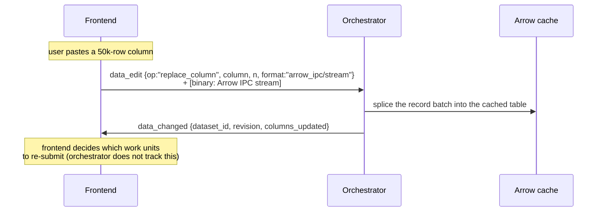

### 21.3 Computed column (runner → cache → frontends)

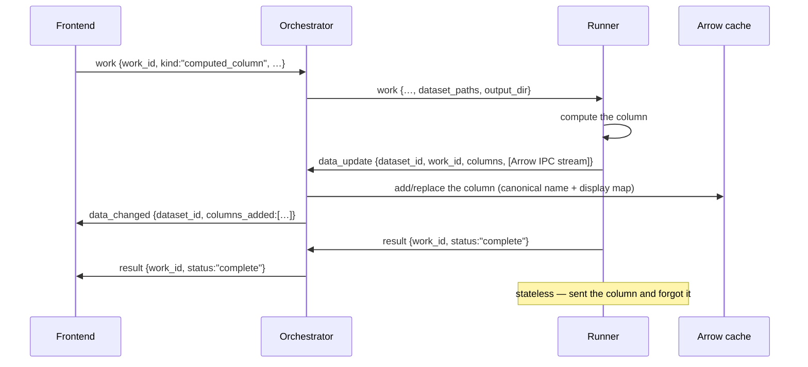

### 21.4 Dev runner attach → QML reload → routed work

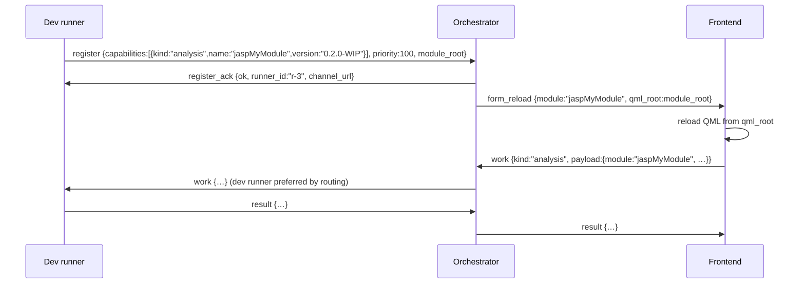

## 22. Status enum

Shared by `result` (both directions):

| `status` | Meaning |
|---|---|
| `running` | Started, no publishable output yet. |
| `changed` | Output updated; `payload` carries the new body. |
| `complete` | Finished successfully; `payload` is final. |
| `aborted` | Cancelled — by `abort`, or by a newer same-id `work`. |
| `validation_error` | Options/data failed validation; user-fixable. `message` explains. |
| `fatal_error` | Work crashed. `message` explains. |

> This consolidates the legacy `analysisResultStatus` / `engineAnalysisStatus` enums
> (`validationError`, `fatalError`, `running`, `changed`, `complete`, `aborted`, …) from
> `Common/enginedefinitions.h` into one clean set. Image operations
> (`saveImg`/`editImg`/`rewriteImgs`) become distinct `kind`s or `op`s rather than statuses,
> if retained.

## 23. Correlation, revision & stale results

- `id` correlates a request with its direct response (`reply_to`).
- Streamed `result`s carry the originating `work_id` and the `revision` they were computed
  from.
- **“Options changed” is not its own message.** The frontend re-sends `work` with the *same*
  `work_id`, the new `options`/`settings`, and a bumped `revision`; the orchestrator forwards
  it as `work` to the owning runner, which cancels the in-flight run and re-runs (§20). The
  sender never needs to know whether the id is running, queued, or idle.
- The **frontend owns the per-`work_id` revision**: it bumps the `revision` on each
  re-submission (the frontend's own iteration count) and sends it with the `work` unit. The
  orchestrator keeps a **high-water mark** per `work_id`, validates that an incoming
  `revision` is ≥ it (rejecting regressions — which also guards against a delayed older
  message after a reconnect/resend), forwards it verbatim to the runner, and **discards any
  result whose `revision` is below the high-water mark** before forwarding it to the
  frontend. The high-water mark is recoverable from disk (the `results_<rev>/` folder names
  record the last completed revision), so an orchestrator restart does not lose revision
  continuity. The frontend may use its own revision to correlate submissions with results, or
  ignore it and rely on `status` for the run lifecycle. This replaces the legacy
  `_analysisAborted` / abort-time bookkeeping with a simple monotonic comparison.
- **Client-side correlation (realized).** The frontend's `JaspClient` keys a slot on `work_id`
  storing `{revision, handler}`; re-submitting the same `work_id` evicts by assignment and a result
  below the slot's `revision` is dropped, so the frontend independently guards against stale dispatch
  even before the orchestrator's high-water mark applies. Because the slot is keyed by the (stable)
  `work_id`, **a caller that supplies its own `work_id` guarantees its uniqueness per logical work
  unit within the session** — the client cannot tell a re-submission from a collision.

## 24. Data plane on the wire

The conceptual data plane — the Arrow cache, the column-name encoding contract, the type
representation, and the `.jasp` format — is defined in §8. This section states the
normative *wire* facts.

### 24.1 Addressing
Datasets are referenced by id everywhere in the frontend↔orchestrator protocol. A `work` unit
carries an ordered `dataset_ids` array (usually one element); the orchestrator owns the cache and
is the only component that knows the mapping `dataset_id → path`, resolving each id to a concrete
`dataset_path` so runners receive `dataset_paths` (parallel, order-preserving; `work`, §19.3).
Per-dataset operations (`dataset_open`, `data_edit`, `dataset_ready`, `data_changed`,
`data_update`) carry a singular `dataset_id`, since each acts on one dataset. Paths never cross
the frontend boundary.

> **Future: multi-dataset work.** `dataset_ids` is an array so a kind that references several
> datasets (e.g. a future join/merge) needs no protocol change. The orchestrator's resolution is
> already one-to-many — replacing N ids with N paths is the same operation as replacing one. When
> such a kind appears, its `payload` schema defines how it references the datasets; to let a
> `payload` name a dataset by id, the runner form would also carry the id↔path correspondence
> (e.g. a `datasets: [{id, path}]` form) — deferred until then. No multi-dataset kind exists
> today; this is future-proofing, not current behavior.

### 24.2 Cache format
A **data-plane runner** (§5.4, §8.1) writes each open dataset as a **Feather V2** file
(== Arrow IPC file, **LZ4-compressed** — §24.5) to the `cache_path` the orchestrator assigns —
the R utility runner for reader-heavy source formats, the Rust data-runner for Arrow-native
ones. Analysis runners **mmap it read-only** — zero-copy, zero serialization on load;
analysis runners never mutate the cache. **Opens** may be served by either lane (each writes
its own `cache_path`, so no contention); **edits are Rust's alone**: they flow frontend →
orchestrator → **Rust data-runner** → cache (`data_edit`, §19.1) or analysis-runner →
orchestrator → **Rust data-runner** → cache (`data_update`, §19.4). One serialized writer per
existing dataset preserves the `revision` invariant (§23); the orchestrator routes and owns
`revision` but never touches the bytes. At cache-build the opening lane canonicalizes column
names and stores the real↔canonical display map in Arrow schema field metadata (§8.2); cache
columns are named canonically and the real (display) names live in metadata.

### 24.3 Large / bulk data
- Incremental bulk data (a column, a block of rows) travels **inline** as an Arrow IPC
  *stream* binary payload (§18.3), **LZ4-compressed** (§24.5), up to `max_inline_payload`.
- Whole-file imports beyond that limit are done **by reference**: the message carries a
  path/URI and the orchestrator routes it (by format) to the opening data-plane lane for
  server-side ingest (§5.4, §8.1). This is the only shape that works for web (no shared
  filesystem with the browser).

### 24.4 Column-name canonicalization & the encoding contract

User column names are arbitrary (`"Age (years)"`) and not valid R symbols. The full contract
is in §8.2; the wire-relevant points:

- **Canonicalize once, at cache-build.** The **lane that opens the dataset** (§5.4) assigns
  each column a clean **canonical** (R-syntactic) name and records the real↔canonical map in
  Arrow schema field metadata (a `jasp:display_name` key on the canonically-named field). Built
  once per dataset; stored in the data itself.
- **Cache columns are named canonically.** Runners work entirely in canonical names.
- **`dataset_ready.schema`** (§19.2) reports, per column, both the canonical `name` and the
  real `display_name` (+ type), so the frontend shows real names while the backend works in
  canonical names.
- **The frontend sends and receives real (display) names** and is encoding-agnostic — it
  never sees a canonical name.
- **The runner does all translation**: encode incoming options real→canonical (incl. user
  R-code via `encodeRScript`), decode results canonical→real for display — each a cheap in-R
  lookup against the schema-metadata map. **No C++ round-trip; the C++ `ColumnEncoder` is
  retired.**
- The orchestrator is **name-agnostic per-work**: the opening lane built the map once at
  cache-build and the orchestrator routes by module/service/format; it never rewrites column
  names per request.

### 24.5 Compression: LZ4 everywhere

**All Arrow IPC artifacts use LZ4 frame compression.** This covers:

| Artifact | Where |
|---|---|
| Feather V2 cache files | §24.2 — `arrow::write_feather(…, compression = "lz4")` |
| Inline Arrow IPC stream payloads | §24.3 — `data_edit` bulk ops, `data_update` columns |

LZ4 decompresses at ~4 GB/s per core — effectively free at read time — while cutting size
~2–4× on typical survey/experimental data. There is **no uncompressed mode** and no
per-message toggle; the complexity isn't worth it. ZSTD is the fallback if a future dataset
class (e.g. genomics) demands better ratios at the cost of ~3× slower decompression — but
that's a config change, not a protocol change.

### 24.6 Type & representation (summary)

The full type contract is in §8.3. For implementers: **the Arrow type is the measurement
level** — `float64` = scale, `dictionary<…, ordered=1>` = ordinal, `dictionary<…,
ordered=0>` = nominal — using Arrow's **native `ordered` flag** (no metadata needed to
distinguish the three). Categoricals store the **data values** in the dictionary with a
sparse `jasp:labels` value→display-label overlay; *read-as-scale returns the values, not the
labels*; ordinal ranking is the dictionary sequence order. Field-metadata keys:
`jasp:display_name`, `jasp:all_integer`, `jasp:labels`, `jasp:empty_values`,
`jasp:auto_sort_by_value`, `jasp:compute_expr`, `jasp:compute_work_id`, `jasp:description`.
The per-cell `intsId` surrogate is dropped (Arrow's dictionary indices replace it).
(**Validated**: the `ordered` flag round-trips through Feather V2 + LZ4 on R `arrow` 25.0.0 —
see `refactor_design/poc/ordered_flag_roundtrip.R`.)

## 25. Lifecycle & timing

### 25.1 Parameters

| Parameter | Default | Notes |
|---|---|---|
| `activity_min_interval_ms` | 1000 | Rate-limit for the opportunistic `activity` message (§19.4): the runner sends an `activity` ping on queue processing only when it has nothing else to send **and** its last activity report is older than this. **Not a fixed heartbeat.** |
| `busy_hang_timeout` | 300000 ms (5 min) | **Primary hang detector.** While the orchestrator has outstanding `work` for a runner: if **no message at all** (neither `result` nor `activity`) arrives for this long, treat the runner as hung → SIGKILL managed / surface "appears hung" for attached. Because activity is reported on every queue-processing tick, this fires only for *truly silent* runners, not slow-but-alive ones. Generous on purpose; may become analysis-aware later. |
| managed-runner death/hang | – | Orchestrator SIGKILLs and spawns a replacement (same module set); in-flight work re-run on the fresh runner (statelessness — §4). |
| attached-runner death/hang | – | Cannot be killed by the orchestrator; dropped from routing, emits `runner_left`, frontend told it “appears hung.” Owner restarts it. |
| `max_invocations` | 50–100 | **Soft** threshold (R leaks memory). The orchestrator counts work per managed runner; when a runner crosses it, it spawns a replacement (same module-set) but the old runner keeps serving until the replacement is READY, then is shut down (make-before-break). Not a hard limit. |
| `pool_size` | 4 | **Steady-state** number of warm managed runners (fixed pool). On a miss, evict the LRU runner and spawn the needed one. During a rotation the pool briefly runs at `pool_size + 1` (deliberate, bounded). (Memory-based sizing is deferred — below.) |
| abort kill timeout | 5000 ms | If `abort` is not honored (R stuck in compiled code), the orchestrator SIGKILLs a *managed* runner and retries on a fresh one. An *attached* runner cannot be killed by the orchestrator — the work stays stuck until its owner restarts it. |

### 25.2 Runner rotation (make-before-break, seamless)

R leaks memory, so managed runners are recycled after enough work — but **never** in a way
that leaves a module without a warm runner. The invocation limit is a **soft** trigger and
the orchestrator drives the whole rotation; the runner itself is oblivious (it just serves
`work` until it gets `shutdown`). The mechanism is in §6.4; the normative invariant:

**A runner is retired only after its replacement is confirmed READY.** If a replacement
fails to start (module won't load, crash during warmup), the orchestrator keeps the old
runner alive and retries the replacement later. Because the old runner covers the
replacement's entire warmup, the module-set always has ≥1 warm runner — there is **no cold
window and no stutter** at rotation. (A naive kill-then-spawn would instead leave a cold gap
of one full warmup.) This is only possible because the runner is stateless (§4): moving work
to the replacement needs no state transfer.

### 25.3 Pool sizing: a fixed pool of N runners (v1)

The pool is a **fixed number of warm managed runners** (`pool_size`, default 4). On a cache
miss (a needed module has no warm runner), the orchestrator **evicts the LRU runner**
(coldest module-set) and spawns the needed one (§6.2). With a pool that comfortably holds the
2–3 modules a typical session uses, eviction is rare.

This is deliberately simple for v1. A fixed count is arbitrary (runners vary hugely in
footprint), but it's predictable and ships; memory-based sizing is deferred.

> **Multiple frontends** (§17.2) share this one pool. Each frontend's work is scoped by its
> `session_id`; the pool is global across all sessions/frontends, so a busy multi-frontend
> deployment may evict cold modules more aggressively.

#### Deferred: memory-based pool sizing (future)

The eventual upgrade sizes the pool by **memory, not a fixed count** — keep the sum of
managed-runner footprint under a `runner_memory_budget`. Research notes for when we do this:

- **Measure PSS, not RSS.** RSS counts a shared page once *per process*, so summing RSS
  overcounts badly. **Proportional Set Size (PSS)** divides each shared page among its
  sharers, so summed PSS equals the true physical usage. Linux: `Pss:` from
  `/proc/<pid>/smaps_rollup` (kernel 4.14+). macOS:
  `task_info(TASK_VM_INFO).phys_footprint`. Windows: `GetProcessMemoryInfo` working set is
  RSS-like and overcounts — budget conservatively there.
- **Who measures**: the orchestrator measures *managed* runners externally (it has the PIDs;
  authoritative; works even when a runner is wedged). Runner **self-reported** memory (a
  `mem_kb` field on `activity`/`register`) is only a secondary/optional signal — the only
  option for *attached* runners (no PID, possibly remote). A budget must never depend on
  self-reports (a wedged runner can't report activity).
- **R-specific**: the dominant per-runner cost is the **private R heap during an analysis**
  (not shared). **R's GC defeats fork-based copy-on-write sharing** — so don't fork runners
  from a warm master to share memory. What *is* genuinely shared: the R binary + package
  `.so` segments and the **mmap'd Arrow dataset cache**.

### 25.4 Liveness & activity reporting

Two distinct failure modes, handled separately:

**1. Crash / death detection — NNG pipe-disconnect (primary, reliable, no heartbeat).**
When a runner process dies (crash, SIGKILL, OOM-kill, clean exit), the OS closes its socket
and NNG fires a pipe-removal event — `nng_pipe_notify` `NNG_PIPE_EV_REM_POST`, exposed in
`nanonext` as `pipe_notify(sock, cv, remove = TRUE, flag = TRUE)` (the `flag` lets a `wait()`
distinguish *disconnect* from *message received*). This is prompt on **both IPC and TCP** and
needs no timeout. This is the workhorse for detecting dead runners.

**2. Hang detection (alive but wedged) — a wall-clock `busy_hang_timeout` on *silence*.** The
hard case: the process is *alive* (socket open, so no pipe-disconnect) but wedged in a compiled
call and produces nothing. While the orchestrator has outstanding `work` for a runner, it treats
**any** inbound message — a `result` or an opportunistic `activity` ping — as proof of life and
stamps `last_activity`. If **no message at all** arrives for `busy_hang_timeout`, treat the runner
as hung. Managed → SIGKILL + re-run on a fresh runner; attached → surface "appears hung."
Because activity is reported on each pass through the runner's main loop, a runner that is
alive and cycling through work keeps `last_activity` fresh — so the timeout fires only for
*truly silent* runners, not ones that are actively processing work units.
**Caveat:** a legitimately long *monolithic* computation that blocks inside jaspBase (so the
loop is never re-reached and no activity can be sent) also produces no message, so this can
still false-positive — mitigate with a generous default, later analysis-aware tuning, and the
user can always abort. This is the fundamental limit: R cannot tell us it is busy in C (§7.6).

Idle runners need no activity reporting either: an open socket *is* the alive signal, death is
caught by pipe-disconnect, and a wedged idle runner is caught lazily on its next work assignment.

**3. Activity reporting — opportunistic, not a fixed heartbeat.** Liveness is reported as a
byproduct of real work, not a timer: each pass through the runner's main loop — reaching the
dispatch point after completing a work cycle — is genuine activity and an opportunity to phone
home. When it has a `result` to stream, the result *is* the activity signal; when it returns to
the loop top with nothing to send, it emits a lightweight `activity` message (§19.4). The
cadence is bounded by the work rate itself, so no separate rate-limiting is needed in practice
(`activity_min_interval_ms` remains available as a guard). The orchestrator stamps
`last_activity` on receipt of **any** inbound message — and **only** on inbound messages: it
does **not** refresh `last_activity` when it *sends* work to a runner, because that is
orchestrator activity, not evidence the runner is alive. `last_activity` means "we observed the
runner doing something at this time," and must stay a trustworthy observation.

A fixed-interval heartbeat on a side thread is deliberately **not** used: it would prove only
that the socket/thread is alive, which says nothing about whether the runner is doing actual
work — and worse, it would keep pinging "alive" while an analysis is wedged, contradicting the
silence-based hang detector above. It also cannot distinguish a legitimately long C call from a
wedged one (R is blocked in both, so `last_activity` is stale in both).

A **TCP beat** to verify the socket still works — fast half-open detection over remote TCP, where
OS TCP keepalive only catches half-open connections and is far too slow by default (Linux ~2h),
exposed by NNG only as a bool with OS-controlled timing — is a future **extension** for
remote/TCP, **not a cornerstone**. It would be a tiny C thread in the runner (a pthread, or an
equivalent `nanonext` primitive) sending a beat independently of the interpreter — NNG sockets
are thread-safe; this is *not* multithreading R. Easily added later if/when needed.

**Recommendation:** for the desktop / local-IPC MVP, ship **pipe-disconnect + opportunistic
activity reporting + `busy_hang_timeout` on silence**. No fixed heartbeat. Add a TCP beat when/if
we go remote/TCP or need alive-but-NNG-wedged detection.

### 25.5 NNG gotchas (validated by the PoC)

The following were validated over both `ipc://` and `tcp://` in the PoC
(`refactor_design/poc/poc_nanonext_transport.R`, nanonext 1.10.1 / nng 1.12.0) — **under PAIR v0**.

- **`nng_pipe_notify` / nanomsg/nng#1665 — does not bite us; validated under PAIR v1 and deployed.**
  That bug (the removal callback stops firing after the first event if you close a socket from
  within the callback) is about the raw C *callback* API. nanonext exposes pipe events as a
  **condition variable**, not a user callback, so that failure mode does not arise: sequential pipe
  removals were all detected, on both a multi-pipe socket and the per-runner-PAIR design (closing
  one runner's channel did not affect another's detection). The PoC's message-vs-disconnect
  distinguisher was `pipe_notify(flag = TRUE)` with `wait()` returning **FALSE for a pipe event vs
  TRUE for a message** (a `recv_aio` completion); `until(cv, msec)` is the timeout-safe detector and
  `cv_value(cv)` a non-consuming counter.
  **Status:** the PoC ran under PAIR **v0**, where pipe events also produced some **spurious
  signals**. Re-validated under **PAIR v1** (the protocol in use) in both directions — Rust↔Rust
  (orchestrator unit tests) and Rust↔R (a real nanonext runner against the Rust orchestrator) — with
  **no spurious signals**. The orchestrator now uses the Rust `nng` crate's `Socket::pipe_notify`
  callback (`PipeEvent::AddPost`/`RemovePost`) to maintain a `Pipe → {runner_id, capabilities}`
  registry and evict runners on disconnect (§5.3, handover Phase 2). Disconnect detection is no
  longer a gap; pipe-*targeted* routing (vs the current broadcast) is the remaining item, needed
  once there is more than one runner.
- **`recv-size-max` (`NNG_OPT_RECVMAXSZ`) — handled automatically by nanonext.** libnng's raw
  default is ~1 MB and silently discards larger messages, but nanonext raises this internally:
  **1/8/64/256 MB messages all delivered intact with default socket settings.** No manual raise to
  `max_inline_payload` (§18.4) is needed when using nanonext. (The raise remains necessary for raw
  libnng, or any other binding that keeps the ~1 MB default.)
- Sends to a disconnected peer are **silently discarded and raise no error** (validated) — detect
  death via pipe-disconnect, never via send failures.
- TCP keepalive (`NNG_OPT_TCP_KEEPALIVE`) is a bool; timing is platform-specific (sysctl),
  slow by default, and TCP-only.

### 25.6 Routing precedence

The base precedence for a work unit targeting module *M* at version *V* is in §9.4 (attached
*M@V* → warm managed *M@V* → spawn managed *M@V*). Additional normative rules:

- **Version policy.** If no runner advertises *M* at exactly *V*, the orchestrator's
  configurable version policy applies: use the best available version — recording the
  producing version in the `result` provenance — or fail with `version_mismatch`. This is
  what lets a **dev runner** (WIP version) and the **installed** runner (release version)
  coexist.
- **Tie-break** when several attached runners advertise the same module at the same priority:
  **most recent registration wins**; otherwise any. (Minor; revisit if shared/remote pools
  become real.)
- **Multi-capability runners.** A runner may advertise **multiple capabilities** (e.g.
  several `analysis` entries, each `{name, version}`); it is eligible for any of them and is
  **evicted / warmed as a single unit** (the whole advertised set together).
- **Raw-R routing.** Work with `kind:"rcode"` is routed to a runner advertising an `rcode`
  capability — in practice a dedicated **utility runner**, since arbitrary per-request
  libpaths widen the load/leak/conflict surface.

## 26. Error handling

Protocol errors use the `error` message (§19.2). Codes:

| `code` | Meaning |
|---|---|
| `bad_envelope` | Missing/invalid required envelope field, or unparseable JSON. |
| `unsupported_version` | Envelope `v` not supported. |
| `unknown_type` | Message `type` not recognized. |
| `auth_failed` | Missing/invalid `auth_token` on a transport that requires one. |
| `not_allowed` | Module not in allowlist, or attached runners disabled. |
| `dataset_not_found` | Unknown `dataset_id`. |
| `module_not_available` | No runner (managed or attached) can serve the module. |
| `version_mismatch` | Module exists, but no runner advertises the requested version (and the version policy is fail). |
| `payload_too_large` | Binary payload exceeds `max_inline_payload`. |
| `timeout` | A bounded wait (e.g. dataset open) elapsed. |
| `internal` | Orchestrator/runner internal failure. |

`error` carries `ref_id` (the offending message's `id`) so the sender can match it.

## 27. Security & tenancy

- **Local `ipc://`**: same trust model as the desktop talking to itself. No token. This is
  the desktop and the local dev-runner case.
- **Remote `tls+tcp://` / `wss://`**: `auth_token` **required** (or mTLS), validated at the
  orchestrator edge during `register` and on frontend connect.
- Orchestrator config gates attachment: `allow_attached_runners` (bool), a module allowlist,
  per-token capabilities, `max_inline_payload`.
- `session_id` scopes every message for multi-tenant web (§11). On desktop it is a single
  constant value. An attached runner is scoped to its session.

## 28. Versioning & compatibility

- The envelope `v` is the protocol version. Current: **`1`**.
- **Additive** changes (new optional fields, new message `type`s, new `op`s, new `kind`s, new
  `format`s) do **not** bump `v`. Receivers ignore unknown fields and unknown message types
  they don't handle (responding `error{code:"unknown_type"}` only when a response is
  warranted).
- **Breaking** changes (field removal/retyping, semantic change to an existing field, framing
  change) bump `v`. A receiver seeing an unsupported `v` responds
  `error{code:"unsupported_version"}` and does not attempt to parse further.
- The orchestrator is the compatibility anchor: it should accept a range of client versions
  and translate where feasible.
- The versioned control-endpoint URL (§17.2) lets a frontend **discover** a compatible
  running orchestrator; the `v` handshake **validates** compatibility before use.

## 29. References

- **Arrow IPC / Columnar Format (the wire + cache format):**
  https://arrow.apache.org/docs/format/Columnar.html — stable, versioned; IANA media types
  registered. Feather V2 == the Arrow IPC *file* format.
- **nanonext** (R binding for NNG, used by `jaspRunner`): https://nanonext.r-lib.org · CRAN.
- **NNG** (Nanomsg Next Generation, the transport): https://nng.nanomsg.org.
- **NNG pipe-notify bug** (defer-close requirement, §25.5): https://github.com/nanomsg/nng/issues/1665.
- **NNG benchmark** (NNG vs ZeroMQ vs NanoMsg, §10): https://arxiv.org/html/2508.07934v1.
