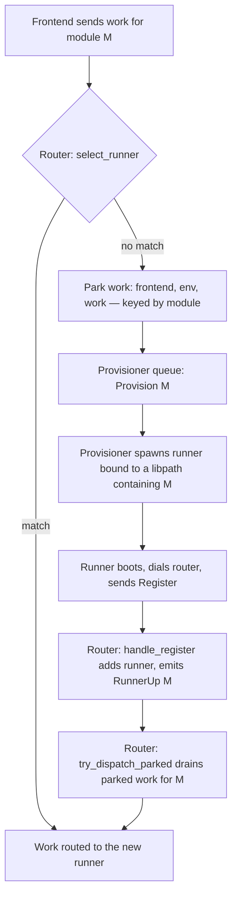
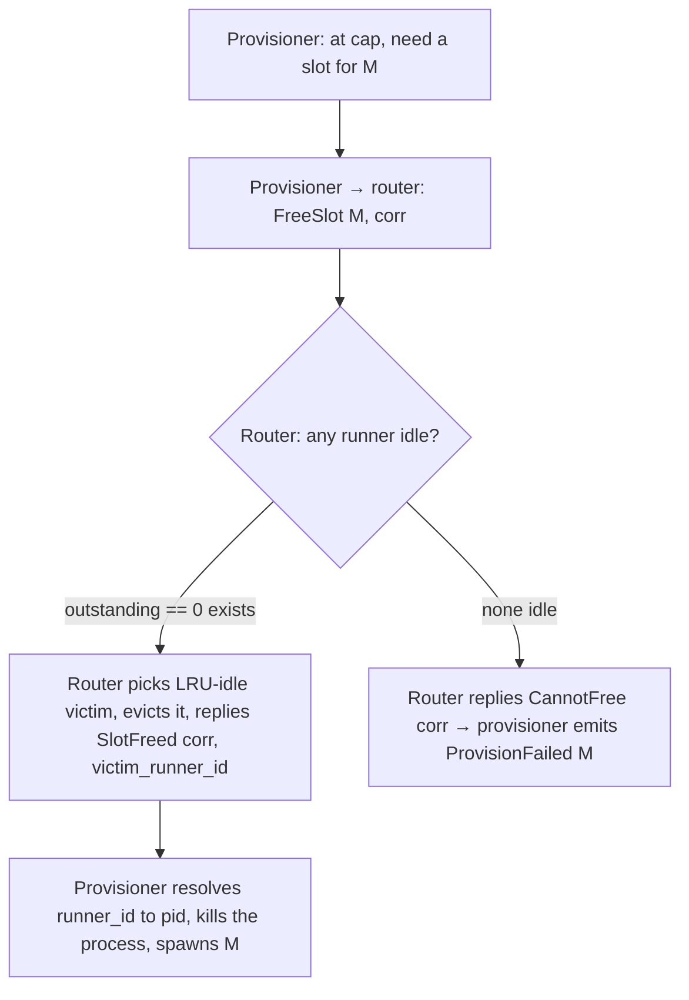

# Orchestrator Runner Provisioner — Capacity & Process-Lifecycle Design

**Status:** settled design; **not yet implemented**. This document is **normative for the
orchestrator's runner-provisioning and capacity architecture** — how a request for a module that no
live runner can serve becomes a runner that can serve it.

**Scope & siblings:** this is a sibling of `orchestrator-router-design.md` (normative for the
single-threaded router, concurrency, and routing) and `orchestrator-design.md` (transport, wire
shapes, configuration). The wire protocol lives in `neo-jasp.md` and `orchestrator/src/messages.rs`.
The **construction of libpaths/libsets** (dependency co-resolution, conflict detection, module
grouping) is a **separate project** (the module-bundle tooling); this design *consumes* libpaths as
given and does not specify how they are built.

---

## 0. Design choice: the provisioner is an async utility that keeps blocking work off the router

The router (see `orchestrator-router-design.md`) is a single thread that owns *all* routing state
with *no locks*; its entire value is that it never blocks. Spawning a process, killing one, and
reaping a dead child are all blocking OS work. **None of it may happen on the router thread.**

So we introduce one more background thread — the **RunnerProvisioner** — whose sole job is to be the
place where process-lifecycle work happens. The router *moves messages*; the provisioner *touches
processes*. Concretely:

- The **router owns** the runner registry, the frontend table, the work-route table, and all routing
  decisions — including *which* runner to evict (idleness is router state).
- The **provisioner owns** OS-process lifecycle (`spawn`, `kill`, `reap`) and its own ephemeral
  bookkeeping of in-flight spawns. It owns **no routing state** and makes **no routing or idleness
  decisions**.

This keeps the router's deadlock-free invariant intact (no second thread ever holds routing state)
and gives the provisioner a narrow, testable contract: `Provision`/`FreeSlot`/`Kill` in,
`ProvisionFailed`/`SlotFreed` out. The provisioner is a servant the router commands, **not** a
co-owner of the fleet.

> **Rejected alternative — provisioner owns the runner registry.** Moving the registry into the
> provisioner forces the router to either take a lock to read it (reintroducing blocking on the hot
> path — the exact deadlock class the single-threaded router eliminated) or read immutable snapshots
> (which makes eviction and per-runner mutation a cross-component, stale-snapshot hazard). The
> registry living in the router is load-bearing, not incidental.

---

## 1. Libpaths, libsets, and the runner model

**Terminology.**

- A **libpath** is a single, self-consistent merged library: **`jaspRunner` itself + one or more
  modules + their co-resolved dependencies** — exactly one version of every package. `jaspRunner`
  lives *inside* the libpath so that its own dependencies co-resolve with the modules'; otherwise the
  runner (which loads first) would pin its dep versions for the whole process and a module built
  against different versions would break subtly at load time.
- A **libset** is the *collection* of libpaths available to the fleet.

A libset exists because not all modules co-resolve: modules with mutually compatible dependencies
share one libpath; modules that conflict on a dependency version cannot, and live in **separate
libpaths** (hence separate runners, where the OS provides the isolation R cannot give in-process).
How modules are partitioned into libpaths is the bundle tooling's job (separate project).

**The runner model.**

- A runner is **bound to one libpath for its lifetime** and **advertises exactly the modules in that
  libpath** (it scans the libpath at startup; it does not advertise a single hard-coded module as
  today).
- Modules are **lazy-loaded on first use and never unloaded** — the first work unit for module M does
  `library(M)`; M stays resident. This is the model JASP's own engine uses (prepend-and-keep; there
  is no `unloadNamespace`). It is efficient and warm, at the cost of monotonic memory growth and
  shared in-process state across the modules a runner has touched (see §9).
- **Model A routing:** the router sends work to any matching runner regardless of busy state; the
  runner queues internally and processes serially (R is single-threaded). This is how `route_work`
  behaves today — unchanged.

Because a runner is bound to a libpath for life, **libpath identity includes version**, and deploying
a new module version is a *fleet-roll* operation (drain old runners, provision new ones on the new
libpath), not an in-place update.

---

## 2. Registration is layered: catalog vs. live capability

Two distinct facts about modules, with two distinct owners:

| Fact | Meaning | Owner |
|---|---|---|
| **Catalog** | what *can* be served (the provisionable module/version set) | **provisioner** (it knows the libset) — this is also the source for `list_modules`-style discovery |
| **Live capability** | what *is* served right now | **runners**, via self-registration with the router |

Runners still **self-register** with the router (open, self-serve). This is what lets a **dev runner**
advertise a locally-built module/version not present in any libset: it simply registers and the
router routes to it directly, the provisioner never involved. The router stays the **sole router**;
the provisioner never routes — it only provisions and answers catalog queries.

The win this layering buys: the system can distinguish **"available but not yet provisioned"**
(fixable — provision and wait) from **"does not exist"** (fatal). Today every miss is just
"no runner → die."

---

## 3. Provisioning flow (the happy path)

Step by step:

1. Work for module M arrives; `select_runner` finds **no** matching runner.
2. The router **parks** the work — it stores `{frontend, env, work}` in a parked store keyed by
   module — and sends `Provision { module, version }` to the provisioner's queue. It then continues;
   it does **not** wait. (This replaces today's immediate fatal error; no-silent-loss is preserved by
   the park timeout in §7 and by `ProvisionFailed` in §4.)
3. The provisioner spawns a runner bound to a libpath containing M (a blocking spawn — on its own
   thread, so the router is unaffected).
4. The runner boots, dials the control endpoint, and sends `Register` advertising M.
5. The router processes the registration in `handle_register`, adds the runner to its registry, and
   emits `RunnerUp { runner_id, modules }` to the provisioner (see §5).
6. **Still inside `handle_register`**, the router calls `try_dispatch_parked()`, which walks the
   parked store and routes every entry the new runner can serve, via the normal `route_work` path
   (Model A).

The critical design point: **the provisioner never carries or re-sends the work.** The runner's *own
registration* is the "engine is online" signal, and the router — which already processes that event —
is what dispatches the parked work. Letting the provisioner signal "provisioned!" would reintroduce a
race (it could report success before the runner has actually registered). Success therefore never
round-trips the provisioner; only failure does (§4).

---

## 4. Failure path

If the provisioner **cannot** provision — module M is not in any libpath, or (v1) it is at its cap
with nothing to spare — it enqueues **`ProvisionFailed { module, reason }`** onto the router's
mailbox. The router fails **every** parked work for that module, sending the frontend a fatal result
(the same shape as today's `no_runner_result`, with a specific reason). The manager never talks to a
frontend directly — only the router does.

---

## 5. Reconciling two views: provisioner bookkeeping vs. router registry

The provisioner tracks **in-flight spawns**; the router tracks **registered runners**. These are two
views of overlapping reality and must be reconciled, or a module can be wedged **un-provisionable**:

> Provisioner spawns M; the process crashes during boot and never registers. No `RunnerUp` ever
> arrives. If the provisioner's `spawning[M]` entry (its dedup key — "don't spawn M twice") is never
> cleared, every later `Provision{M}` is ignored as a duplicate. M is permanently un-provisionable;
> each request parks, waits out the park timeout, and fails.

So the provisioner keeps **only an ephemeral in-flight set** — `spawning: module → { timestamp, child
handle / pid }` — and **never mirrors the established registry** (the router is the sole authority for
"what is running"). The `spawning[M]` entry has three clearing paths:

| Event | Source | Action |
|---|---|---|
| `RunnerUp { modules }` | router, on registration (success) | clear `spawning[M]`, M is now *established* |
| child exits before `RunnerUp` | provisioner reaps its own child (it is the parent) | boot **crash** → clear `spawning[M]`, allow re-spawn, emit `ProvisionFailed` |
| in-flight timeout (§7) | provisioner's own clock | boot **hung** (alive but never registered) → clear `spawning[M]` |

And symmetrically, the router emits **`RunnerGone { runner_id, modules }`** when it evicts a runner
or detects its channel die; the provisioner clears *established* for those modules so a future
`Provision{M}` may re-spawn.

The principle: **registration is the authoritative "provision succeeded,"** and a process that fails
to boot *cannot report its own failure* — so its parent, the provisioner, must detect it (by reaping
the child, or by timing out).

The **`RunnerUp`** signal does double duty: the runner registers with a PID-bearing hint
(`runner-<pid>`), so the provisioner can associate the router's canonical `runner_id` with the PID of
the process it spawned. That `runner_id ↔ pid` table is what later lets the provisioner execute a
targeted `Kill { runner_id }` for eviction (§6).

---

## 6. Eviction: the router selects, the provisioner executes

**The provisioner never knows which runners are idle, and never should.** Idleness is router state
(`outstanding == 0`), and the router is the only thread that observes sends and terminal results, so
it is the only place that can select a victim without stale-state races. Giving the provisioner
idleness knowledge would mean sharing routing state across threads — the door we deliberately closed.

The router already has what it needs: `outstanding` (idle check) and `last_activity` (LRU order).
Eviction-for-provision (deferred to v2 — see §10) is therefore a collaboration where each side does
what it owns:

**Hard rule: never evict a runner with `outstanding > 0`.** An idle runner (Model A: `outstanding` is
incremented on send, decremented on terminal result) has nothing in flight, so evicting it loses no
work. If *no* runner is idle, eviction cannot make room without aborting in-flight work — so v2 either
fails the provision (`ProvisionFailed`) or, only if preemption is ever enabled, aborts the
lowest-priority busy runner and requeues its work. Preemption is off by default and may never be
needed.

---

## 7. Timers: two, for two different victims

| Timer | Owner | Job | Fires when |
|---|---|---|---|
| **In-flight timeout** `T_spawn` | provisioner | clear a wedged `spawning[M]`; emit a *specific* `ProvisionFailed` | a spawn has not produced a registration within `T_spawn` |
| **Park timeout** `T_park` | router | no-silent-loss: fail parked work so the frontend is never stranded | parked work has had no resolution within `T_park` |

Set **`T_spawn` < `T_park`**. In the normal case the provisioner gives up first and surfaces a
specific "runner for M failed to start"; the park timeout is then purely the backstop for "even the
provisioner is wedged." They protect different victims: `T_spawn` keeps the **fleet** able to serve M
again; `T_park` keeps the **user's request** from vanishing. (The router's existing hang detection
also reaps *registered* runners whose channels die — a third, independent liveness mechanism.)

---

## 8. Message & state contract

**Router → Provisioner** (the provisioner's queue; all non-blocking sends from the router thread):

| Message | When | Meaning |
|---|---|---|
| `Provision { module, version }` | every routing miss | "a runner for this module is needed" (stateless; the provisioner dedups via `spawning`) |
| `FreeSlot { module, corr }` *(v2)* | provisioner at cap | "evict an idle runner so I can provision `module`" |
| `Kill { runner_id }` *(v2)* | router evicts | "terminate this runner's process" |

**Provisioner → Router** (new `RouterMsg` variants on the router's mailbox):

| Message | When | Router action |
|---|---|---|
| `ProvisionFailed { module, reason }` | cannot provision / boot failed | fail all parked work for `module` to their frontends |
| `SlotFreed { corr, victim_runner_id }` *(v2)* | router evicted a victim | provisioner kills the pid and spawns |
| `CannotFree { corr }` *(v2)* | no idle runner to evict | provisioner emits `ProvisionFailed` |

**Router → Provisioner (lifecycle signals):**

| Message | When |
|---|---|
| `RunnerUp { runner_id, modules }` | a runner registers (`handle_register`) |
| `RunnerGone { runner_id, modules }` | a runner is evicted or its channel dies |

**Router state added:**

| Field | Type | Purpose |
|---|---|---|
| `parked` | per-module FIFO of `{frontend, env, work}` | work awaiting a runner |
| `parked_since` | per-entry timestamp | park-timeout scan on `Tick` |

(The provisioner owns its own `spawning` set and `runner_id ↔ pid` table; these are *not* router
state.)

**Router behavior changes:** on miss, park + `Provision` (not immediate fatal); `try_dispatch_parked()`
at the end of `handle_register`; process `ProvisionFailed`; emit `RunnerUp`/`RunnerGone`; park-timeout
scan on `Tick`; send the frontend a `running` marker when work is parked (so a waiting client doesn't
time out believing the work is lost); dedup parked entries by `(session_id, work_id, revision)` —
frontends retry sends.

**Runner changes:** scan the libpath at startup and advertise the whole module set (today it
advertises one hard-coded module); lazy-load a module on first work for it.

---

## 9. Conscious trade-offs (accepted)

- **One process, many modules ⇒ shared R global state.** A runner that has touched modules X, Y, Z
  carries all their loaded namespaces and any global side effects; a module that crashes or leaks can
  taint later work in that runner (and cross-session, if a runner serves multiple users). The escape
  valve is **runner recycling** — the provisioner kills and respawns a runner after an error or
  periodically. This stays compatible with incremental recompute, because recompute state is **on
  disk** (copy-on-seed per revision), not in the runner's memory — recycling costs only warmth, never
  correctness.
- **Efficiency over per-module isolation.** Conflicting modules get separate libpaths → separate
  runners (OS isolation); compatible modules share a runner (warmth, lower process count). This is a
  deliberate knob, tunable by how modules are grouped into libpaths.
- **Cold start is the dominant UX feel.** First run of a not-warm module pays a full R + jaspBase +
  module boot (seconds); iteration is fast (that is the win). Plan warm-pool sizing / pre-warming of
  common modules, and keep client timeouts tolerant of provisioning latency (the `running` marker
  helps).

---

## 10. Open questions & deferred work

**External (separate project):** libpath *construction* — co-resolving `jaspRunner` + modules + deps
into merged libpaths, detecting conflicts (shared-dep hash mismatch ⇒ cannot merge ⇒ separate
libpath), and the policy for grouping modules into libpaths. This design consumes libpaths as given.

**Deferred here:**

- **Eviction-for-provision (§6)** — v2. v1 fails the provision when at cap with nothing idle.
- **Preemption** (abort a busy runner) — off by default; likely never needed.
- **Version-matching in `select_runner`** — currently matches on module *name* only; once runners
  carry diverse module versions this must match on version (exact-preferred, any-version fallback).
- **Runner recycling** for memory growth / taint recovery (§9).
- **Discovery** (`list_modules`) — owned by the provisioner's catalog; not wired yet.

---

## 11. Implementation order (bricks)

1. **Runner generalization** — scan-and-advertise-many + lazy-load on first work. Self-contained,
   testable, a prerequisite for the provisioner to spawn multi-module runners; keeps the recompute
   test green.
2. **Router provisioning plumbing** — `parked` store, `Provision` on miss, `try_dispatch_parked()` on
   registration, `ProvisionFailed` handling, park timeout, `RunnerUp`/`RunnerGone` emission, the
   `running` marker.
3. **Provisioner thread** — spawn/reap on a tick, `spawning` set with the three clearing paths,
   in-flight timeout, consume `Provision`, emit `ProvisionFailed`; spawn the (generalized) runner.
   End-to-end test: kill the manually-started runner, let the provisioner spawn one on demand.
4. **Eviction-for-provision (§6)** — `FreeSlot`/`SlotFreed`/`Kill`, router LRU-idle selection,
   `runner_id ↔ pid` resolution.
5. **Version-matching** in `select_runner`.
