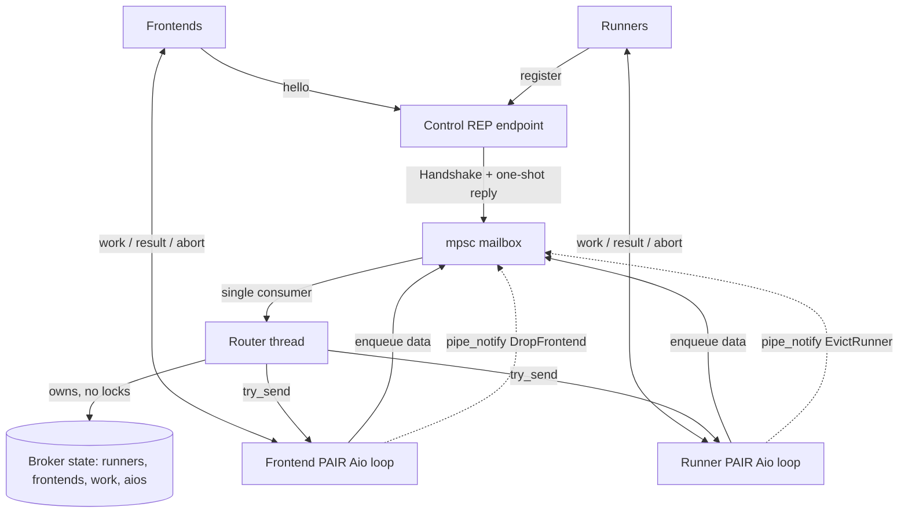
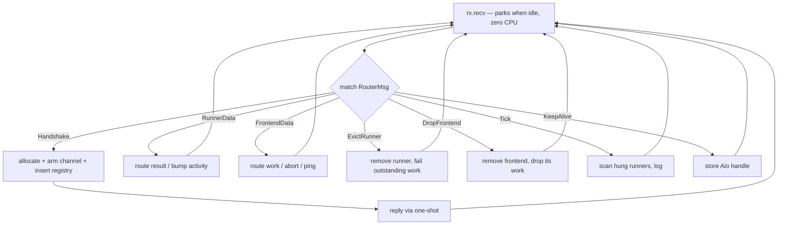
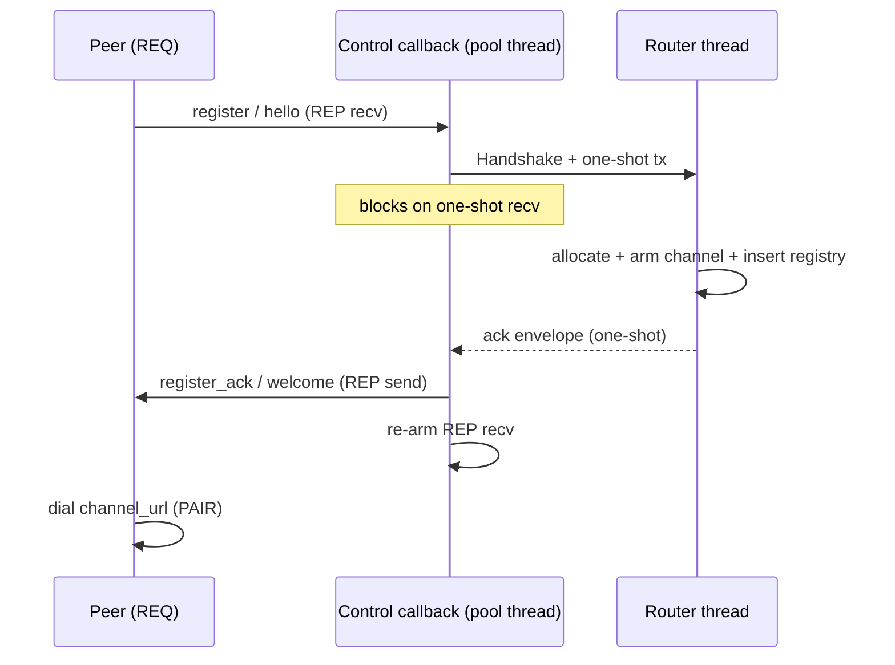
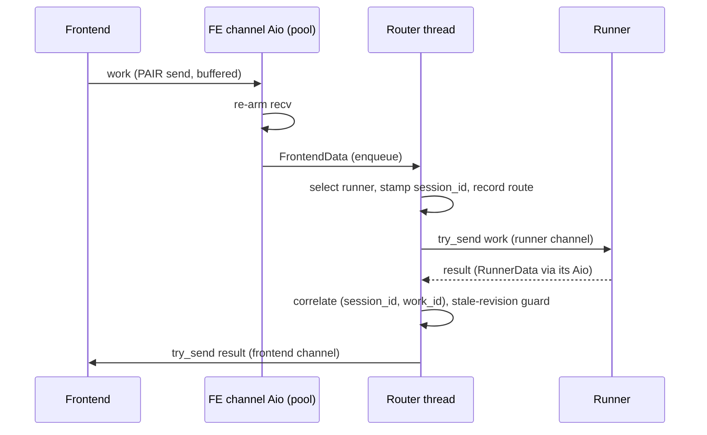
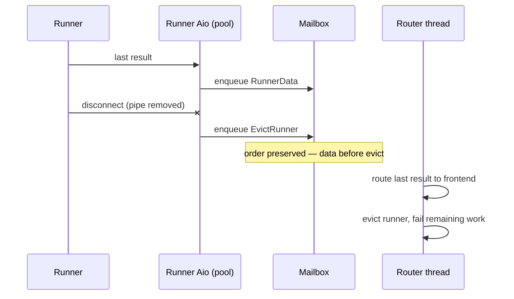
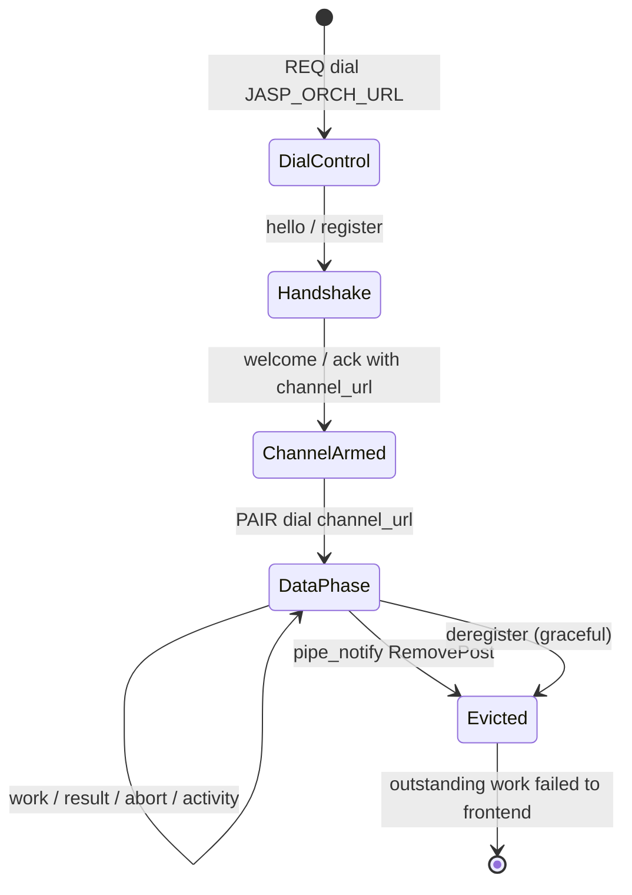
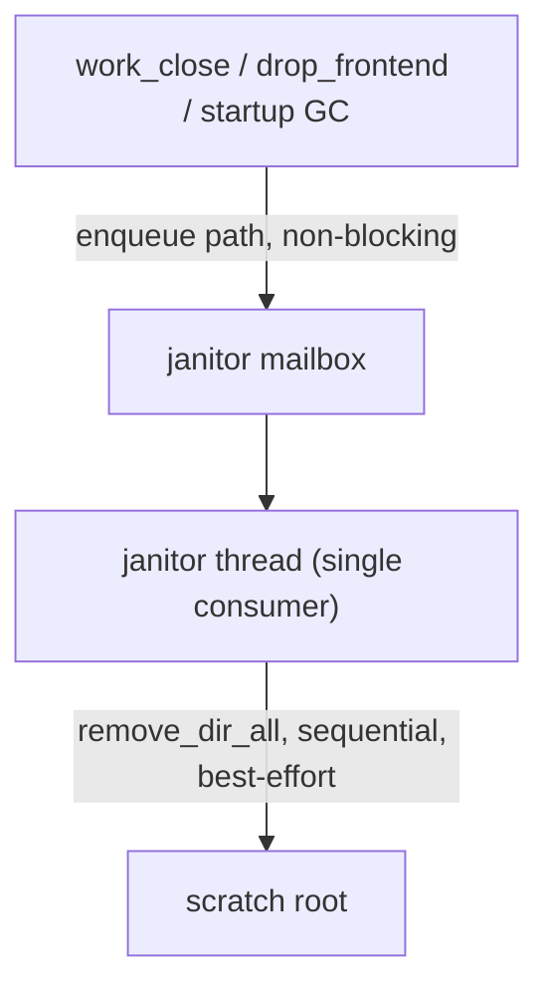

# Orchestrator Broker/Router — Single-Threaded Router Design

**Status:** settled design, implemented and green (`cargo build` / `test` / `clippy` all clean; 8/8
unit tests pass). This document is **normative for the orchestrator's concurrency and routing
architecture**.

**Scope:** this document is normative for the orchestrator's concurrency and routing architecture,
and includes a rationale for the central design choice (the single-threaded router). Transport
model, handshake wire shapes, data structures, message routing/correlation, and configuration are
detailed in `orchestrator-design.md`, which remains authoritative for those topics. The wire
protocol itself lives in `neo-jasp.md` (§17–§25) and `orchestrator/src/messages.rs` (single source
of truth; JSON Schema generated from it).

---

## 0. Design choice: a single-threaded router, and why performance is not a concern

The orchestrator routes every message through **one dedicated router thread** (the canonical
event-loop pattern — redis, nginx workers, node). This is the right default for an I/O-bound broker
with light per-message work, and at this project's scale it has orders of magnitude of headroom.

**Performance will not be an issue.** A desktop JASP session has a handful of peers (a few
frontends, a few runners) and a human-driven work rate: analyses fire on a button click, and
`activity` pings are rate-limited to roughly one per second. Peak load is tens of messages per
and the router's cost per message is a hash lookup plus a non-blocking `try_send` —
microseconds. The bottleneck is always the IPC transport and the runners' actual computation, never
the router's dispatch. The single-threaded design would still be comfortable at a hundred times this
rate. (For reference, redis serves 100k+ ops/sec on one thread; an nginx worker handles thousands of
connections on one thread. This broker is several orders of magnitude quieter than either.)

What this buys in return is the real prize: **total routing order, zero callback races, no locks,
and the disappearance of the blocking-send/busy-callback deadlock class by construction.** The
alternative — routing inline inside socket callbacks across several threads — needs `RwLock`s on
every registry and a careful "lock → clone → drop → then I/O" discipline to avoid races and
deadlocks. The single-threaded router collapses that entire category of bug into one easy-to-state
invariant: *the router owns all state; callbacks only enqueue.*

## 1. Architecture overview

Two kinds of thread, joined by one mailbox:

- **NNG pool threads** run the socket `Aio` callbacks. Their job is now trivial: receive a frame,
  re-arm the recv, and hand the message to the router. They never lock, never route, never block.
- **One router thread** (`orch-router`) owns *all* broker state and performs *all* policy —
  registration, routing, eviction, hang scan — sequentially, as plain `HashMap` operations.



The mailbox is `std::sync::mpsc` — **multiple producer, single consumer**. Every callback holds a
cheap `Sender` clone; the router holds the only `Receiver`. Because `Receiver` is not `Clone`, "all
routing is sequential" is not a discipline we maintain — it is a property the type system enforces.

---

## 2. The router thread

The router owns, as plain `HashMap`s (safe: only this thread touches them):

| Field | Type | Purpose |
|---|---|---|
| `runners` | `HashMap<String, Arc<RunnerRuntime>>` | registered runners by `runner_id` |
| `frontends` | `HashMap<String, Arc<FrontendRuntime>>` | connected frontends by `session_id` |
| `work` | `HashMap<(String,String), WorkRoute>` | correlation table, keyed `(session_id, work_id)` |
| `aios` | `HashMap<String, Aio>` | strong `Aio` refs that keep recv loops alive |
| `counter` | `u64` | id minting (`r-N` / `s-N`) |
| `ever_registered` | `bool` | "a runner existed" — gates no-silent-loss errors |
| `config`, `nonce` | — | allocation + injection config |
| `tx` | `Sender<RouterMsg>` | clone handed to each newly-armed channel |

Its entire life is one loop:



### 2.1 The mailbox catalog (`RouterMsg`)

| Variant | Producer | Router action |
|---|---|---|
| `Handshake { env, reply }` | control REP callback | allocate + arm channel, register peer, reply ack/welcome on the one-shot |
| `RunnerData { runner, env }` | runner channel Aio | route `result` (correlate, forward to frontend, drop route on terminal); bump-on-recv activity already applied |
| `FrontendData { frontend, env }` | frontend channel Aio | route `work` (select runner, stamp `session_id`, record route, forward); `abort`; answer `ping` |
| `EvictRunner(id)` | runner `pipe_notify` / recv-`Closed` | remove runner, fail its outstanding work to the frontends (no silent loss) |
| `DropFrontend(id)` | frontend `pipe_notify` / recv-`Closed` | remove frontend, drop its work entries |
| `Tick` | hang-detector thread (1 Hz) | scan for wedged runners, log |
| `KeepAlive { key, aio }` | `arm_control` | store the control `Aio` so its loop stays alive |
| `QueryRunners / QueryHung / QueryEverRegistered` | tests only | read-only snapshot, replied on a one-shot |

---

## 3. The AIO callback contract

Every channel callback obeys the same three-step contract. This is the heart of the deadlock fix.

```
recv frame  →  re-arm recv  →  enqueue RouterMsg   (then return immediately)
```

- **Re-arm before forwarding.** The recv is re-posted *first*, so the socket is always receptive and
  a peer's blocking `send` can always land in `RECVBUF` without waiting on anything we do next.
- **Enqueue is non-blocking.** `Sender::send` on an unbounded mpsc never blocks, so the callback
  releases its pool thread at once. (Unbounded is deliberate: producers run on the pool and must
  never stall; the router drains far faster than peers produce.)
- **No routing, no locks, no socket I/O in the callback.** All of that moved to the router.
- The runner callback also bumps `last_activity` (an atomic) on recv — a lock-free store, the one
  piece of "state" touched off the router, and safe because it is a single atomic write.

**Disconnects use `pipe_notify(RemovePost)`, not recv-`Closed`.** A *listening* PAIR stays open
waiting for the next peer, so its recv does **not** return `Closed` when the current peer leaves
(probe-verified). `RemovePost` is the reliable per-peer disconnect signal; it enqueues
`EvictRunner` / `DropFrontend`. The recv-`Closed` arm remains only as a belt-and-braces path for a
full socket close. Eviction is idempotent, so both paths firing is harmless.

---

## 4. Handshake flow (control endpoint)

The control endpoint keeps REQ/REP. Its callback is the *one* place that waits on the router, and
the wait is structured carefully:



**Why the block is safe** (this is subtle and load-bearing):

- **REP is serial anyway.** A REP socket cannot take request #2 until it has replied to request #1.
  Handshakes are one-at-a-time regardless of threading, so the brief block gives up no concurrency.
- **REP forces this shape.** After recv, REP is in a "must send next" state; it cannot re-arm until
  the reply goes out, and the router computes that reply. So the callback must own the recv→send
  alternation and must wait for the answer. The one-shot is the clean bridge.
- **The router is not on the pool.** The router is its own OS thread; it wakes on the mpsc, does
  only non-blocking work (`try_send`, lookups, arming), and replies over the kernel one-shot — which
  wakes the blocked pool thread *directly*, with NNG uninvolved. So the wait is bounded by
  (messages queued ahead) × (microseconds), and is **independent of NNG's pool size** — see §7.
- **Ordering guarantee:** the channel is armed *inside* `Handshake`, before the ack is sent, so it
  is always receptive before the peer dials `channel_url`.

---

## 5. Data routing flow



Correlation: `work_id` is session-scoped; the orchestrator stamps `session_id`
onto the work envelope so the key `(session_id, work_id)` round-trips through the runner and back.
On a terminal `result` (`complete` / `fatalError` / `validationError`) the route is removed and the
runner's `outstanding` counter decremented. A `result` whose revision is stale (§23) is dropped.

Runner selection (unchanged): analysis matches by module name, rcode by a `Rcode` capability;
highest `priority` wins, ties break to most recent registration (`seq`).

---

## 6. Disconnect & eviction — and why the ordering is safe

Disconnects are enqueued as ordinary messages, so they serialize *behind* any data the dying peer
already enqueued. This looks odd and is in fact the mechanism that lets us have no locks:



Four properties make every interleaving correct:

1. **One thread = one total order, no torn state.** The alternative — evicting on the
   `pipe_notify` thread *concurrently* with data routing on pool threads — would require `RwLock`s
   on every registry to stay correct. Here both the data and the disconnect are ordinary messages in
   one queue, processed in order. *That single choice is what lets us have no locks at all.*
2. **Messages carry their own `Arc<Runtime>`,** not a map lookup — a late `RunnerData` for an
   already-evicted runner is still a valid object; it cannot dangle.
3. **The work table is the correlation authority.** Eviction removes a runner's work entries and
   fails them to the frontend; a late result arriving after that finds no entry and is dropped
   ("result for unknown work"). No ordering yields a double-delivery or a crash — a result either
   lands before eviction (delivered) or after (cleanly dropped).
4. **Eviction is idempotent** — `evict_runner` no-ops if the runner is already gone.

Delivering in-flight data before reaping the peer is a *feature*: a result that beat the disconnect
by a microsecond reaches the user instead of vanishing. The only inherent (and harmless) waste: a
frontend's work can be routed and then dropped by an immediately-following `DropFrontend`, so a
runner may compute work whose result is later discarded. Unavoidable in any async-disconnect broker.

### Peer lifecycle



### Workspace reclamation (the janitor) & revision-granular `work_close`

Workspace directories are reclaimed **off the router thread**. Recursive deletion (`rm -r`) is
blocking filesystem I/O of unbounded duration, so it must never run on the router (the §7 curse).
A single **janitor** thread — the same single-consumer-plus-mailbox pattern as the router — receives
paths over an mpsc channel and deletes them sequentially. The router only ever *enqueues a path*
(non-blocking); it never touches the filesystem itself.



Deletion is **best-effort and idempotent**: `NotFound` is treated as success (already gone), so a
repeated or stale reclaim is harmless. **Startup GC** — wipe the whole scratch root, since nothing
is live at boot — is the backstop for anything a missed `work_close` leaked.

**`work_close` is revision-granular** (§19.1). Each revision owns a self-contained
`results_<revision>/` dir (neo-jasp §4.7); concurrent/out-of-order revisions never share a mutable
scratch. `work_close(work_id, revision)` reclaims only that revision's dir — aborting the work first
*only if that revision is the in-flight one* (the route tracks the latest revision); `work_close(work_id)`
with no revision reclaims the whole `work_id` tree and aborts the in-flight work. Both are idempotent.

A new revision seeds incremental recompute by **copying** a finished base revision's dir (the
orchestrator-injected `base_results_dir`), never by sharing — so there is no shared-scratch race to
serialize, and **no abort-on-supersede**: the stale-revision guard already drops a superseded
revision's `result`, and an in-flight analysis cannot be interrupted mid-computation anyway
(neo-jasp §7.6 — R blocked in C).

---

## 7. Concurrency invariants — read this before touching the router

> ### 🜏 He who adds blocking calls to the router thread shall be cursed. 🜏
>
> The router must **never** do blocking I/O, and must **never** wait on anything that needs an NNG
> pool thread. No blocking `recv`. No blocking `send` (always `try_send`). No waiting on an `Aio`
> callback. No synchronous DNS, no `thread::sleep`, no lock that a callback holds. Only: hash
> lookups, atomics, JSON, `try_send`, and mpsc.

This is not superstition; it is the single property the whole design rests on.

**Why it matters, precisely — including the one-pool-thread case.** NNG's pool defaults to roughly
one thread per CPU, so on a single-core machine the pool is **one thread**. Consider that thread
blocked in the handshake callback, waiting on the router:

- It does **not** deadlock, because the router is a *separate* OS thread whose work needs no pool
  thread. The one-shot reply wakes the pool thread via the kernel, NNG uninvolved. There is no
  circular wait: pool → router → (nothing that needs the pool).
- It **does** briefly *stall* data callbacks: while the one pool thread is parked in the handshake,
  no data callback can fire, so data processing pauses for the handshake's duration
  (microseconds–milliseconds). Nothing is lost — frames sit in `RECVBUF` and fire the instant the
  thread frees. Handshakes are rare, so this is invisible.
  (This is also why §0's performance note holds even on constrained hardware: the stall is bounded
  by handshake duration, which is bounded by the router's non-blocking work.)

The **only** way to convert this stall into a real deadlock is to break the curse: make the router
need a pool thread. Then, on a one-thread pool: pool thread waits for router, router waits for pool
→ dead, from a Raspberry Pi up. "The router never blocks" and "the router never touches the pool"
are the same invariant. Keep it.

Secondary invariants:

- **Callbacks never route.** recv → re-arm → enqueue → return. If a callback grows logic, that logic
  belongs in a `RouterMsg` handler.
- **Send is always `try_send`.** On `TryAgain`/`Closed`, apply the per-peer backpressure policy
  (§8): runner → evict; frontend → best-effort drop.
- **Eviction is idempotent;** `pipe_notify` and recv-`Closed` may both fire.

---

## 8. Transport, buffering, backpressure (with implementation corrections)

Restated briefly, with **three corrections** discovered during implementation (they also close out
items in `HANDOVER-next3.md`):

- **Scheme-aware channel allocation.** Channels match the control URL's scheme: `tcp` → `host:0`
  with the OS-assigned port read back via `LocalAddr`; `ipc` → a unique path per channel; `inproc`
  → tests. Only the fixed control endpoint needs stale-socket handling.
  - ⚠️ **Correction:** `tcp` port readback requires `u16::from_be` — nng 1.0.1 returns the port
    endian-flipped on little-endian hosts (probe-verified, `tcp_port_probe`).
  - ⚠️ **Correction:** **abstract IPC is unavailable** through the nng crate's URL API — the NUL byte
    is truncated at the FFI boundary. Use filesystem ipc paths (unique per channel) instead.
- **Buffers:** orchestrator channel sockets `SENDBUF = 256`, `RECVBUF = 128`; peers set 64. The
  outbound `SENDBUF` is deliberately the deeper of the two: it is the cushion that absorbs a slow or
  bursty peer — above all a frontend whose QML/UI thread has momentarily stalled — before `try_send`
  gives up. The inbound `RECVBUF` stays shallow because the recv `Aio` drains it near-instantly (it
  only re-arms and enqueues to the router). A peer must set `RECVBUF > 0` for the broker's
  `try_send` to land (inproc PAIR defaults to 0 / rendezvous — probe-verified, `buf_probe`).
- **Backpressure (the settled policy, now executed on the router):** every channel send is
  `try_send`. On failure — runner → **evict** (a compute slot; reroute/spawn another); frontend →
  **best-effort drop** (a user session; tolerate a transiently full buffer). No hand-rolled send
  queue: the NNG socket buffer *is* the queue, and the policy is decided at the `try_send` call site.
  - ⚠️ **Correction:** this replaces an earlier "sender thread" notion entirely — blocking sends
    inside `Aio` callbacks deadlock NNG's pool. `try_send` from the router is the rule.
- **No-silent-loss:** once a runner has ever registered, work that cannot be served surfaces as a
  visible `fatalError` result to the frontend; before any runner exists it is dropped quietly.

---

## 9. Liveness & hang detection (neo-jasp §25.4)

A dedicated slow thread paces the scan; the scan itself runs on the router. Every second the
detector sends `Tick`; the router checks each runner for `outstanding > 0` **and**
`now − last_activity > hang_timeout_ms`, and logs the wedged runners. All runners are self-attached
in this increment, so detection only *surfaces* (managed → SIGKILL + rerun is deferred). `activity`
messages and any recv bump `last_activity`; `activity` is rate-limited by the
`activity_min_interval_ms` advertised in `register_ack`.

---

## 10. Test observability

Because the router exclusively owns state, tests cannot poke the registries directly. Instead they
round-trip the mailbox, which preserves the single-owner invariant:

- `Broker::runners_snapshot()` → `QueryRunners` → current runner ids.
- `Broker::hung_snapshot()` → `QueryHung` → currently-wedged runner ids.
- `Broker::is_ever_registered()` → `QueryEverRegistered`.

Registration is **synchronous** (the control callback waits for the router to insert before
replying), so once a test's `register`/`hello` ack has landed, the peer is guaranteed registered —
the old registry-poll loops are gone. The hang-detection test is black-box: route a real work unit,
let the runner go silent, and query the scan, rather than poking atomics.

---

## 11. Alternatives considered

| Topic | Inline-in-callback routing | This design (single-threaded router) |
|---|---|---|
| Where routing runs | in `Aio` callbacks, on NNG pool threads | one dedicated `orch-router` thread |
| State protection | `RwLock<HashMap>` per registry + a lock for the `Aio` handles | plain `HashMap`s, single owner, no locks |
| Callback body | recv → lock → route → send → re-arm | recv → re-arm → enqueue → return |
| Handshake | handled synchronously in the control callback | forwarded to the router via one-shot |
| Disconnect | `pipe_notify` evicts on its own thread (concurrent with routing) | `pipe_notify` enqueues; router evicts in order |
| Hang detector | reads registries under lock | sends `Tick`; router scans its own state |
| `ever_registered` | shared `AtomicBool` | plain `bool`, router-owned |
| Blocking-send deadlock | possible (a blocking send parks behind a busy callback) | impossible by construction |

**Unchanged:** REQ/REP control + per-peer PAIR data; transport-agnostic scheme-aware allocation;
`(session_id, work_id)` correlation with orchestrator-stamped session; capability/priority runner
selection; no-silent-loss; framing (`[u32 BE len][JSON]`); the message catalog in `messages.rs`.
