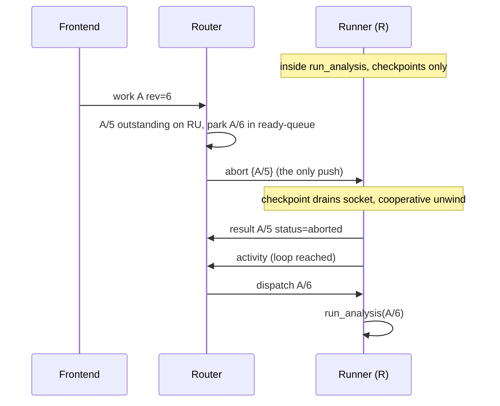
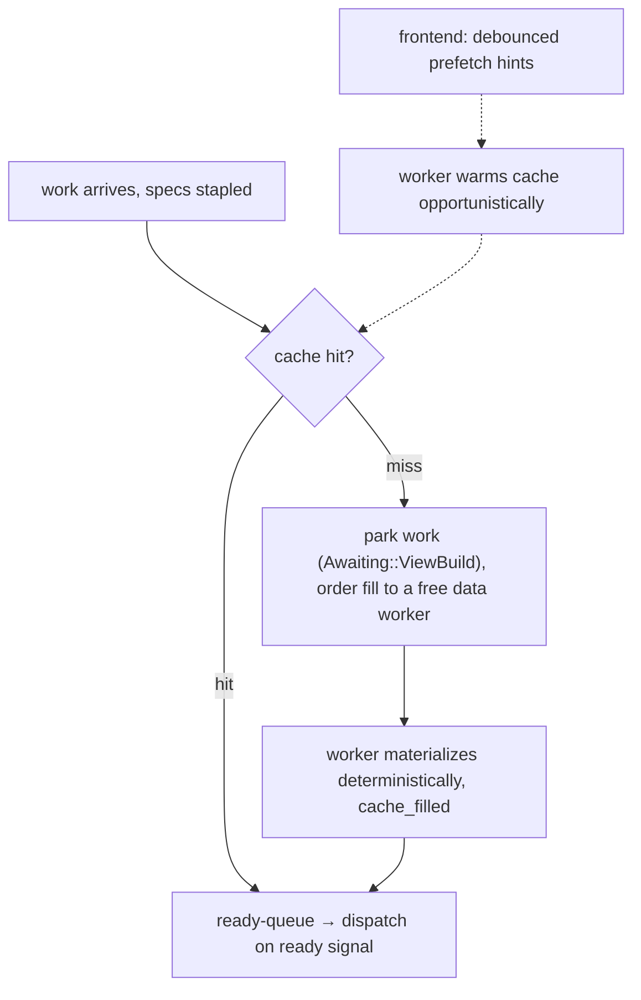

# Orchestrator v2 — the scheduler (pull dispatch, credit windows, views as cache)

**Status:** design converged 2026-09-02 (a long planning session on top of the
analysis-views conversation). **Implementation status (later that day): steps 1–4 of
§12 plus the runner-side abort (§7) have landed** — `orchestrator/` is now the Cargo
workspace of §11 (`wire`, `classic`, `v2`, `data_runner`); classic is frozen
(bugfix-only: it gained `Status::Aborted` as terminal so the runner-side abort serves
both orchestrators); v2's scheduling core (pull/credit dispatch, ready-queue
supersession, one-abort churn, raced-completion discard, wedge→recycle, op-aware
evictions) is implemented with its must-pass tests, verified end-to-end over the real
jaspBase runner (see `refactor_design/test_v2_supersede_e2e.R`). The views phase (§8,
steps 5–8) is NOT started. This document remains normative-for-when-we-build for
everything not yet implemented. It amends `analysis-views-design.md` (§8 below lists
exactly what supersedes what) and sits in the family of:

- `orchestrator-design.md` — **classic**, the as-built spec of the current
  `orchestrator/src/main.rs` (stays the reference for everything that survives);
- `orchestrator-provisioner-design.md`, `orchestrator-router-design.md` — companions;
- `neo-jasp.md` — the wire spec (§18 framing, §19 messages, §25 liveness); **all v2
  wire changes stay additive, `v` stays 1**;
- `analysis-views-design.md` — the views concept; **AV6/AV7/AV9/AV11 are superseded
  here** (§8), AV1–AV5, AV8 (amended), AV10, AV12 stand;
- `HANDOVER-post-excisions.md` — the frontend as it stands.

Written for a fresh implementing session: self-contained, with repo grounding in §13
so every claim about "what exists today" can be verified.

---

## 0. TL;DR for the implementer

1. Classic is a **pipe** ("forwards work frontend→runner"); v2 is a **scheduler**.
   The transport, threading fundamental, and lifecycle machinery survive; the
   router's *policy core* is new.
2. **Three principles, never violated:**
   - **P1 — single-writer router.** Everything enters through the mpsc mailbox; one
     router thread owns all state as plain maps; no locks; never blocks; never
     touches the filesystem.
   - **P2 — dumb executors.** Executors register slots, signal readiness, run one
     thing at a time, report terminals. No queues, no supersession logic, no
     revision comparisons, no scheduling opinions.
   - **P3 — correctness never depends on hints.** Determinism + content addressing
     backstop everything; prefetch, credit windows, and pool queues are optimization.
3. **Works pull, aborts push.** A `work` is only ever sent as the answer to an
   executor's ready signal (`register`/`activity`/`result`), bounded by its credit
   window. `abort` is the one unsolicited message to a busy runner.
4. **Works are self-describing:** they carry `(work_id, revision)` for supersession
   and **stapled view specs** per dataset input. A staple miss parks the work and
   orders a cache fill; there is no `view_build` protocol.
5. **Views are transparent but cacheable:** no pins, no releases, no stash — the
   LRU never reclaims a view referenced by a parked or dispatched work. That one
   hold rule is the whole lifecycle.
6. **Queues live in the router, one shape per semantics:** ready-queue (newest
   revision wins), edit chains (per dataset, ordered, never superseded), parked
   (awaiting runner/worker/view-build).
7. **Death is op-aware and mostly already built in classic:** fail-obsolete
   (analysis), continue-ordered (edit chain), refuse-dangling (open), retry-idempotent
   (view).
8. **Crates:** `orchestrator/` becomes a Cargo workspace — `wire` (shared truth),
   `classic` (frozen), `v2` (this design), `data_runner` (renamed from "lane"; Rust
   crate names allow underscores). Extract, don't fork. Both orchestrators run
   side-by-side; the desktop picks by URL; flip the default when v2's parity is boring.
9. **Build order:** wire → data_runner promotion → v2 skeleton → scheduling core →
   views → runner-side abort → prefetch (last, it's pure optimization).
10. Classic's ~2,900 lines of tests stay green as the spec of record. v2 writes its
    own expectations.

---

## 1. Thesis and principles

Classic's own Cargo description admits it: *"PAIR v1 broker that forwards work
frontend->runner and result runner->frontend."* That is a pipe. Every scheduling
property we need — supersession under option churn, cache-aware dispatch, credit
flow control, federation — requires the center to be a scheduler instead.

### P1 — single-writer router (unchanged from classic)

NNG `Aio` callbacks on NNG pool threads do the bare minimum — recv, re-arm, forward
over mpsc — and **one router thread owns every table and queue as plain `HashMap`s**.
Blocking filesystem work goes to the janitor thread. This is classic's architecture
(`orchestrator/src/main.rs` header, L11–20) and it is the crown jewel: v2 changes
*what* the router computes, never *how* it runs.

### P2 — dumb executors (the new discipline)

The R runner's loop already *is* the right shape (`runner_jaspbase.R` L1251):
`repeat { send_activity; recv; run; result }` — one work at a time, blocking, nothing
read mid-run. Classic violates the shape by pushing works into busy runners, which
pile up in the PAIR socket buffer: an **implicit, unrecallable queue** the runner
drains FIFO — it will happily run a superseded revision because nothing can reach
into that buffer. v2 makes the router honor what the loop already implies.

### P3 — correctness never depends on hints (the backstop)

Every optimization in this design is allowed to fail silently because two invariants
catch it:

- **Determinism**: a view rebuild from `(spec, base_revision)` is byte-identical
  (AV8; gate with a differential test). Works are pure functions of content-addressed
  inputs, so re-execution and duplicate execution are safe.
- **Revision discipline**: terminals carry `(work_id, revision)`; the router
  discards stale ones. First terminal wins; closes are idempotent (both tested in
  classic).

### The recurring pattern: one writer, many caches

This conversation killed the same bug four times, in four costumes:

| Costume | The bug | The fix |
|---|---|---|
| pin table in the worker | two writers of "held" | books in the router |
| runner queue n=3 | unrecallable, invisible to supersession | ready-queue in the router |
| the stash slot ("abort current, start this") | repair for push-created staleness | dispatch-on-ready; nothing stashed |
| auto-heal from retained specs | repairing stale *references* | **staple the spec, not the id** — descriptions don't go stale |
| pool-side queues (future) | — | allowed *behind a credit window*, managed by a real scheduler |

> **One writer, many caches; a cache is always safe to drop.** If a second party
> holds state that influences decisions, it is a bug — unless it is bounded
> (credit window) and reconcilable (revisions, determinism).

---

## 2. What survives from classic / what is new

| Survives (extract, don't fork) | New in v2 |
|---|---|
| REQ/REP control handshake → per-peer PAIR v1 channels | credit ledger + ready-signal dispatch |
| `[u32 BE][JSON][binary tail]` framing (§18.1) | ready-queue with supersession |
| Aio → mailbox → single router thread | auto-abort of superseded running works |
| registration, capabilities, module catalog | the view books: staple check, implied build, un-park |
| datasets, `path_refs`, revisions (D11 echoes) | prefetch hint forwarding |
| **edit chains** (per-dataset, revision-gated) | internal `cache_filled` event |
| **op-aware death handling** (`evict_runner`) | LRU/budget sweep on tick |
| janitor, provisioner, hang detection (30s), park timeouts | workspace/crate split |
| per-revision `results_<rev>` workspaces | remote-pool credit windows (reserve) |

Roughly: transport + lifecycle survive; the scheduling core and views are new.

---

## 3. The wire (all additive; `v` stays 1)

| Message | Direction | Carries | Notes |
|---|---|---|---|
| `work` | router → executor | `work_id`, `revision`, `views: [spec…]` stapled, payload, injected `dataset_paths`/`output_dir`/`base_results_dir` | only sent on a ready signal, within credits |
| `result` | executor → router | `work_id`, `revision`, `status`, payload | terminal; **returns one credit** |
| `abort {work_id}` | router → executor | target work | the **only** unsolicited send to a busy runner; credit-neutral |
| `activity` | runner → router | — | **liveness only** (hang detector), never credit accounting |
| `register` | executor → router (control) | capabilities, **`slots: N`** (default 1), base_uris | boot = full credit window |
| `prefetch {specs}` | frontend → router → data worker | specs | hint; no ack, no credit, ignorable |
| `cache_filled {view_id}` | data worker → router | hash | internal; un-parks waiters; **never forwarded to the frontend** |

### `(work_id, revision)` — submission supersession

- The **submitter** (frontend) assigns a stable slot id and a monotonic revision,
  bumped on **every** submission — including retries (a retry *is* a newer submission;
  no dedupe special-case exists).
- Router rules: arriving `(id, rev=N)` supersedes any queued work with same id and
  lower rev; `rev ≤` an in-flight one gets an immediate `superseded` reply.
- **Orthogonal to dataset revision** (D11): the dataset revision lives inside the
  spec hash; the work revision is about *submission* order. Two monotonic counters,
  never conflate them.
- Already on the wire today (both runner scripts echo it); classic already
  supersedes *parked* works by it and rejects *stale edits* by it. v2 extends it to
  running works via abort.

### Stapled specs (the shape from analysis-views §4)

```jsonc
// per dataset input, on the work unit
{ "dataset_id": "d1…",
  "columns": [ {"name": "Age (years)", "as": "scale"},
               {"name": "group",       "as": "nominal"} ],
  "filter":  "mask-col-ref",
  "all":     false }
```

Multiplicity is structural (same column at two types = two entries). Types are
structured (`as`), never string conventions.

### `view_id = hash(FORMAT_VERSION, spec, base_revision)`

- Computed by the **router** at staple time (it tracks dataset revisions via D11
  echoes; hashing a spec is microseconds of CPU — honors P1).
- `FORMAT_VERSION` is a constant folded into the hash input so a writer/codec
  change can never false-hit against an old blob.
- Determinism is load-bearing: same hash ⇒ byte-identical rebuild. Differential
  test is the gate (see §8).

---

## 4. The books, the queues, the machinery

### The books (router-owned plain maps)

```
works:        (session, work_id) → { runner, revision, kind, dataset_paths }
executors:    id → { capabilities, slots, outstanding (credits in use), last_activity }
datasets:     id → { path, revision, state }        + path_refs (refcounts)
view cache:   hash → { state: building|ready|evictable|gone, waiters, spec, touch, bytes }
edit chains:  dataset_id → ordered queue (revision-gated)
catalog:      module metadata
```

### The queues — one shape per semantics

| Queue | Discipline | Supersession |
|---|---|---|
| ready-queue (analyses) | FIFO by arrival | **yes** — newest `(work_id, revision)` wins |
| edit chains (per dataset) | order-preserving, revision-gated | **never** — order *is* the semantics |
| parked (awaiting runner / worker / view build) | timeout-bounded | inherits its family's rule |

### The tending table (event → action)

| Event | Action |
|---|---|
| work arrives, specs stapled | compute ids; **cache hit? → ready-queue : park + order fill**; supersede queued older revisions; newer revision of a *running* work → **abort push** |
| ready signal (register / activity / result) | update credits/liveness; pop ready-queue head if credits + capability match → dispatch |
| edit arrives | append to the dataset's chain (revision-gated); head dispatches to a free worker |
| cache_filled | mark view ready; un-park waiters → ready-queue |
| result arrives | discard if stale by revision; else forward; return credit |
| pipe close | evict: fail outstanding (op-aware), drain/refuse chains, respawn via provisioner, release path refs; frontend drop → sweep its works; session end → janitor wipe |
| tick | hang scan (recycle wedged via provisioner); park timeouts (fail); LRU sweep (**unheld views only**) |
| prefetch arrives | forward hint to a free capable worker; throttled; never queued |

### The one hold rule

> **A view referenced by a parked or dispatched work is never reclaimed.** Everything
> else is LRU food. There are no other pins, no releases, no advisories.

### The credit ledger

- `register` carries `slots: N`. Local R runner → 1 (R is single-threaded). Rust
  data worker → 1 (one job at a time, as built). Remote pool → N (reserve, §10).
- Dispatch condition: `outstanding < slots` **and** capability match (module for R
  runners; op + format for data workers — `data_open` also matches source format).
- Terminals return credits (any status). The router **computes** availability from
  dispatches-out minus terminals-back; it never trusts a "I'm free" claim.
- `activity` is liveness only — a lost or extra activity can never corrupt
  scheduling.
- Abort is credit-neutral: the credit returns when the aborted terminal arrives
  (checkpoint-gated, possibly slow).
- A wedged runner **freezes its own credits** — self-limiting; the hang detector
  recycles the process; respawn registers fresh with full credits; parked works
  re-dispatch.
- Prefetch costs no credit (it is not work).

---

## 5. Dispatch: pull, not push

**Rule: a `work` message is only ever sent as the answer to a ready signal from
that executor, within its credit window.** A busy executor's socket may hold at
most an abort (and an ignorable prefetch).

Why (grounded in classic's behavior): `select_runner` today has **no busy check** —
works queue implicitly in the 64-deep PAIR buffer, unrecallable and invisible to
supersession, and the runner *runs whatever it pops* (both runner scripts check only
`type == "work"`). Under pull discipline that entire failure class is deleted by
construction.

"Push vs pull" is a *discipline*, not a transport property — PAIR is a dumb
bidirectional pipe; the router's books enforce the restraint (`outstanding < slots`).

### Scheduler extension hooks (reserve, not v1)

- Richer capability advertisements: `gpu`, `high_mem` — same matching, more fields.
- Topology scoring: books gain cache-topology (per-executor cached-view sets — a
  Bloom filter of hashes works); the scorer prefers executors near the data. Stapled
  specs make "route to where the data is" trivially expressible: anyone holding the
  base can materialize.
- Dispatch hooks stay the same two events: work arrival (free capable executor?)
  and ready signal (pop best match). Withholding a free-but-far executor is a
  starvation-prone policy knob — later, default stays dispatch-on-match.

---

## 6. Supersession & abort



- **Churn during the abort window** (A/7 arrives): the ready-queue churns A/6→A/7
  with zero messages to the runner; exactly one abort was ever sent; only A/7
  dispatches when ready.
- **Recompute-seed safety**: `base_revision` always names a *completed* revision
  (frontend-declared; classic injects `base_results_dir` from it) — aborting a
  running obsolete revision can never yank a seed out from under anyone.
- **Raced completion**: if R finished normally before the abort was processed, the
  terminal arrives, is discarded by revision check, and the abort sits in the buffer
  until loop-top — the runner's loop needs a type-switch that treats a popped
  `abort` as a no-op.
- **No checkpoint ever comes** (wedged in a C call): hang detector (30s default) →
  provisioner recycles the process → respawn registers → parked works re-dispatch.
  Killing is safe *because* works are deterministic over content-addressed inputs
  and per-`(work, revision)` results dirs already isolate duplicates.

---

## 7. The runner protocol (R side) — two planes, one flag

### The two planes

- **Wrapper plane** (NNG listener thread, always alive): receives messages anytime,
  sets flags, fetches bytes. Never touches R.
- **R plane** (single thread, checkpoint-gated): only acts when module code calls
  jaspBase's check code. A `lavaan` optimizer grinding for minutes sees nothing,
  hears nothing, aborts never. **No protocol can beat checkpoint density** — the
  design must never assume prompt abort, and the router has no "aborting soon"
  state: it keeps seeing RUNNING until a terminal arrives.

### The loop (mostly as built; deltas marked)

```r
repeat {
  send_activity(sock)        # READY + liveness
  msg <- recv(...)           # loop-top read — under discipline, always a work
  out <- run_analysis(work)  # BUSY; NEW: check code drains socket non-blocking
                             #      at checkpoints; abort → cooperative unwind
  send(result)               # terminal = credit back
}
```

What the runner **never** does: queue works, compare revisions, hold state beyond
the current work. Its whole contract is *register slots, signal, run, report* —
and it remains a process we are always allowed to kill.

### As-built gaps (the runner-side to-do)

1. Checkpoint drain in the jaspBase bridge: non-blocking socket poll at each check;
   `abort {work_id}` for the running work → abort flag → cooperative unwind (R
   condition) → loop sends `result(status="aborted")`.
2. Loop-top type-switch: `abort`/other → log + no-op + loop (covers raced
   completion). Today non-work types are *ignored* — right shape, needs the no-op
   semantics documented.
3. (Optional, later) prefetch consumption at the drain — wrapper-plane fetch into a
   local content-addressed cache; R never involved.

This work lands **once** and serves both orchestrators — it is orthogonal to which
scheduler runs.

---

## 8. Views: transparent but cacheable

> **`view_build` stops being protocol and becomes cache policy.** The wire loses
> three messages (`view_build`, `view_ready`, `view_release`) and gains one optional
> hint (`prefetch`). The view lifecycle sits *inside* the pull discipline.

### Implied build (the guarantee)



- The router checks its **books** (pure map lookup — it never stats the filesystem;
  P1). On a miss it orders the fill; the worker executes and confirms; the confirm
  un-parks waiters. No terminal to the frontend — a cache fill has no
  frontend-visible identity to fail.
- **Worker dies mid-build**: waiters were never dispatched, so nothing
  frontend-visible fails — respawn, re-order. Strictly better than classic's
  `lane_eviction_fails_an_in_flight_view`, because the *frontend* never ordered a
  build; the implied build belongs to the dispatch path.
- **Pass-through survives** as the hash-hit-on-base optimization (`columns: all` +
  unfiltered resolves to a reference to the base file — zero copy).
- Split: **router orders, worker executes** (same split as `data_open`: router mints
  identity/path, worker writes bytes).

### Prefetch (the optimization — build it LAST)

Debounced pre-warm: the frontend already derives specs (AV2); when options *settle*
(~hundreds of ms of no changes), it sends one `prefetch {specs}` hint. The worker
fills the cache quietly. If the user never runs that state, the built view is an
unreachable hash awaiting GC (AV8's "unreachable, not invalid" doing janitor work).
If the hint is lost or the cache was evicted, the implied build catches it — which
is exactly why the hint may be ignorable, lossy, and free of protocol weight.
Given builds are cheap projections, prefetch is a measured-latency optimization;
ship implied build first, prefetch only if dispatch-time fills ever show in the
numbers.

### Cache policy (AV9 as amended)

Content-addressed files, LRU + disk budget, delete on session teardown, tmpfs
backing as a config knob — all unchanged. The **only** lifecycle rule is the hold
rule of §4. The LRU sweep rides the tick; reclamation executes on the janitor.

### Amendments to `analysis-views-design.md`

| Original | Disposition |
|---|---|
| AV1 single-dataset, N views | stands |
| AV2 frontend derives specs | stands — and doubles as the recovery story: the frontend can always re-derive |
| AV3 `fullDataset` flag | stands |
| AV4 worker owns casts (data_runner crate is the seed) | stands |
| AV5 encoding at the language boundary; the map is the protocol | stands |
| AV6 `view_build`/`view_ready`/`view_release` messages | **superseded** — stapled specs + `cache_filled` + optional `prefetch` |
| AV7 two-step ordering with pins | **superseded** — ready-queue + implied build + the one hold rule |
| AV8 content addressing | **amended** — add `FORMAT_VERSION` to the hash input; determinism differential test is the gate |
| AV9 materialization policy | **amended** — cache with implied build on miss; pass-through = hash-hit-on-base |
| AV10 fetch stapling & delivery ladder | stands — fetch refs stamped at dispatch; local path (v1) → URL (later) |
| AV11 pre-warm as primary flow | **superseded** — demoted to debounced `prefetch` hint |
| AV12 pull-model reserve | stands |

### Considered and rejected (do not relitigate)

| Idea | Why it died |
|---|---|
| Pin table in the worker | two writers of "held"; dispatch-path RTT; split-brain under budget pressure |
| Warm pins, TTL decay, `view_stale` advisories | repair for staleness that stapled specs eliminated |
| The stash slot (`run{W2, abort_current}`) | un-readable mid-run (loop blocked) — the socket can't deliver it until the current work ends; saves nothing; runner keeps state |
| Auto-heal from router-retained specs | only needed because references can go stale; descriptions don't |
| `view_build` as a work unit | drags result-forwarding, correlation, timeouts; builds are router-initiated, not frontend-initiated |
| Runner queue n=3 (with router mirror) | gardening returns; the socket buffer problem formalized |
| Heartbeat protocol | nng pipe-close detects death; activity (as built) covers liveness; progress would be checkpoint-gated anyway and proves nothing |
| Literal REQ/REP pull | lockstep forbids the abort push; PAIR + router self-restraint (books-enforced) is the right shape |

---

## 9. Death, hangs, teardown

Per-family death semantics — **as already built in classic's `evict_runner`; v2
inherits them**:

| Work family | On executor death |
|---|---|
| analysis | fail fast to frontend; resubmission *is* retry (new revision) |
| data_edit | chain head dies → nothing applied (revision stays) → queue drains to the respawned worker |
| data_open | dataset identity dies — half-written cache reclaimed, queued edits **refused, never silently lost** |
| data_view / view build | frontend-retried (idempotent chunks) / implied-build re-orders (waiters never dispatched) |

- Provisioner: spawns R runners on demand from parked demand; keeps N data workers
  alive; recycles wedged runners (hang detector, 30s default).
- Janitor: every blocking FS op — reclaims, workspace deletion, teardown wipe.
- Duplicate execution (timeout requeue while original still grinds): both emit
  terminals; first wins; the rest die by revision. Per-`(work, revision)` results
  dirs (already injected by classic) prevent clobbering.

---

## 10. Remote pools (reserve — design property, not v1 code)

A remote pool is **a router, one level down** — same architecture, same rules.
Pull generalizes from "one at a time" (slots = 1) to **credit-window dispatch**
(slots = N): exactly AMQP prefetch / Kafka consumer windows.

| The pool **may** (performance state) | The pool **must** (correctness) |
|---|---|
| queue & reorder within its credit window | never exceed the window |
| batch dispatch to its workers | honor forwarded aborts/supersessions |
| cache views locally (content-addressed) | echo `(work_id, revision)` on every terminal |
| build views locally from the base | return credits on terminal or failure |

Why this is not the two-writers evil: the window bounds divergence, the pool's
queue is managed by a real scheduler that acts on forwarded aborts, and the top
router's books remain the truth (stale terminals die at the revision check; pool
death fails exactly the tracked in-flight set). The pool's queue is a cache of
scheduling decisions — safe to drop (§1's pattern, fifth costume).

Views at the pool fall out of content addressing: works carry stapled specs, so any
pool holding the base revision can materialize views itself — same build function,
deterministic, hash is the contract. The origin never needs to know whether a pool
fetched, cached, or built.

Parked, for the federation era: session-scoped auth (TLS + signed URLs so teardown
revokes fetchability), envelope encryption for runner-local caches, per-session
fairness quotas on the ready queue, cache-topology advertisement (Bloom filters).

---

## 11. Crates: the workspace

```
orchestrator/            ← becomes a Cargo workspace
  crates/
    wire/         messages + framing — THE single source of truth for the protocol
    classic/      today's main.rs, FROZEN once v2 starts (bugfix-only; tests stay green)
    v2/           the scheduler in this doc: books, queues, machinery, one handler per event class
    data_runner/  today's src/bin/data_runner.rs, grown up (Rust crate names allow
                  underscores — `data_runner` it is; binary name can stay jasp-data-runner)
```

Rules:

1. **Extract, don't fork.** `wire` is shared from day one. v2 pulls the
   channel/mailbox plumbing out of classic so the hard-won NNG traps
   (`NNG_OPT_RECVMAXSIZE` silently discarding large frames; a dialed PAIR not
   erroring recv when the listener dies — hence `pipe_notify`; pre-connect send
   buffering) live in exactly one place.
2. **Classic freezes** the moment v2 exists. It remains the always-runnable
   fallback; its test suite is the spec of record for everything unchanged.
3. **The data worker evolves independently**: view-building ships as an *added
   capability advertisement*; classic never orders builds, so either orchestrator
   can run the same workers. The rename from "lane" to `data_runner` is overdue —
   "lane" was always CSV-lane vocabulary that outgrew itself.
4. **Side-by-side**: both binaries answer the same env/URL contract
   (`JASP_ORCH_URL`); the desktop and e2e scripts pick per test; differential
   scenarios run both and compare.

Why separate crates beat in-place evolution: ~2,900 of classic's ~6,000 lines are
tests, and a large share encode push-dispatch expectations. Evolving in place
churns them noisily, breaks bisects, and leaves no fallback. A new crate keeps
classic green, lets v2 write pull-discipline expectations of its own, and forces
the module boundaries this design converged on (books/queues/machinery) instead of
accreting another 2,000 lines onto `main.rs`.

---

## 12. Implementation plan (ordered, reversible)

1. **Extract `wire`** — pure move of `messages.rs` + framing into `crates/wire`;
   classic compiles against it. Zero behavior change. (Workspace scaffolding.)
2. **Promote `data_runner`** — its own crate; add the view-build capability
   advertisement (and the build function, seeded from the CSV typing machinery per
   AV4). Additive: classic ignores the capability.
3. **v2 skeleton** — transport extracted from classic (channels, mailbox, arm_*),
   router shell shaped as books/queues/handlers, inproc test harness copied from
   classic's pattern.
4. **Scheduling core** — credits, ready-signal dispatch, ready-queue with
   supersession, abort push + stale-terminal discard, tick (hang/park/LRU).
   Tests: pull discipline (never dispatch to busy), credit accounting, churn
   (A5→A6→A7 sends one abort), raced-completion no-op, wedge → recycle → requeue.
5. **Views subsystem** — view books, staple check, implied build (park → order →
   `cache_filled` → un-park), hold rule, LRU on tick, pass-through. Determinism
   differential test as the gate.
6. **Runner-side abort** — checkpoint drain + cooperative unwind + loop-top no-op
   (serves both orchestrators).
7. **Differential + e2e** — both orchestrators over shared scenarios
   (`refactor_design/frontend_*.R` pattern); flip the default; freeze classic.
8. **Prefetch** — last, only if measurements want it.

Each step leaves the tree green and the previous orchestrator runnable.

---

## 13. Repo grounding (what exists today, where)

**Post-implementation (steps ①–④ + runner-side abort):** the orchestrator is now the
Cargo workspace of §11 — `orchestrator/crates/{wire,classic,v2,data_runner}`. The
paths below are the PRE-extraction locations, kept for historical grounding of the
design's claims; the live equivalents are `crates/classic/src/main.rs`,
`crates/wire/src/{messages,framing,transport,provisioner,janitor}.rs`,
`crates/data_runner/src/main.rs` (+ `csv2arrow/arrowview/dataedit`), and
`crates/v2/src/{main,router}.rs` (books/queues/machinery + the must-pass tests).

- `orchestrator/src/main.rs` (~6.3k lines incl. tests) — classic router: mailbox
  fundamental (header L11–20), `RunnerRuntime{outstanding, last_activity}`,
  `ParkedWork` + `Awaiting` (parking exists, for provisioning), `try_dispatch_parked`,
  `dispatch_work` (injects `dataset_paths`, `output_dir` = `results_<rev>`,
  `base_results_dir`; resolves `path_refs`), `select_runner` (capability match,
  `max_by_key(priority, seq)` — **no busy check**), `evict_runner` (op-aware death),
  `route_abort`/`abort_and_release`, edit chains (`queued_edits`, `drain/flush`),
  hang detection (`scan_hung`, 30s), catalog push, janitor, provisioner wiring.
  Tests incl. `parked_work_is_superseded_by_a_newer_revision`,
  `stale_edit_is_rejected_at_dispatch`,
  `work_close_aborts_outstanding_and_is_idempotent`,
  `runner_disconnect_evicts_and_fails_outstanding_work`,
  `lane_eviction_fails_an_in_flight_view_but_keeps_the_dataset`.
- `orchestrator/src/bin/data_runner.rs` — the data worker: registers
  `{Open:[csv], View, Edit}` capabilities; PAIR dial + `pipe_notify`; one-job-at-a-time
  loop; edit family with `EditJob`; `RECV_MAX_SIZE` raised.
- `orchestrator/src/messages.rs`, `provisioner.rs`; `orchestrator/Cargo.toml`
  (single crate, two bins — the description still says "forwards work").
- `refactor_design/runner_jaspbase.R` — the R runner: register with all modules;
  loop at L1251 (`activity` → `recv` → blocking `run_analysis` → `result`);
  **no abort handling, no mid-run reads**; alias/rename machinery already present
  (~L331–418); per-revision seeding for recompute.
- `Desktop/jaspclient/jaspclient.cpp` — frontend client: transient REQ handshake →
  PAIR channel; bounded recv loop; `pipe_notify` reconnect; `kPeerBufDepth = 64`.
- `refactor_design/frontend_*.R` — e2e driver scripts (modules, provision, ttest,
  recompute) — the differential-harness seed.
- `refactor_design/analysis-views-design.md` — the views concept this doc amends.

---

## 14. Open questions (parked, not blocking the shape)

1. From analysis-views §13: stable column identity across renames; user-code symbol
   disambiguation; view store on web; HEX derivation (name- vs index-derived);
   filter-ref spelling; grid-chunk unification.
2. Topology scorer inputs (cached-view Bloom filters; distance metric) and whether
   withholding dispatch is ever worth its starvation risk.
3. Federation era: session-scoped auth (signed URLs), envelope encryption for
   runner-local caches, per-session fairness quotas.
4. v2 ↔ classic coexistence details: do they share the provisioner process pool, or
   does each own its own? (Leaning: each owns its own — simpler, and classic freezes.)
5. Activity cadence: keep "once per loop pass" (truthful) vs a timed floor for very
   long runs (the hang detector currently tolerates 30s of silence — a long-but-
   healthy analysis that passes no checkpoints may need one).
6. Scalar-vs-list for single-dataset R kinds (parked in analysis-views §7) — decide
   before the first multi-dataset kind.

---

## 15. Considered and rejected (the graveyard, so we don't relitigate)

| Idea | Why it died |
|---|---|
| `analysis_key` in the router | frontend domain leaking into the router; `(work_id, revision)` declared by the submitter is mechanical |
| Runner-held queues (any n) | second writer of "what's pending"; unrecallable; runs superseded work |
| Stash slot on the runner | PAIR delivers to the loop, the loop is blocked — unreadable mid-run; solves a push-created wound |
| Auto-heal with router-retained specs | staleness repair; stapled specs make descriptions self-healing |
| Pins of any flavor (binding, advisory, TTL-decaying) | correctness never needed them; AV8 + hold rule cover it |
| Heartbeat protocol | nng pipe-close + activity (as built) suffice; progress is checkpoint-gated and proves nothing |
| Orchestrator knowing about "analyses" | submitters declare semantics, the router enforces mechanics |
| Compute-at-dispatch as *coupling* | the coupling objection died with pull: parking *is* the dispatch path now; the router never blocks |
| In-place evolution of classic | 2,900 lines of push-dispatch tests would churn; no fallback; noisy bisects |

---

*Transcribed 2026-09-02 from the scheduling session — the conversation where every
doubt made the design smaller and the router smarter.* 📐
